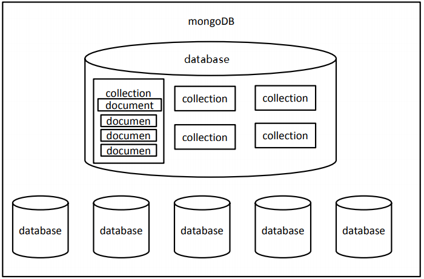

## 数据库（Database）

- 数据库是按照数据结构来组织、存储和管理数据的仓库。
- 我们的程序都是在内存中运行的，一旦程序运行结束或者计算机断电，程序运行中的数据都会丢失。
- 所以我们就需要将一些程序运行的数据持久化到硬盘之中，以确保数据的安全性。而数据库就是数据持久化的最佳选择。
- 说白了，数据库就是存储数据的仓库。


## 数据库分类

数据库主要分成两种：

- 关系型数据库
  - MySQL、Oracle、DB2、SQL Server ……
  - 关系数据库中全都是表
- 非关系型数据库
  - MongoDB、Redis ……
  - 键值对数据库
  - 文档数据库MongoDB


## MongoDB简介

- MongoDB是为快速开发互联网Web应用而设计的数据库系统。
- MongoDB的设计目标是极简、灵活、作为Web应用栈的一部分。
- MongoDB的数据模型是面向文档的，所谓文档是一种类似于JSON的结构，简单理解MongoDB这个数据库中存的是各种各样的 JSON。（BSON）

数据库（database）
- 数据库的服务器
    - 服务器用来保存数据：**mongod** 用来启动服务器

- 数据库的客户端
  - 客户端用来操作服务器，对数据进行增删改查的操作：**mongo** 用来启动客户端


## 安装

### 下载

> 下载地址：https://www.mongodb.com/download-center/community 或者 https://www.mongodb.org/dl/win32/

MongoDB的版本偶数版本为稳定版，奇数版本为开发版。MongoDB对于32位系统支持不佳，所以

3.2版本以后没有再对32位系统的支持。


### 安装及配置

下载完后直接安装。默认安装路径：`C:\Program Files\MongoDB\Server\3.2\bin`

#### 配置环境变量

将MongoDB的 bin 目录（此处为`C:\Program Files\MongoDB\Server\3.2\bin` ）添加到 path 下

操作：在**文件资源管理里面**右键点击 此电脑 —》属性—》高级系统设置—》环境变量—》将MongoDB的 bin 目录添加到用户变量的 Path下或者系统变量的 Path下；

#### 创建数据目录

MongoDB将数据目录存储在 db 目录下。但是这个数据目录不会主动创建，我们在安装完成后需要创建它。请注意，数据目录应该放在根目录下（(如： C:\ 或者 D:\ 等 )。

在本教程中，我们已经在 C 盘安装了 mongodb，现在让我们创建一个 data 的目录然后在 data 目录里创建 db 目录。

```powershell
c:\>cd c:\

c:\>mkdir data

c:\>cd data

c:\data>mkdir db

c:\data>cd db

c:\data\db>
```

你也可以通过 window 的资源管理器中创建这些目录，而不一定通过命令行。


#### 启动MongoDB服务器

打开CMD命令行窗口，输入：

```powershell
mongod
```

32位系统第一次启动：

```powershell
mongod --storageEngine=mmapv1
```

如果出现如下输出，则说明启动成功

```powershell
...
[initandlisten] waiting for connections on port 27017
```

**指定端口和路径**

在控制台启动MongoDB

```po
mongod --dbpath 路径 --port 端口号
```

示例：

```powershell
mongod --dbpath C:\Users\lilichao\Desktop\mongo\data\db --port 1234
```

修改 db 目录，并且制定端口号为 1234

> 注意：打开的命令行窗口不能关闭


如果你觉得每次都要运行 mongod 并且不能关闭窗口会很麻烦，那么你可以将MongoDB设置为系统服务，可以

自动在后台启动，不需要每次都手动启动

1. 在 c 盘的 data目录（没有，则创建 data 目录）下，创建数据库 `db` 和日志文件的目录 `log`

2. **创建配置文件**。在目录 `C:\Program Files\MongoDB\Server\3.2` （即MongoDB的安装目录） 下添加一个配置文件 `mongod.cfg`，该文件必须设置 systemLog.path 参数，包括一些附加的配置选项更好。

   例如，`mongod.cfg` 配置文件指定 systemLog.path 和 storage.dbPath。具体配置内容如下：

   ```
   systemLog:
       destination: file
       path: c:\data\log\mongod.log
   storage:
       dbPath: c:\data\db
   ```

3. 以管理员的身份打开命令行窗口，执行如下的命令：

   ```
   sc.exe create MongoDB binPath= "\"C:\Program Files\MongoDB\Server\3.2\bin\mongod.exe\" --service --config=\"C:\Program Files\MongoDB\Server\3.2\mongod.cfg\"" DisplayName= "MongoDB" start= "auto"
   ```

   说明示例

   ```
   sc.exe create MongoDB binPath= "\"mongod的bin目录\mongod.exe\" --service --config=\"mongo的安装目录\mongod.cfg\"" DisplayName= "MongoDB" start= "auto"
   ```

4. 启动mongodb服务。如果启动失败，证明上边的操作有误，在控制台输入 sc delete MongoDB 删除之前配置的服务，然后从第 1 步再来一次

5. 这时，你可以通过 任务管理器—》服务—》打开服务，找到 MongoDB Server 服务，然后右键点击，选择属性，将启动类型选为自动，此后，每次电脑开启后，MongoDB Server 服务都会自动开启，而不用手动开启。


#### MongoDB 后台管理 Shell

如果你需要进入MongoDB后台管理，你需要在打开一个cmd窗口，输入 `mongo` 连接mongodb ，出现 `>`，MongoDB Shell是MongoDB自带的交互式Javascript shell,用来对MongoDB进行操作和管理的交互式环境。

当你进入mongoDB后台后，它默认会链接到 test 文档（数据库）：

```shell
> mongo
MongoDB shell version: 3.0.6
connecting to: test
……
```

由于它是一个JavaScript shell，您可以运行一些简单的算术运算:

```shell
> 2 + 2
4
>
```

在 Mongo Shell 中的一些命令

- `help <option> `  语法帮助
- `use <database>`  更改当前操作的数据库
- `show <option>`  根据参数显示列表
  - dbs 显示数据库列表
  - collections 显示当前数据库的集合
  - profile 显示时间超过1毫秒的system.profile条目
  - log[name] 显示登录记忆的最后一段
- exit 退出数据库
- load(script) 加载js文件db.auth(username , password)
  在当前数据库做身份验证


#### 关闭MongoDB

- 打开新的命令行窗口

- 登录服务器：

  ```
  mongo
  ```

- 切换管理员用户：

  ```
  admin
  ```

- 关闭数据库

  ```
  db.shutdownServer()
  ```


mongo 后面可以跟的参数

|参数 | 说明 |
| --------- | -------- |
|--help –h| 返回基本帮助和用法文本|
|--version| 返回MongoDB的版本|
|--config<文件名> -f<文件名>| 指定包含运行时配置的配置文件|
|--verbose -v| 增加发送到控制台日志的数量|
|--quiet| 减少发送到控制台日志的数量|
|--port<端口>| 指定mongod的端口，默认27017|
|--bind_ip<端口>| 指定id地址|
|--maxConns<编号>| 指定链接的最大数|
|--logpath<路径>| 指定日志文件的路径|
|--auth| 启用远程主机的身份验证|
|--dbpath<路径>| 指定数据库实例的路径|
|--nohttpinterface| 禁用HTTP接口|
|--nojournal |禁用日志|
|--noprealloc| 禁止预分配数据文件|
|--repair| 在所有数据库上运行修复程序|


## 基本概念

数据库（database）是一个仓库，在仓库中可以存放集合。
集合（collection）：类似于数组，在集合中可以存放文档。集合就是一组文档，也就是集合是用来存放文
档的

文档（document）：文档数据库中的最小单位，我们存储和操作的内容都是文档。类似于JS中的对象，在MongoDB中每一条数据都是一个文档。集合中存储的文档可以是各种各样的，没有格式要求

多个文档组成集合，多个集合组成数据库




## 创建数据库

- 使用use时，如果数据库存在则会进入到相应的数据库，如果不存在则会自动创建。一旦进入数据库，则可以使用db来引用当前库

  ```
  use 数据库名
  ```

- 向集合中插入文档，如果集合不存在则创建（`<collection>` 代指具体的集合名）

  ```
  db.<collection>.insert(文档)
  ```

- 创建一个新的集合

  ```
  db.createCollection()
  ```

- 删除集合

  ```
  db.<collection>.drop()
  ```


## 文档的增删改查

> 详见 [MongoDB CRUD Operations](https://docs.mongodb.com/manual/crud/)

- 插入文档（`<collection>` 代指具体的集合名）

  ```
  db.<collection>.insert ()
  ```

- 查询文档

  ```
  db.<collection>.find ()
  ```

- 删除文档

  ```
  db.<collection>.remove()
  ```

- 修改文档

  ```
  db.<collection>.update()
  ```


### 添加文档

```
db.<collection>.insert (文档对象或由文档对象组成的数组)
```

- insert()可以用于向集合中添加一个或多个文档，可以传递一个对象，或一个数组。
- 可以将对象或数组中的对象添加进集合中
- 添加时如果集合或数据库不存在，会自动创建
- 插入的文档对象会默认添加`_id`属性，这个属性对应一个唯一的id，是文档的唯一标识。也可以自己指定 `_id`，如果我们指定了，数据库就不会在添加了，如果自己指定 `_id` 也必须确保他的唯一性。 

```
db.<collection>.insertOne (文档对象) // 3.2以上版本支持
db.<collection>.insertMany (由文档对象组成的数组) // 3.2以上版本支持
```

示例

```js
db.test.insert({name: "vigor", age: '18'})
/* {
    "_id": ObjectId("5e10b059bac498f0ffcb04ab"),
    "name": "vigor",
    "age": "18"
} */
```


### 删除文档

```
db.<collection>.remove()
```

- remove()可以用来移除符合条件的所有文档对象
- 方法接收一个查询文档作为参数，只有符合条件的文档才会被删除
- 删除数据是永久的，不能撤销
- 第二个参数是指是否只删除符合条件的一个文档，默认是 false，

示例

```js
db.test.remove({age: '18'}, true)
/* WriteResult({ "nRemoved" : 1 })
只删除了满足 age 为 18 的文档 */
```


### 修改文档

```
db.<collection>.update()
```

替换文档

- 可以在update()中传递两个参数，一个是查询文档，一个是新的文档，这样符和条件的文档将会被新文档所替换
- update()的第三个参数，用来指定是否使用upsert，默认为 `upsert: false`
- update()的第四个参数，用来指定是否同时修改多个文档，默认为`multi: false`

示例

```js
db.test.update({name: "vigor"}, {age: "22"})
/* {
    "_id": ObjectId("5e10b059bac498f0ffcb04ab"),
    "age": "22"
} 直接被第二个参数对象替换了原来的整个文档 */
```


### 修改器

- 使用update会将整个文档替换，但是大部分情况下我们是不需要这么做的
- 如果只需要对文档中的一部分进行更新时，可以使用更新修改器来进行。
- 我们将要学习以下几个修改器
  `$set`、 `$unset` 、`$inc`、`$push`、`$addToSet` 

#### `$set`、`$unset`

- `$set` 用来指定一个字段的值，如果这个字段不存在，则创建它。

- 语法：

  ```
  db.<collection>.update(查询对象, {$set:更新对象});
  ```

-  `$unset` 可以用来删除文档中一个不需要的字段，用法和set类似。

示例

```js
db.test.update({name: "vigor"}, {$set:{age: "22"}});
/*
WriteResult({ "nMatched" : 1, "nUpserted" : 0, "nModified" : 1 })
{ "_id" : ObjectId("5e10b726bac498f0ffcb04ae"), "name" : "vigor", "age" : "22" }
*/
```


#### `$inc`

- `$inc`用来增加已有键的值，或者该键不存在那就创建一个
- `$inc` 只能用于Number类型的值


### 查询文档

```
db.<collection>.find ()
```

- MongoDB使用find()来对文档进行查询，返回是一个数组

- find()需要一个查询文档作为参数，如果不传该参数，则会返回集合中的所有元素。

- 可以将查询条件以键值对的形式添加到查询文档中

- 查询条件

  ```
  $lt、$lte、$gt、$gte、$ne、$or、$in、$nin、$not、$exists、$and
  ```

```js
db.<collection>.find ({name: "vigor"})
/* {
    "_id": ObjectId("5e10b059bac498f0ffcb04ab"),
    "name": "vigor",
    "age": "18"
} */
```


```
db.<collection>.findOne()
```

用来查询集合中符合条件的第一个文档，返回的是一个文档对象


```
db.<collection>.find ().count()
```

查询所有结果的数量


```js
db.<collection>.find().limit(num);
```

limit()设置显示数据的上限，上一条语句表示最多显示 num 条数据


```js
db.<collection>.find().skip(num)
```

skip()用于跳过指定数量的数据，上一条语句表示跳过 num 条数据


查询文档时，默认情况是按照_id的值进行排列（升序），sort()可以用来指定文档的排序的规则，sort()需要传递一个对象来指定排序规则：1表示升序， -1表示降序。**limit skip sort 可以以任意的顺序进行调用**

```js
db.<collection>.find({}).sort({filename1: 1, filename2: -1});
```

上面表示，可以依据 `filename1` 来进行升序，当 `filename1` 相同时，可以依据 `filename2` 来降序来排序


在查询时，可以在第二个参数的位置来设置查询结果的 **投影**，规则为：1表示要显示的字段，0表示不显示的字段

```js
db.<collection>.find({},{filename1: 1, _id:0 , filename2: 1});
```

上面表示，只显示 `filename1` 和`filename2` 字段的内容，而不显示 `_id` 和其他字段的内容（默认是会显示 `_id` 的内容，所以可以将其设置为 0 来隐藏其内容）


## 文档之间的关系

1. 一对一（one to one）

   在MongoDB，可以通过**内嵌文档的形式**来体现出一对一的关系

   例如，夫妻 (一个丈夫 对应 一个妻子)

   ```js
   db.wifeAndHusband.insert([
       {
           name:"黄蓉",
           husband:{
               name:"郭靖"
           }
       },{
           name:"潘金莲",
           husband:{
               name:"武大郎"
           }
       }
   
   ]);
   ```

   “黄蓉” 的丈夫对应的是 “郭靖”，"潘金莲" 的丈夫对应的是 "武大郎"

   

2. 一对多（one to many）/ 多对一 (many to one)

   也可以通过内嵌文档来映射一对多的关系

   例如，父母 - 孩子、用户 - 订单、文章 - 评论

   ```js
   //一对多 用户(users) 和 订单(orders)
   db.users.insert([{
       _id: "swk",
       username: "孙悟空"
       },{
       _id: "zbj",
       username: "猪八戒"
   }]);
   // 一个用户对应多个商品
   db.order.insert({
       list:["香蕉","苹果"],
       user_id: "swk"
   });
   
   db.order.insert({
       list:["牛肉","漫画"],
       user_id: "zbj"
   });
   
   //查找用户"孙悟空"的订单
   var user_id = db.users.findOne({username:"孙悟空"})._id;
   db.order.find({user_id:user_id});
   
   ```

   

3. 多对多(many to many)

   可以通过数组的形式来映射一对多的关系

   分类 - 商品、老师 - 学生

   ```js
   //多对多
   db.teachers.insert([
       {name:"洪七公"},
       {name:"黄药师"},
       {name:"龟仙人"}
   ]);
   
   db.stus.insert([
       {
           name:"郭靖",
           tech_ids:[
               ObjectId("59c4806d241d8d36a1d50de4"),
               ObjectId("59c4806d241d8d36a1d50de5")
           ]
       },{
           name:"孙悟空",
           tech_ids:[
               ObjectId("59c4806d241d8d36a1d50de4"),
               ObjectId("59c4806d241d8d36a1d50de5"),
               ObjectId("59c4806d241d8d36a1d50de6")
           ]
       }
   ])
   //多个老师有多个学生，多个学生也有多个老师
   db.teachers.find()
   db.stus.find()
   ```