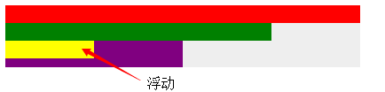
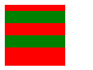
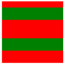
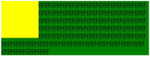
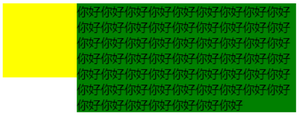

## BFC

**块级格式化上下文（Block Formatting Context，BFC）**。它是一个独立的渲染区域，**只有块级盒子（block-level box）参与**， 它规定了内部的块级盒子如何布局，并且与这个独立盒子里的布局**不受外部影响**，当然它也**不会影响到外面的元素**。

**创建 BFC** :

- 根元素( `<html>` )
- **overflow** 值不为 visible 的块元素
- **浮动元素**（元素的 float 不是 none）
- **绝对定位元素**（元素的 position 为 absolute 或 fixed）
- **行内块元素**（元素的 display 为 inline-block）
- 表格单元格（元素的 display为 table-cell，HTML表格单元格默认为该值）
- 表格标题（元素的 display 为 table-caption，HTML表格标题默认为该值）
- 匿名表格单元格元素（元素的 display为 table、table-row、 table-row-group、table-header-group、table-footer-group（分别是HTML table、row、tbody、thead、tfoot的默认属性）或 inline-table）
- display 值为 flow-root 的元素
- contain 值为 layout、content或 paint 的元素
- 弹性元素（display为 flex 或 inline-flex元素的直接子元素）
- 网格元素（display为 grid 或 inline-grid 元素的直接子元素）
- 多列容器（元素的 column-count 或 column-width 不为 auto，包括 column-count 为 1）
- column-span 为 all 的元素始终会创建一个新的BFC，即使该元素没有包裹在一个多列容器中（标准变更，Chrome bug）。


**BFC 的特性**：

1.内部的**块级元素**会在垂直方向上一个接一个的放置。

2.**垂直方向**上的距离由**margin**决定，**属于同一个BFC的两个相邻Box的margin会发生叠加** 

3.bfc的区域**不会与float**的元素区域**重叠**，正常情况下，没有设置 bfc 的元素会与 float 元素重叠。（详见 [bfc 不与 float 重叠](https://zhidao.baidu.com/question/1050642522648545939.html)）

4.计算bfc的**高度**时，**浮动元素也参与计算**。（清除浮动 haslayout）

5.bfc就是页面上的一个**独立容器**，容器里面的子元素不会影响外面元素。


例子：

1. BFC中的盒子对齐

   内部的**块级元素**会在垂直方向上一个接一个的放置。

   

   浮动的元素也是这样，box3浮动，他依然接着上一个盒子垂直排列。并且所有的盒子都左对齐。

```html
<div class="container">
  <div class="box1"></div>
  <div class="box2"></div>
  <div class="box3"></div>
  <div class="box4"></div>
</div>
<style>
  div {
    height: 20px;
  }

  .container {
    position: absolute;
    /* 创建一个BFC环境*/
    height: auto;
    background-color: #eee;
  }

  .box1 {
    width: 400px;
    background-color: red;
  }

  .box2 {
    width: 300px;
    background-color: green;
  }

  .box3 {
    width: 100px;
    background-color: yellow;
    float: left;
  }

  .box4 {
    width: 200px;
    height: 30px;
    background-color: purple;
  }
</style>
```


2. 外边距折叠

特性的第二条：垂直方向上的距离由margin决定在常规文档流中，两个兄弟盒子之间的垂直距离是由他们的外边距所决定的，但不是他们的两个外边距之和，而是以较大的为准。

> 补充
>
> - 就算父元素不是 BFC 模式，**兄弟的块级元素（block）**的**垂直外边距**（margin-top、margin-bottom）也会发生折叠
> - 内联块级元素（inline-block）任何情况下的垂直或者水平外边距**都不会**发生折叠
> - 内联元素（inline）任何情况下的**垂直内外边距**（padding/margin-top、padding/margin-bottom）都是**失效**的，并且**width，height也是失效的**，**水平外边距不会发生折叠**
>
> 关于 block、inline、inline-block的区别，详见[行内元素和块级元素的具体区别是什么？inline-block是什么？](https://www.cnblogs.com/iceflorence/p/6626187.html) 



```html
<div class="container">
  <div class="box"></div>
  <div class="box"></div>
</div>
<style>
  .container {
    overflow: hidden;
    width: 100px;
    height: 100px;
    background-color: red;
  }

  .box1 {
    height: 20px;
    margin: 10px 0;
    background-color: green;
  }

  .box2 {
    height: 20px;
    margin: 20px 0;
    background-color: green;
  }
</style>
```

 这里我门可以看到，第一个子盒子有上边距（不会发生margin穿透的问题）；两个子盒子的垂直距离为20px而不是30px，因为垂直外边距会折叠，间距以较大的为准。

 那么有没有方法让垂直外边距不折叠呢？答案是：有。特性的第5条就说了：bfc就是页面上的一个独立容器，容器里面的子元素不会影响外面元素，同样外面的元素不会影响到BFC内的元素。所以就让box1或box2再处于另一个BFC中就行了。




```html
<div class="container">
  <div class="wrapper">
  <div class="box1"></div>
  </div>
  <div class="box2"></div>
</div>
<style>
  .container {
    overflow: hidden;
    width: 100px;
    height: 100px;
    background-color: red;
  }

  .wrapper {
    overflow: hidden;
  }

  .box1 {
    height: 20px;
    margin: 10px 0;
    background-color: green;
  }

  .box2 {
    height: 20px;
    margin: 20px 0;
    background-color: green;
  }
</style>
```


3. 不被浮动元素覆盖

以常见的两栏布局为例。

左边固定宽度，右边不设宽，因此右边的宽度自适应，随浏览器窗口大小的变化而变化。


```html
<div class="column"></div>
<div class="column"></div>
<style>
  .column:nth-of-type(1) {
    float: left;
    width: 200px;
    height: 300px;
    margin-right: 10px;
    background-color: red;
  }

  .column:nth-of-type(2) {
    overflow: hidden;
    /*创建bfc */
    height: 300px;
    background-color: purple;
  }
</style>
```

还有三栏布局。

左右两边固定宽度，中间不设宽，因此中间的宽度自适应，随浏览器的大小变化而变化。


```html
<div class="contain">
  <div class="column"></div>
  <div class="column"></div>
  <div class="column"></div>
</div>
<style>
  .column:nth-of-type(1),
  .column:nth-of-type(2) {
    float: left;
    width: 100px;
    height: 300px;
    background-color: green;
  }

  .column:nth-of-type(2) {
    float: right;
  }

  .column:nth-of-type(3) {
    overflow: hidden;
    /*创建bfc*/
    height: 300px;
    background-color: red;
  }
</style>
```


也可以用来防止字体环绕：

众所周知，浮动的盒子会遮盖下面的盒子，但是下面盒子里的文字是不会被遮盖的，文字反而还会环绕浮动的盒子。这也是一个比较有趣的特性。

             



html：

```html
<div class="left"></div>
<p>你好你好你好你好你好你好你好你好你好你好你好你好你好你好你好你好你好你好你好       你好你好你好你好你好你好你好你好你好你好你好你好你好你好你好你好你好你好你好       你好你好你好你好你好你好你好你好你好你好你好你好你好你好你好你好你好你好你好你好你好你好你好    </p>
```

css：

（1）环绕

```css
.left {
  float: left;
  width: 100px;
  height: 100px;
  background-color: yellow;
}

p {
  background-color: green;
  /* overflow: hidden; */
}
```


（2）利用bfc防止环绕

```css
.left {
  float: left;
  width: 100px;
  height: 100px;
  background-color: yellow;
}

p {
  background-color: green;
  overflow: hidden;
}
```


4. BFC包含浮动的块

这个是大家再熟悉不过的了，利用overflow:hidden清除浮动嘛，因为浮动的盒子无法撑出处于标准文档流的父盒子的height。


```html
<head>
	<style type="text/css">
		*{
			margin: 0;
			padding: 0;
		}
		#wrap{
			border: 1px solid;
			/*触发bfc*/
			overflow: hidden;
			/*position: absolute;*/
			/*float: left;*/
                                          
			/*拥有布局: hadlayout*/
			/*zoom:1;*/
		}
		
		#inner{
			float: left;
			width: 200px;
			height: 200px;
			background: pink;
		}
	</style>
</head>
<body>
	<div id="wrap">
		<div id="inner"></div>
	</div>
</body>
```

给浮动属性元素的父级元素开启 BFC。（overflow：hidden，绝对定位，浮动）


参考

> [CSS中的BFC详解](https://www.cnblogs.com/chen-cong/p/7862832.html)
>
> [块格式化上下文](https://developer.mozilla.org/zh-CN/docs/Web/Guide/CSS/Block_formatting_context) 


