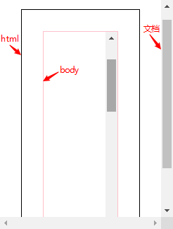
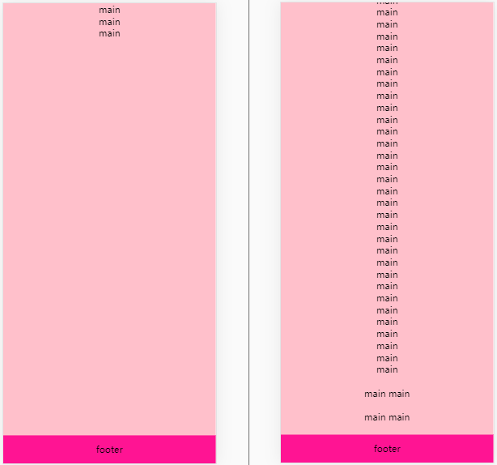
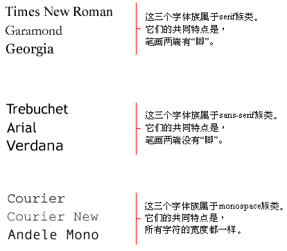
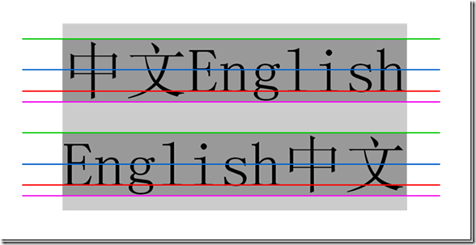
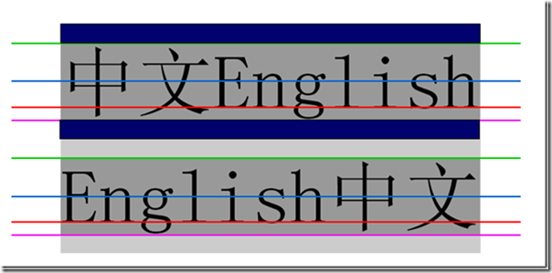
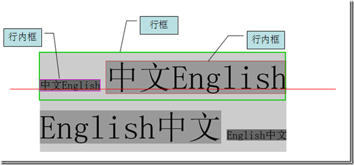

## 包含块

详见 [CSS的包含块（containing block）](https://www.vigor666.com/posts/b87a4295.html) 

对于浮动元素，其包含块定义为最近的块级元素祖先元素。对于定位，情况则没有这么简单。CSS2.1 定义了一下行为：

- 根元素的包含块（也称为初始包含块）由用户代理建立。在HTML中，根元素的就是html元素，不过有些浏览器会使用body为根元素。在大多数浏览器中，初始包含块是一个视窗大小的矩形。
- 对于一个非根元素，如果position至是relative或static，包含块则由最近的块级框、表单元格或行内块祖先的内容边界构成。
- 对于一个非根元素，如果position值是absolute，包含块设置为最近的position值不是static的祖先元素（可以是任何类型）。这个过程如下：
  1. 如果这个祖先元素是块级元素，包含块则设置为该元素的内边距边界，换句话说，就是由边界框界定的区域。
  2. 如果这个祖先元素是行内元素，包含块则设置为该元素的内容边界。在从左向右读的语言中，包含块的上边界和左边界是该祖先元素中第一个框内容区的上边界和左边界，包含块的下边界和右边界是最后一个框内容区的下边界和右边界，在从右向左的语言中，包含块的右边界对应于第一个框的由内容边界，包含块的左边界则取自最后一个框的左内容边界。上下边界也一样。（不同浏览器表现得不一样 :question:）
  3. 如果没有祖先，元素的包含块定义为初始包含块。


> 注意：
>
> 1. 定位元素参照于谁来定位
>    	相对：元素本来的位置
>    	绝对：包含块
>    				如果最近的祖先元素中存在定位元素，则这个定位元素就是包含块
>    				如果没有，包含块为初始包含块
>    	固定：视口
>
> 2. 初始包含块是视窗大小的矩形，不等于视窗
>
> 3. left、right、top、bottom、width、height 默认值都是 auto，并且都不可以继承
>
>    margin、padding 默认值都是 0
>
>    border-width 默认值是 medium
>
>    font-size 等还有其他呢 :question:
>
> 4.  **百分比**的参照（如，width：50%）
>
>    width、margin、padding、left、right：包含块的 width
>    height、top、bottom：包含块的height


## 浮动

浮动只提升半层


## 三栏布局

详见 [CSS 布局](https://www.vigor666.com/posts/8dc2f6c6.html#css-布局) 


## 等高布局

使用负margin-bottom和正padding-bottom对冲实现


```html
<!DOCTYPE html>
<html>
	<head>
		<meta charset="UTF-8">
		<title>伪等高布局</title>
		<style type="text/css">
			*{
				margin: 0;
				padding: 0;
			}
			#wrap{
				width: 600px;
				border: 1px solid;
				margin: 0 auto;
				overflow: hidden;
			}
			#wrap .left{
				float: left;
				width: 100px;
				background: pink;
				padding-bottom: 1000px;
				margin-bottom: -1000px;
			}
			#wrap .right{
				float: left;
				width: 400px;
				background: deeppink;
				padding-bottom: 1000px;
				margin-bottom: -1000px;
			}

			/* 清除浮动 */
			.clearfix{
				*zoom: 1;
			}
			.clearfix:after{
				content: "";
				display: block;
				clear: both;
			}
		</style>
	</head>
	<body>
		<div id="wrap" class="clearfix">
			<div class="left">
				left <br />left <br />left <br />left <br />
				left <br />left <br />left <br />left <br />
				left <br />left <br />left <br />left <br />
			</div>
			<div class="right">
				right<br />right<br />right<br />right<br />
				right<br />right<br />right<br />right<br />
			</div>
		</div>
	</body>
</html>
```

元素设置的padding-bottom尽可能大一些，并且需要设置一样大小的margin-bottom负值去抵消padding-bottom撑大的区域，正负一抵消，对于页面布局不会有影响。另外的话还需要设置父元素overflow：hidden把子元素多出来的色块背景隐藏掉。


## 使用绝对定位(absolute)来模拟固定定位(fixed)

> 因为 IE6及其以下不支持 fixed，所以可以用绝对定位来进行模拟


```html
<!DOCTYPE html>
<html>
	<head>
		<meta charset="UTF-8">
		<title>使用绝对定位来模拟固定定位</title>
		<style type="text/css">
			*{
				margin: 0;
				padding: 0;
			}
			html{
				overflow: hidden;
				height: 100%;
			}
			
			body{
				overflow: auto;
				height: 100%;
			}
			
			#test{
				position: absolute;
				left: 50px;
				top: 50px;
				width: 100px;
				height: 100px;
				background: pink;
			}
		</style>
	</head>
	<body>
		<div id="test"></div>
		<div style="height: 1000px;">
			csjkahcjk <br />csjkahcjk <br />csjkahcjk <br />
			csjkahcjk <br />csjkahcjk <br />csjkahcjk <br />
		</div>
	</body>
</html>
```

步骤：

1. 禁止系统滚动条
2. 将滚动条加给body
3. 让body的尺寸变为视口的尺寸


**注意：**

系统默认的滚动条是在文档那里，只有html和body同时设置了overflow: scroll; body才有滚动条，并且html的滚动条还是体现在文档那里



```html
<!DOCTYPE html>
<html>
	<head>
		<meta charset="UTF-8">
		<title></title>
		<style type="text/css">
			html{
				margin: 30px;
				border: 1px solid;
				height: 100%;
				overflow: scroll;
			}
			body{
				margin: 30px;
				border: 1px solid pink;
				height: 100%;
				overflow: scroll;
			}
		</style>
	</head>
	<body>
		<div style="height: 1000px;"></div>
	</body>
</html>
```

如果要禁止滚动条，直接在对应元素添加 `overflow: hidden` 样式，如，`html { overflow: hidden }` 禁止了系统的滚动条


## footer 的粘连布局



当内容没有撑满页面时，footer会在页面的底部，当内容撑满可视界面并且出现滚动条时，只有滚动条滑到底部时（即整个内容被预览完）才出现 footer。

```html
<!DOCTYPE html>
<html>
	<head>
		<meta charset="UTF-8">
		<meta name="viewport" content="width=device-width,initial-scale=1.0,user-scalable=no"/>
		<title>粘连布局</title>
		<style type="text/css">
			*{
				margin: 0;
				padding: 0;
			}
			html,body{
				height: 100%;
			}
			#wrap{
				min-height: 100%;
				background: pink;
				text-align: center;
				overflow: hidden;
			}
			#wrap .main{
				padding-bottom:50px ;
			}
			#footer{
				margin-top: -50px;
				height: 50px;
				line-height: 50px;
				background: deeppink;
				text-align: center;
			}
		</style>
	</head>
	<body>
		<div id="wrap" >
			<div class="main">
				main <br />main <br />main <br />
			</div>
		</div>
		<div id="footer">
			footer
		</div>
	</body>
</html>
```

先将 `html` 、`body` 的 height 设置为 100% 以及将 `#wrap` 的 min-height 设置为 100%，以至撑满可视高度，然后 `.main` 的 padding-bottom 设置为 `#footer` 的高度，避免 `#footer` 元素的内容挡住 `.main` 的内容，最后将 `#footer` 的margin-top 设置为 自身高度的负值。


##  盒子模型(Box Model)

Box：CSS 布局的基本单位

Box 是 CSS 布局的对象和基本单位，直观点来说，就是一个页面是由很多个 Box 组成。

元素的类型和 display 属性，决定了这个 Box 的类型，不同类型的 Box，会参与不同 Formatting Context（一个决定如何渲染文档的容器），因此 Box 内的元素会以不同的方式渲染，然我们看看有哪些盒子：

- **block-level box**

  display 属性为 **block**，**list-item**，**table** 的元素，会生成 block-level box，并参与 block formatting context

- **inline-level box**

  display 属性为 **inline**、**inline-block**、**inline-table**  的元素，会生成 inline-level box，并参与 inline formatting context


## Formatting Context

Formatting Context 是 W3C CSS2.1 规范中的一个概念。它是页面中的一块渲染区域，并且有一套渲染规则，他决定其子元素将如何定位，以及和其他元素的关系和相互作用。最常见的 Formatting Context 有 **Block Formatting Context**（简称 **BFC**）和 **Inline Formatting Context**（简称 **IFC**）


## BFC

详见 [BFC（块级格式上下文）](https://www.vigor666.com/posts/d2b0cc7d.html) 


## 清除浮动


1. 给浮动属性元素的父级元素开启 BFC。（overflow：hidden，绝对定位，浮动）

   ```html
   <head>
   	<style type="text/css">
   		*{
   			margin: 0;
   			padding: 0;
   		}
   		#wrap{
   			border: 1px solid;
   			/*触发bfc*/
   			overflow: hidden;
   			/*position: absolute;*/
   			/*float: left;*/
                                             
   			/*拥有布局: hadlayout*/
   			/*zoom:1;*/
   		}
   		
   		#inner{
   			float: left;
   			width: 200px;
   			height: 200px;
   			background: pink;
   		}
   	</style>
   </head>
   <body>
   	<div id="wrap">
   		<div id="inner"></div>
   	</div>
   </body>
   ```

   

2. 给父级加高度（扩展性不好）

   ```html
   <head>
   	<style type="text/css">
   		*{
   			margin: 0;
   			padding: 0;
   		}
   		#wrap{
   			border: 1px solid;
   			height: 300px;
   		}
   		
   		#inner{
   			float: left;
   			width: 200px;
   			height: 200px;
   			background: pink;
   		}
   	</style>
   </head>
   <body>
   	<div id="wrap">
   		<div id="inner"></div>
   	</div>
   </body>
   ```

   

3. 空标签清除浮动（~~IE6最小高度是 19px；解决后 IE6 下还有 2px 偏差~~）

   ```html
   <head>
   	<style type="text/css">
   		*{
   			margin: 0;
   			padding: 0;
   		}
   		#wrap{
   			border: 1px solid;
   		}
   		
   		#inner{
   			float: left;
   			width: 200px;
   			height: 200px;
   			background: pink;
   		}
   	</style>
   </head>
   <body>
   	<div id="wrap">
   		<div id="inner"></div>
       <div style="clear: both;"></div>
   	</div>
   </body>
   ```

   

4. `<br />` 清浮动（不符合工作中：结构、样式、行为，三者分离的要求）

   ```html
   <head>
   	<style type="text/css">
   		*{
   			margin: 0;
   			padding: 0;
   		}
   		#wrap{
   			border: 1px solid;
   		}
   		
   		#inner{
   			float: left;
   			width: 200px;
   			height: 200px;
   			background: pink;
   		}
   	</style>
   </head>
   <body>
   	<div id="wrap">
   		<div id="inner"></div>
       <br clear="all" />
   	</div>
   </body>
   ```

   

5. 伪元素 + 开启 haslayout

   因为 IE6、7 下不支持伪元素，所以要额外的去开启 haslayout。

   ```html
   <head>
   	<style type="text/css">
   		*{
   			margin: 0;
   			padding: 0;
   		}
   		#wrap{
   			border: 1px solid;
   		}
   		
   		#inner{
   			float: left;
   			width: 200px;
   			height: 200px;
   			background: pink;
   		}
                         
       /*开启haslayout*/
   		.clearfix{
   			*zoom: 1; /* * 为IE浏览器的 CSS hack */
   		}
   		
   		/*ie 6 7 不支持伪元素*/
   		.clearfix:after{
   			content: "";
   			display: block;
   			clear: both;
   		}
   	</style>
   </head>
   <body>
   	<div id="wrap" class="clearfix">
   		<div id="inner"></div>
   	</div>
   </body>
   ```

   

## IE 浏览器的 haslayout

#### 什么是haslayout

layout是windows IE的一个私有概念，它决定了元素如何对其内容定位和尺寸计算，以及与其他元素的关系和相互作用。当一个元素“拥有布局”时，它会负责本身及其子元素的尺寸和定位。而如果一个元素“没有拥有布局”，那么它的尺寸和位置由最近的拥有布局的祖先元素控制。

必须说明的是，IE8及以上浏览器使用了全新的显示引擎，已经不在使用haslayout属性，因此文中提到的haslayout属性只针对IE6和IE7。

#### 为什么会有haslayout

理论上说，每个元素都应该控制自己的尺寸和定位，即每个元素都应该“拥有布局”，当然这只是理想状态。而对于早期的IE显示引擎来说，如果所有元素都“拥有布局”的话，会导致很大的性能问题。因此IE开发团队决定使用布局概念来减少浏览器的性能开销，即只将布局应用于实际需要的那些元素，所以便出现了“拥有布局”和“没有拥有布局”两种情况。

####  默认情况下拥有布局的元素

下面，先来看下哪些元素在默认情况下就“拥有布局”。

```
html, body
table
tr, td
img
hr
input, select, textarea, button
iframe, embed, object, applet
marquee
```

#### 查看和触发haslayout

haslayout是windows IE私有的，而且它不是css属性，我们无法通过css显式的设置元素的haslayout。但我们可以通过javascript来查看一个元素是否拥有布局：

```
<div id="div1">这是一个div</div>;

var oDiv = document.getElementById('div1');
alert(oDiv.currentStyle.hasLayout);	//弹出false
```

如果元素拥有布局，obj.currentStyle.hasLayout就会返回true，否则返回false。hasLayout是一个只读属性，所以也无法通过javascript进行设置。

在实际开发过程中，很多IE下（IE6、IE7）的显示问题，都可以通过触发元素的haslayout来解决，下面列出一些常见的可以触发元素haslayout的属性和方法：

```
float: left或right
display: inline-block
position: absolute
width: 除auto外任何值
height: 除auto外任何值
zoom: 处normal外任何值
writing-mode: tb-rl
```

在IE7中，以下属性也可以触发元素的haslayout

```
min-height: 任意值
min-width: 任意值
max-height: 除none 外任意值
max-width: 除none 外任意值
overflow: 除visible外任意值，仅用于块级元素
overflow-x: 除visible 外任意值，仅用于块级元素
overflow-y: 除visible 外任意值，仅用于块级元素
position: fixed
```

#### haslayout引起的bug及解决方法

- IE 很多常见的浮动 bug 。
- 元素本身对一些基本属性的异常处理问题。
- 相对定位的元素没有布局。
- 拥有布局的元素外边距不叠加。

当然可能还有一些我们没有发现的bug，一般情况下我们会使用zoom: 1;来触发haslayout从而来解决这些bug，因为zoom: 1不会影响到元素的现有表现，虽然zoom: 1无法在IE5.0中触发haslayout，但是IE5.0已经不在我们的测试范围内了，所以可以放心的使用zoom: 1。另外在IE6及较早版本的浏览器中还可以使用height: 1%来触发，IE7中可以使用min-height: 0来触发。


> 参考: [理解 IE haslayout](https://github.com/8788/blog/issues/1)  


## css hack

CSS hack由于不同厂商的浏览器，比如Internet Explorer, Safari, Mozilla Firefox, Chrome等，或者是同一厂商的浏览器的不同版本，如IE6和IE7，对CSS的解析认识不完全一样，因此会导致生成的页面效果不一样，得不到我们所需要的页面效果。 这个时候我们就需要针对不同的浏览器去写不同的CSS，让它能够同时兼容不同的浏览器，能在不同的浏览器中也能得到我们想要的页面效果。

简单的说，CSS hack的目的就是使你的CSS代码兼容不同的浏览器。当然，我们也可以反过来利用CSS hack为不同版本的浏览器定制编写不同的CSS效果。

> 详见：[css hack](https://baike.baidu.com/item/css%20hack/7026361?fr=aladdin) 


## 检测 IE 浏览器版本

利用 css hack 的条件注释表达式进行检测

```js
function isIE(version){
  var b = document.createElement("b");
  b.innerHTML="<!--[if IE "+version+"]><i></i><![endif]-->";
  return   b.getElementsByTagName("i").length == 1 ;
}
console.log(isIE(8));
```


## 垂直水平居中

详见 [水平垂直居中](https://www.vigor666.com/posts/4d3c8f02.html#三-水平垂直居中) 


## 字体

### font-size

font-size CSS 属性指定字体的大小。该属性的值会被用于计算em长度单位

**默认值** ：medium（chrome下为16px）；**可继承**

**值**： （这一块的取值其实有很多种形式，但为了不困扰大家，建议暂时关注三种）
    px   

​    em   ：em值的大小是动态的。当定义font-size属性时，1em等于元素的父元素的字体大小

​    %    ：参照父元素的字体大小


### font-style

font-style 属性允许你选择 font-family 字体下的 italic 或 oblique 样式。 
Italic 样式一般是指书写体，相比无样式的字体，通常会占用较少的高度，而 oblique 字形一般只是常规字形的倾斜版本

**默认值**：normal；**可继承**

**值**
normal
    选择 font-family 的常规字体。
italic
    选择斜体，如果当前字体没有可用的斜体版本，会选用倾斜体（oblique ）替代。
oblique
    选择倾斜体，如果当前字体没有可用的倾斜体版本，会选用斜体（ italic ）替代。


### font-weight

font-weight属性指定了字体的粗细程度。 一些字体只提供 normal 和 bold 两种值。
**默认值**： normal；**可继承**

**值**
    normal
       正常粗细。与400等值。
    bold
       加粗。 与700等值。
    lighter
       比从父元素继承来的值更细
    bolder
       比从父元素继承来的值更粗
    100(Thin 或者 Hairline), 200, 300, 400, 500, 600, 700, 800, 900
       数值化的规定字体粗细成都的方式，提供了除了 normal 和 bold 之外更多的值。

**回退机制**
    如果一个字体只有 normal 和 bold 两种粗细值选择，指定粗细值为 100-500 时，实际渲染时将使用 normal，指定粗细值为 600-900 时，实际渲染时将使用 bold

**相对粗细值的解析**
    当指定的是相对粗细值 lighter 或 bolder 时，将使用如下图表来决定元素渲染时的绝对粗细值：
继承值（Inherited value）      bolder   lighter
           100                          400       100
           200                          400       100
           300                          400       100
           400                          700       100
           500                          700       100
           600                          900       400
           700                          900       400
           800                          900       700
           900                          900       700 

**插值规律**
    font-weight 数值采取离散式定义（使用 100 的整倍数）。数值为实数，非 100 的整数倍的值将被四舍五入转换为 100 的整倍数，遇到 *50 时，将向上转换，如 150 将转换为 200 


### font-family

CCS属性font-family允许您通过给定一个有先后顺序的，由字体名或者字体族名组成的列表来为选定的元素设置字体。 属性的值用逗号隔开。浏览器会选择列表中第一个该计算机上有安装的字体。

**默认值** ：depends on user agent  **可继承**

**取值**

> `<family-name>`
>        一个字体的名字。例如"Times" 和 "Helvetica" 都是字体名。字体名可以包含空格，但包含空格时应该用引号。
>
> `<generic-name>`
>        通用字体族名是一种备选机制，用于在指定的字体不可用时给出较好的字体。通用字体族名都是关键字，所以不可以加引号。 在列表的末尾应该至少有一个通用字体族名。 以下是该属性可能的取值以及他们的定义。
>        `serif`
>            带衬线字体，笔画结尾有特殊的装饰线或衬线。
>            例如： Lucida Bright, Lucida Fax, Palatino, "Palatino Linotype", Palladio, "URW Palladio", serif. 
>
> ​       `sans-serif`
> ​       	无衬线字体，即笔画结尾是平滑的字体。
> ​       	例如， "Open Sans", "Fira Sans", "Lucida Sans", "Lucida Sans Unicode", "Trebuchet MS", "Liberation Sans", "Nimbus Sans L", sans-serif.
>
>    	`monospace`
>    		等宽字体，即字体中每个字宽度相同。
>    		例如， "Fira Mono", "DejaVu Sans Mono", Menlo, Consolas, "Liberation Mono", Monaco, "Lucida Console",            monospace.
>	
>    	`cursive`
>       	 草书字体。这种字体有的有连笔，有的还有特殊的斜体效果。因为一般这种字体都有一点连笔效果，所以会给人一种手写           的感觉。
>        	例如， "Brush Script MT", "Brush Script Std", "Lucida Calligraphy", "Lucida Handwriting", "Apple                     Chancery", cursive.
>
>   	 `fantasy`
>    		Fantasy字体主要是那些具有特殊艺术效果的字体。
>    		E.g. Papyrus, Herculanum, Party LET, Curlz MT, Harrington, fantasy. 



​        

示例
       h1 {font-family: arial, verdana, sans-serif;}
       h1标题将采用Arial字体显示。如果访问者的计算机未安装Arial，那么就使用Verdana字体。假如Verdana字体也没安装的话，那么将采用一个属于sans-serif族类的字体来显示这个h1标题。

### font简写

在使用 CSS font 简写属性时有几条注意事项。如果不符合这些情况，该属性将无效并被完全忽略。
       1.除了使用关键字的情况之外，该属性必须同时设置 font-size 和 font-family 属性值。
       2.属性值的顺序并非完全自由：如需设置 font-style 和 font-weight 中任意一个，它们必须要放在 font-size 值的前面。 line-height 值必须紧跟在 font-size 之后，并且要在属性值前面加上 / 。最后， font-family 是必不可少的，且必须放在最后

推荐形式：
       font: font-style   font-weight   font-size/line-height   font-family


## 行高

### line-height

​    对于代替元素，line-height没有影响
​    对于非代替元素，line-height才有影响
​       对于块级元素，css属性line-height指定了元素内部line-box的最小高度
​       对于行内元素，line-height用于计算line-box的高度   

默认值： **normal**  **可继承**

值：
    `normal`
       取决于用户代理。桌面浏览器（包括火狐浏览器）使用默认值，**约为1.2**
    `<number>`
       该属性的应用值是这个无单位数字<number>乘以该元素的字体大小。计算值与指定值相同。大多数情况下，使用这种方法设置line-height是首选方法，在继承情况下不会有异常的值。
    `<length>`
       指定<length>  用于计算 line box 的高度。
    `<percentage>`
       与元素自身的字体大小有关。计算值是给定的百分比值乘以元素计算出的字体大小。 
行高继承的怪癖
           父级行高使用的是百分比的话，子级继承的是父级百分比计算过后的值
           父级行高使用的是number因子的话，子级直接继承的是父级的number因子
        

### 顶线、中线、基线、底线




从上到下四条线分别是顶线、中线、基线、底线，很像才学英语字母时的四线三格


### 行高、行距、半行距


1. 行高是指上下文本行的基线间的垂直距离，即图中两条红线间垂直距离。

2. 行距是指一行底线到下一行顶线的垂直距离，即第一行粉线和第二行绿线间的垂直距离。

3. 半行距是行距的一半，即区域3垂直距离/2，区域1，2，3，4的距离之和为行高，而区域1，2，4距离之和为字体size，所以半行距也可以这么算：（行高-字体size）/2 


### 内容区、行内框、行框



1.内容区：底线和顶线包裹的区域，即上图深灰色背景区域。 
   文本行中的每个元素都会生成一个内容区，这个由字体的大小确定。这个内容区则会生成一个行内框
   如果不存在其他因素，这个行内框就完全等于该元素的内容区，由line-height产生的行间距就是增加
   和减少各行内框高度的因素之一



2.行内框 : 行内框是一个浏览器渲染模型中的一个概念，无法显示出来，行内框默认等于内容区域， 将line-height的计算值减去font-size的计算值，这个值就是总行距，这个值可能是个负值，任何将行间距/2 分别应用到内容区的顶部和底部，其结果就是该元素的行内框
3.行框（line box），行框是指本行的一个虚拟的矩形框，是浏览器渲染模式中的一个概念，并没有实际显示。默认情况下行框高度等于本行内所有元素中行内框最大的值（一行上垂直对齐时以行高值最大的行内框为基准，其他行内框采用自己的对齐方式向基准对齐，最终计算行框的高度），当有多行内容时，每行都会有自己的行框。


## 文本相关属性

color

text-align

text-indent

text-decoration

letter-spacing

word-spacing

white-space（溢出显示省略号）


## Vertical-align

vertical-align 用来指定inline-block的垂直对齐方式。
ps:我们经常会在img（替换元素）上使用vertical-align属性
默认值：**baseline** ； **不可继承**

**值**
    大部分取值是相对于父元素来说的：
       `baseline`
           元素基线与父元素的基线对齐。
           对于一些 可替换元素，比如 <textarea> ， HTML标准没有说明它的基线，这意味着对其使用这个关键字，各浏览器表现可能不一样。一般情况下如果元素没有基线baseline，则以它的外边距的下边缘为基线。
       `text-top`
           元素顶端与父元素字体的顶端对齐。
       `text-bottom`
           元素底端与父元素字体的底端对齐。
       `middle`
           元素中线与父元素的小写x中线对齐。
       `sub`
           元素基线与父元素的下标基线对齐。（使元素的基线相对于基准基线下降，下降的幅度有浏览器厂商决定）
       `super`
           元素基线与父元素的上标基线对齐。（使元素的基线相对于基准基线升高，升高的幅度有浏览器厂商决定）
       `<length>`
           元素基线超过父元素的基线指定高度。可以取负值。
       `<percentage>`
           同 <length> , 百分比相对于 line-height 。
    **以下两个值是相对于整行来说的**：
      ` top`
           元素及其后代的顶端与整行的顶端对齐。
       `bottom`
           元素及其后代的底端与整行的底端对齐。

 