1. 
2. 样式表
3. 规则
4. 选择器 + 声明块
5. 声明
6. css属性+css属性值组成的键值对


## CSS选择器

> CSS3选择器规范地址：	   https://www.w3.org/TR/2011/REC-css3-selectors-20110929/
> CSS3选择最新选择器规范:  https://www.w3.org/TR/selectors 

### 基本选择器

通配符选择器		`* { margin: 0; padding: 0; border: none; }`

元素选择器		`body { background: #eee; }`

类选择器		`.list { list-style: square; }`

ID选择器		`#list { width: 500px; margin: 0 auto; }`

后代选择器		`.list li { margin-top: 10px; background: #abcdef; }`


### 基本选择器扩展

- 子元素选择器

  ```css
  #wrap > .inner {color: pink;}
  ```

  也可称为直接后代选择器,此类选择器只能匹配到直接后代，不能匹配到深层次的后代元素

- 相邻兄弟选择器	

  ```css
  #wrap #first + .inner {color: #f00;}
  ```

  它只会匹配紧跟着的兄弟元素

- 通用兄弟选择器	

  ```css
  #wrap #first ~ div { border: 1px solid;}
  ```

  兄弟选择符，位置无须紧邻，只须同层级，`A~B` 选择`A`元素之后所有同层级`B`元素。

- 选择器分组		

  ```css
  h1,h2,h3{color: pink;}  
  ```

  此处的逗号我们称之为结合符


### 属性选择器

#### 存在和值属性选择器

- [attr]：该选择器选择包含 attr 属性的所有元素，不论 attr 的值为何。例如，`div[name]{ border: 1px solid;}`


- [attr=val]：该选择器仅选择 attr 属性被赋值为 val 的所有元素。

- [attr~=val]：表示带有以 attr 命名的属性的元素，并且该属性是一个以空格作为分隔的值列表，其中至少一个值为

val。


#### 子串值属性选择器

- [attr|=val] : 选择attr属性的值是val（包括val）或以val-开头的元素。

- [attr^=val] : 选择attr属性的值以val开头（包括val）的元素。

- [attr$=val] : 选择attr属性的值以val结尾（包括val）的元素。

- [attr*=val] : 选择attr属性的值中包含字符串val的元素。


### 伪类与伪元素选择器

#### 链接伪类		

> 注意:link，:visited，:target是作用于**链接元素**的！

- :link		表示作为超链接，并指向一个未访问的地址的所有锚
- :visited	表示作为超链接，并指向一个已访问的地址的所有锚
- :target 	代表一个特殊的元素，它的id是URI的片段标识符

:target 实例：利用 :target 实现点击某个标签，显示对应的样式


```html
<head>
	<meta charset="UTF-8">
	<title></title>
	<style type="text/css">
		*{
			margin: 0;
			padding: 0;
		}
		a{
			text-decoration: none;
			color: deeppink;
		}
		div{
			width: 200px;
			height: 200px;
			background: pink;
			display: none;
			text-align: center;
			font: 50px/200px "微软雅黑";
		}
		:target{
			display: block;
		}
	</style>
</head>
<body>
	<a href="#div1">div1</a>
	<a href="#div2">div2</a>
	<a href="#div3">div3</a>
	<div id="div1">
		div1
	</div>
	<div id="div2">
		div2
	</div>
	<div id="div3">
		div3
	</div>
</body>
```

如上图所示，点击某个 [锚点](https://baike.baidu.com/item/%E9%94%9A%E7%82%B9/5408626?fr=aladdin) ，则显示 id 为对应的锚记的样式，例如，点击第一个 a 标签，则此时的锚点为 #div1，而 :target 此时变为 #div1，所以 id 为 div1 的标签就有了 :target 的样式。


#### 动态伪类

> 注意:hover，:active基本可以作用于**所有的元素**

- :hover		表示悬浮到元素上
- :active		表示匹配被用户激活的元素（点击按住时）

由于a标签的:link和:visited可以覆盖了所有a标签的状态，所以当:link，:visited，:hover，:active同时出现在a标身上时 **:link和:visited不能放在最后**！！！
			

**隐私与:visited选择器**

只有下列的属性才能被应用到已访问链接：
**color**、**background-color**、**border-color**


#### 表单相关伪类

- :enabled	匹配可编辑的表单
- :disable	匹配被禁用的表单
- :checked	匹配被选中的表单
- :focus		匹配获焦的表单

**自定义单选按钮**


```html
<head>
	<meta charset="UTF-8">
	<title></title>
	<style type="text/css">
		*{
			margin: 0;
			padding: 0;
		}
		label{
			position: relative;
			float: left;
			width: 100px;
			height: 100px;
			border: 2px solid;
			overflow: hidden;
			border-radius: 50%;
		}
		label > span{
			position: absolute;
			left: 0;
			top: 0;
			bottom: 0;
			right: 0;
		}
		input{
			position: absolute;
			left: -50px;
			top: -50px;
		}
		
		
		input:checked + span{
			background: pink;
		}
	</style>
</head>
<body>
	<label >
		<input type="radio" name="atguigu" />
		<span></span>
	</label>
	<label >
		<input type="radio" name="atguigu" />
		<span></span>
	</label>
	<label >
		<input type="radio" name="atguigu" />
		<span></span>
	</label>
</body>
```

利用 label 标签将 input 与 span 绑定，这时点击 input 或者 span 都会选中该选项，接着利用绝对定位的特性，将 span 标签撑满整个 label ，然后给 label 设置 `overflow: hidden` ，隐藏 span 标签溢出边界的部分。


#### 结构性伪类

**index的值从1开始计数**！！！！

index可以为变量n(只能是n)

index可以为**even** 、**odd**

#wrap ele:nth-child(index)		表示匹配#wrap中第index的子元素 这个子元素必须是ele

#wrap ele:nth-of-type(index)	表示匹配#wrap中第index的ele子元素

除此之外:nth-child和:nth-of-type有一个很重要的区别： **nth-of-type以元素为中心**

```html
<head>
	<style type="text/css">
		*{
			margin: 0;
			padding: 0;
		}
		#wrap .inner:nth-of-type(1){
			border: 1px solid;
		}
		
		/* // 上面的样式等价于下面的样式
		#wrap div:nth-of-type(1){
			border: 1px solid;
		}
		#wrap p:nth-of-type(1){
			border: 1px solid;
		}
		#wrap span:nth-of-type(1){
			border: 1px solid;
		}
		#wrap h1:nth-of-type(1){
			border: 1px solid;
		}
		#wrap h2:nth-of-type(1){
			border: 1px solid;
		}*/
		
		/*nth-of-type以元素为中心*/
	</style>
</head>
<body>
	<div id="wrap">
		<div class="inner">div</div>
		<p class="inner">p</p>
		<span class="inner">span</span>
		<h1 class="inner">h1</h1>
		<h2 class="inner">h2</h2>
		<h2 class="inner">h2</h2>
	</div>
</body>
```

上面的渲染结果是除了最后一个 h2 以外，所有带有 `inner` 类属性的标签都会有 1px 的实线边界，而不是只有第一个 inner 类属性的标签有边界。因为 nth-of-type 以元素为中心，所以结果是匹配#wrap中所有带有 inner 子类元素里面，所有的第 1 个的非同类元素

##### :nth-child(index)系列

:first-child

:last-child

:nth-last-child(index)

:only-child	(相对于:first-child:last-child 或者 :nth-child(1):nth-last-child(1))


##### :nth-of-type(index)系列

:first-of-type

:last-of-type

:nth-last-type(index)

:only-of-type	(相对于:first-of-type:last-of-type 或者 :nth-of-type(1):nth-last-of-type(1))
				
:not		
:empty(内容必须是空的，有空格都不行，有attr没关系)


#### 伪元素

::after

::before

::firstLetter

::firstLine

::selection


### css声明的优先级

#### 选择器的特殊性

选择器的特殊性由选择器本身的组件确定，特殊性值表述为4个部分，如    0,0,0,0
一个选择器的具体特殊性如下确定：
1. 对于选择器中给定的ID属性值，加 0,1,0,0
2. 对于选择器中给定的各个类属性，属性选择，或伪类，加 0,0,1,0
3. 对于选择器中的给定的各个元素和伪元素，加0,0,0,1
4. 通配符选择器的特殊性为0,0,0,0
5. 结合符对选择器特殊性没有一点贡献
6. 内联声明的特殊性都是1,0,0,0
7. 继承没有特殊性

特殊性 1,0,0,0 大于所有以0开头的特殊性(不进位)
选择器的特殊性最终都会授予给其对应的声明
如果多个规则与同一个元素匹配，而且有些声明互相冲突时，特殊性越大的越占优势
	 
注意：id选择器和属性选择器
			      div[id="test"]（0,0,1,1） 和 #test（0,1,0,0）   
	

#### 重要声明

有时某个声明比较重要，超过了所有其他声明，css2.1就称之为重要声明，并允许在这些声明的结束分号之前插入  !important  来标志。必须要准确的放置  !important 否则声明无效。 !important 总是要放在声明的最后，即分号的前面

标志为 !important的声明并没有特殊的特殊性值，不过要与非重要声明分开考虑。
实际上所有的重要声明会被浏览器分为一组，重要声明的冲突会在其内部解决，非重要声明也会被分为一组，非重要声明的冲突也会在其内部解决，如果一个重要声明与非重要声明冲突，胜出的总是重要声明

#### 继承

继承没有特殊性，甚至连0特殊性都没有，0特殊性要比无特殊性来的强

#### 来源

css样式的来源大致有三种：创作人员、读者、用户代理   

**权重：**

1. 读者的重要声明（IE浏览器有提供该功能的接口：打开IE浏览器 -》工具 -》Internet选项 -》辅助功能 -》用户样式表）
2. 创作人员的重要声明
3. 创作人员的正常声明
4. 读者的正常声明
5. 用户代理的声明


**层叠**

1. 找出所有相关的规则，这些规则都包含一个选择器

2. 计算声明的优先级
先按来源排序
在按选择器的特殊性排序
最终按顺序


## 自定义字体和字体图标

```css
@font-face
```

```html
<style type="text/css">
	@font-face {
		font-family:"Myfont"; /* Myfont 是自定义字体的名字*/
		src: url(font/BAUHS93.TTF); /* 自定义字体存放的路径 */
	}
	
	#test{
		font: 50px "Myfont";
	}
</style>
```

1.制作一套 [矢量图](https://baike.baidu.com/item/%E7%9F%A2%E9%87%8F%E5%9B%BE/2490766?fr=aladdin#1) （工具：Adobe illustrator[^1]（简称：AI））
2.将矢量图与字符进行绑定（工具：FontLab[^2]）
3.使用工具或者站点生成一套字体（字体兼容处理网站：https://www.fontsquirrel.com/tools/webfont-generator）
4.最终使用

从上面第 2 步生成的字体文件（例如，*.ttf 为后缀的文件）上传到第 3 步的网站中，然后该网站会生成一个压缩包，接着下载并解压，目录如下

```
webfontkit-日期
├── specimen_files
├── Myfont-demo.html // Myfont 是自定义的字体名
├── Myfont-webfont.woff
├── Myfont-webfont.woff2
├── stylesheet.css
└── generator_config.txt
```

stylesheet.css 的内容如下：

```css
/*! Generated by Font Squirrel (https://www.fontsquirrel.com) on January 22, 2018 */
@font-face {
    font-family: 'Myfont';
    src: url('Myfont-webfont.woff2') format('woff2'),
         url('Myfont-webfont.woff') format('woff');
    font-weight: normal;
    font-style: normal;
}
```

其实有用的是以 `.woff` 、 `.woff2` 、 `.css` 为后缀的文件，其他文件可以删除，可以加入 index.html 来进行演示，目录如下

```
┌── index.html
├── Myfont-webfont.woff
├── Myfont-webfont.woff2
└── stylesheet.css
```

index.html

```html
<!DOCTYPE html>
<html>
	<head>
		<meta charset="UTF-8">
		<title></title>
    <link rel="stylesheet" type="text/css" href="stylesheet.css"/>
		<style type="text/css">
			body{
				font: 100px "Myfont";
			}
		</style>
	</head>
	<body>
    <!--加入第2步中，矢量图是与字母 Q 进行绑定的，那么这里的 Q 就会显示对应的矢量图，其他字母正常显示--> 
		QQQQQ aab
	</body>
</html>

```


**或者使用下面的方法获取自定义字体图标**（[淘宝网](https://www.taobao.com/) 就是采用此方法）

icomoon字体图标: https://icomoon.io/#home（阿里巴巴的图标库：https://www.iconfont.cn/）

在 icomoon 网站上选中或者上传对应的 SVG，然后生成字体（Generate Font），接着下载压缩包并解压，目录如下

```
┌── fonts
|   ├── icomoon.svg
│   ├── icomoon.eot
│   ├── icomoon.ttf
│   └── icomoon.woff
├── style.css
├── demo.html
├── ...
└── ...
```

目录中只有 fonts 文件和 style.css 是有用的，其他是起到说明和演示作用

打开 `demo.html` 以查看字体中所有字形及其代码/连字的列表。

要在桌面程序中使用生成的字体，可以安装TTF字体。 为了复制与每个图标关联的字符，请参考 `demo.html` 中每个字形右下角的文本框。 此文本框中的字符可能不可见，但仍可以复制。 有关更多信息，请参见本指南：https://icomoon.io/#docs/local-fonts。如果将生成的字体是要用在自己的项目中的，则不需要 `demo-files` 目录下的任何文件。

您也可以不用通过 `demol.html` 来查看图标，而是在 https://icomoon.io/ 网站上使用 `Import Icons` 按钮（或通过 Main Menu → Manage Projects）将 `selection.json` 导入IcoMoon应用，以检索图标选择。

自定义实例：

```html
┌── fonts
|   ├── icomoon.svg
│   ├── icomoon.eot
│   ├── icomoon.ttf
│   └── icomoon.woff
├── style.css
└── index.html
```

index.html

```html
<!DOCTYPE html>
<html>
	<head>
		<meta charset="UTF-8">
		<title></title>
		<link rel="stylesheet" type="text/css" href="style.css"/>
		<style type="text/css">
			.test{
				font-size:48px;
				color: pink;
			}
		</style>
	</head>
	<body>
    <!--这里引入对应图标的样式名即可-->
		<i class="icon-add_circle test" ></i>
	</body>
</html>

```


注意：

> **矢量图形**是[计算机图形学](https://zh.wikipedia.org/wiki/计算机图形学)中用[点](https://zh.wikipedia.org/wiki/点)、[直线](https://zh.wikipedia.org/wiki/直线)或者[多边形](https://zh.wikipedia.org/wiki/多边形)等基于数学方程的几何图元表示[图像](https://zh.wikipedia.org/wiki/图像)。矢量图形与使用[像素](https://zh.wikipedia.org/wiki/像素)表示图像的[位图](https://zh.wikipedia.org/wiki/位图)不同。                    —— 参照于 [矢量图形](https://zh.wikipedia.org/wiki/%E7%9F%A2%E9%87%8F%E5%9B%BE%E5%BD%A2) 

通俗来说，矢量图**存储**的是一幅**图的结构数据**，例如**各个关键点的相对位置和比例等数据**，当图形放大或缩小的时候，矢量图图形是根据结构数据重新绘制的，因此**几乎不失真**。


## 新的 UI 方案

### 文本新增样式

#### opacity

opacity属性指定了一个元素的透明度

默认值：1.0    不可继承

```css
#test { opacity: 0.1 }
```


#### 新增颜色模式rgba

```css
#test { color: rgba(0, 0, 0, .8) }
```


#### 文字阴影

**text-shadow** 用来为文字添加阴影，而且可以添加多层，阴影值之间用逗号隔开。（多个阴影时，第一个阴影在最上边）

```
默认值：none。不可继承 
```

**值**
`<color>`

​	可选。可以在偏移量之前或之后指定。如果没有指定颜色，则使用UA（用户代理）选择的颜色。
`<offset-x>` `<offset-y>`

​	必选。这些长度值指定阴影相对文字的偏移量。

​	`<offset-x>` 指定水平偏移量，若是负值则阴影位于文字左边。

​	`<offset-y>` 指定垂直偏移量，若是负值则阴影位于文字上面。

​	如果两者均为0，则阴影位于文字正后方(如果设置了`<blur-radius>` 则会产生模糊效果)。
`<blur-radius>`
​    可选。这是 `<length>` 值。如果没有指定，则默认为0。
​    值越大，模糊半径越大，阴影也就越大越淡

**文字阴影**

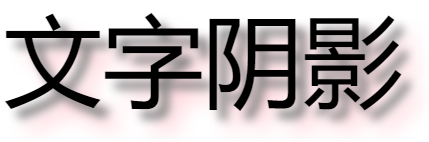

```html
<head>
	<meta charset="UTF-8">
	<title></title>
	<style type="text/css">
		*{
			margin: 0;
			padding: 0;
		}
		h1{
			text-align: center;
			font: 100px/200px "微软雅黑";
			text-shadow:10px 10px 10px gray,pink 20px 20px 20px;
		}
	</style>
</head>
<body>
	<h1>文字阴影</h1>
</body>
```


**浮雕文字**

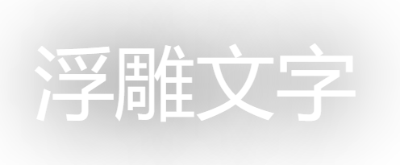

```html
<head>
	<meta charset="UTF-8">
	<title></title>
	<style type="text/css">
		*{
			margin: 0;
			padding: 0;
		}
		h1{
			text-align: center;
			font: 100px/200px "微软雅黑";
			color: white;
			text-shadow: black 1px 1px 100px;
		}
	</style>
</head>
<body>
	<h1>浮雕文字</h1>
</body>
```


**模糊文字**


```html
<head>
	<meta charset="UTF-8">
	<title></title>
	<style type="text/css">
		*{
			margin: 0;
			padding: 0;
		}
		h5{
			text-align: center;
			font: 50px/200px "微软雅黑";
			color: black;
			transition: 1s;
		}
		
		h5:hover{
			color: rgba(0,0,0,0);
			text-shadow: black 0 0 200px;
		}
	</style>
</head>
<body>
	<h5>文字模糊</h5>
</body>
```


#### 文字描边

只有webkit内核才支持：-webkit-text-stroke（准确的来说不能算是css3的东西）

```
-webkit-text-stroke: <length> <color>;
```

```css
#test { -webkit-text-stroke: 5px pink }
```


#### 文字排版

**direction**: 控制文字的方向。一定要配合 `unicode-bidi: bidi-override;` 来使用

**取值**

`ltr` ：默认属性。可设置文本和其他元素的默认方向是从左到右。

`rtl` ：可设置文本和其他元素的默认方向是从右到左。

```css
div {
  direction:rtl;
	unicode-bidi:bidi-override;
}
```


**text-overflow** : 确定如何向用户发出未显示的溢出内容信号。
       它可以被剪切，
       显示一个省略号（'...'）

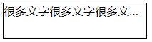

```css
<head>
<meta charset="utf-8">
<title>无标题文档</title>
<style>
	div{
		width: 200px;
		height: 50px;
		border: 1px solid;
		margin: 0 auto;
		/*下面4项属性时必须的*/
		display: block; /* display不为inline */;
		white-space: nowrap;
		overflow: hidden;
		text-overflow: ellipsis;
	}
</style>
</head>
<body>
	<div>很多文字很多文字很多文字很多文字很多文字很多文字很多文字很多文字很多文字很多文字很多文字</div>
</body>
```


### 盒模型新增样式

#### 盒模型阴影

**box-shadow** 
    以逗号分割列表来描述一个或多个阴影效果，可以用到几乎任何元素上。 如果元素同时设置了 border-radius，阴影也会有圆角效果。多个阴影时和多个 text shadows 规则相同(第一个阴影在最上面)。

默认值:  none    不可继承

值：
`inset`
默认阴影在边框外。
使用inset后，阴影在边框内。

`<offset-x>` `<offset-y>`
这是头两个 `<length>` 值，用来设置阴影偏移量。
`<offset-x>` 设置水平偏移量，如果是负值则阴影位于元素左边。
`<offset-y>` 设置垂直偏移量，如果是负值则阴影位于元素上面。
如果两者都是0，那么阴影位于元素后面。
这时如果设置了`<blur-radius>` 或`<spread-radius>` 则有模糊效果。

`<blur-radius>`
这是第三个 `<length>` 值。值越大，模糊面积越大，阴影就越大越淡。 
不能为负值。默认为0，此时阴影边缘锐利。

`<spread-radius>`
这是第四个 `<length>` 值。取正值时，阴影扩大；取负值时，阴影.收缩。默认为0，此时阴影与元素同样大。

`<color>`
阴影颜色，如果没有指定，则由浏览器决定

 **盒模型阴影**

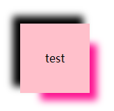

```html
<head>
	<meta charset="UTF-8">
	<title></title>
	<style type="text/css">
		*{
			margin: 0;
			padding: 0;
		}
		#test{
			box-shadow: -10px -10px 10px 0px black , 20px 20px 10px -10px deeppink;
			/* 垂直水平居中 */
			width: 100px;
			height: 100px;
			position: absolute;
			left: 0;
			right: 0;
			bottom: 0;
			top: 0;
			margin: auto;
			
			background: pink;
			text-align: center;
			line-height: 100px;
		}
	</style>
</head>
<body>
	<div id="test">test</div>
</body>
```


#### 倒影

-webkit-box-reflect  设置元素的倒影（准确的来说不能算是css3的东西）

默认值:none  不可继承

值：（必须是123的顺序）
倒影的方向
    第一个值，above, below, right, left
倒影的距离
    第二个值，长度单位
渐变
    第三个值


```html
<head>
	<meta charset="UTF-8">
	<title></title>
	<style type="text/css">
		*{
			margin: 0;
			padding: 0;
		}
		html,body{
			height: 100%;
		}
		body{
			text-align: center;
		}
		body:after{
			content: "";
			display: inline-block;
			height: 100%;
			vertical-align: middle;
		}
		img{
			vertical-align: middle;
			-webkit-box-reflect:left 10px;
		}
	</style>
</head>
<body>
	
</body>
```


#### resize

resize 是 CSS 属性允许你控制一个元素的可调整大小性。（一定要配合overflow：auto使用）

默认值：none  不可继承

值：
    none
       元素不能被用户缩放。 
    both
       允许用户在水平和垂直方向上调整元素的大小。
    horizontal
       允许用户在水平方向上调整元素的大小。
    vertical
       允许用户在垂直方向上调整元素的大小。

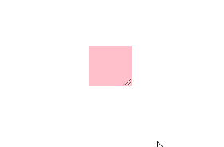

```html
<head>
	<meta charset="UTF-8">
	<title></title>
	<style type="text/css">
		*{
			margin: 0;
			padding: 0;
		}
		html,body{
			height: 100%;
		}
		body{
			text-align: center;
		}
		body:after{
			content: "";
			height: 100%;
			display: inline-block;
			vertical-align: middle;
		}
		div{
			display: inline-block;
			width: 200px;
			height: 200px;
			background: pink;
			vertical-align: middle;
			resize :both;
			overflow:auto;
		}
	</style>
</head>
<body>
	<div></div>
</body>
```


#### box-sizing

box-sizing 属性用于更改用于计算元素宽度和高度的默认的 CSS 盒子模型。可以使用此属性来模拟不正确支持CSS盒子模型规范的浏览器的行/列为。

默认值：content-box  不可继承

值
**content-box**
		默认值，标准盒子模型。 width 与 height 只包括内容的宽和高， 不包括边框（border），内边距（padding），外边距（margin）。注意: 内边距, 边框 & 外边距 都在这个盒子的外部。 比如. 如果 .box {width: 350px}; 而且 {border: 10px solid black;} 那么在浏览器中的渲染的实际宽度将是370px;
		尺寸计算公式：
			width = 内容的宽度，
			height = 内容的高度。
			宽度和高度都不包含内容的边框（border）和内边距（padding）。

**border-box**
	width 和 height 属性包括内容，内边距和边框，但不包括外边距。这是当文档处于 Quirks模式 时Internet Explorer使用的盒模型。
	这里的维度计算为：
		width = border + padding + 内容的  width，
		height = border + padding + 内容的 height。


### 新增UI样式

#### 圆角

传统的圆角生成方案，必须使用多张图片作为背景图案。CSS3圆角的出现，使得我们再也不必浪费时间去制作这些图片了，而且还有其他多个优点：

- 减少维护的工作量。图片文件的生成、更新、编写网页代码，这些工作都不再需要了。

　　* 提高网页性能。由于不必再发出多余的HTTP请求，网页的载入速度将变快。
　　* 增加视觉可靠性。某些情况下（网络拥堵、服务器出错、网速过慢等等），背景图片会下载失败，导致视觉效果不佳。CSS3就不会发生这种情况

**border-radius** 
    用来设置边框圆角。当使用一个半径时确定一个圆形；当使用两个半径时确定一个椭圆，这个(椭)圆与边框的交集形成圆角效果。


**默认值**  :  0      **不可继承**

**值**：
固定的px值定义圆形半径或椭圆的半长轴，半短轴。不能用负值
使用百分数定义圆形半径或椭圆的半长轴，半短轴。水平半轴相对于盒模型的宽度；垂直半轴相对于盒模型的高度。不能用负值
这是一个简写属性，用来设置 
	border-top-left-radius,
	border-top-right-radius,
	border-bottom-right-radius ，
	border-bottom-left-radius
半径的第一个语法取值可取1~4个值:
	border-radius: radius             
	border-radius: top-left-and-bottom-right      top-right-and-bottom-left 
	border-radius: top-left     top-right-and-bottom-left     bottom-right 
	border-radius: top-left     top-right     bottom-right      bottom-left 

半径的第二个语法取值也可取1~4个值
	border-radius: (first radius values) / radius             
	border-radius: (first radius values) / top-left-and-bottom-right      top-right-and-bottom-left 
	border-radius: (first radius values) / top-left     top-right-and-bottom-left     bottom-right 
	border-radius: (first radius values) / top-left     top-right     bottom-right       bottom-left 

**注意**
    百分比值
       在旧版本的 Chrome 和 Safari 中不支持。(fixed in Sepember 2010)
       在 11.50 版本以前的 Opera 中实现有问题。
       Gecko 2.0 (Firefox 4) 版本前实现不标准：水平半轴和垂直半轴都相对于盒子模型的宽度。
       在旧版本的 iOS (iOS 5 之前) 和 Android 中 (WebKit 532 之前) 不支持。


椭圆

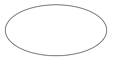

```html
<head>
	<meta charset="UTF-8">
	<title></title>
	<style type="text/css">
		*{
			margin: 0;
			padding: 0;
		}
		#test{
			width: 200px;
			height: 100px;
			border: 1px solid;
			position: absolute;
			left: 0;
			right: 0;
			top: 0;
			bottom: 0;
			margin: auto;
			border-radius:50%;
		}
	</style>
</head>
<body>
	<div id="test"></div>
</body>
```


**风车**


```html
<head>
	<meta charset="UTF-8">
	<title></title>
	<style type="text/css">
		*{
			margin: 0;
			padding: 0;
		}
		html,body{
			height: 100%;
			overflow: hidden;
		}
		
		#wrap{
			width: 100px;
			height: 100px;
			position: absolute;
			left: 0;
			right: 0;
			top: 0;
			bottom: 0;
			margin: auto;
			transition:2s;
			/* border: 1px solid; */
		}
		#wrap > div{
			margin: 5px;
			width: 40px;
			height: 40px;
			border: 1px solid;
			background: deeppink;
			float: left;
			box-sizing: border-box;
		}
		#wrap > div:nth-child(1),#wrap > div:nth-child(4){
			border-radius:0 60%;
		}
		#wrap > div:nth-child(2),#wrap > div:nth-child(3){
			border-radius:60% 0;
		}
		
		#wrap:hover{
			transform: rotate(360deg);
		}
	</style>
</head>
<body>
	<div id="wrap">
		<div></div>
		<div></div>
		<div></div>
		<div></div>
	</div>
</body>
```


**对话框**

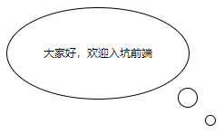

```html
<head>
	<meta charset="UTF-8">
	<title></title>
	<style type="text/css">
		*{
			margin: 0;
			padding: 0;
		}
		html,body{
			height: 100%;
			overflow: hidden;
		}
		
		#test{
			width: 200px;
			height: 100px;
			border: 1px solid;
			border-radius:50%;
			text-align: center;
			font: 12px helvetica;
			line-height: 100px;
			position: relative;
		}
		#test:after{
			position: absolute;
			display: block;
			content: "";
			width: 20px;
			height: 20px;
			border: 1px solid;
			bottom: -10px;
			right: -10px;
			border-radius:50%;
		}
		#test:before{
			position: absolute;
			display: block;
			content: "";
			width: 10px;
			height: 10px;
			border: 1px solid;
			bottom: -30px;
			right: -30px;
			border-radius:50%;
		}
	</style>
</head>
<body>
	<div id="test">大家好，欢迎入坑前端</div>
</body>
```


#### 边框图片

border-image CSS属性允许在元素的边框上绘制图像。。这使得绘制复杂的外观组件更加简单，使用 border-image 时，其将会替换掉 border-style 属性所设置的边框样式

默认值：              不可继承
   border-image-source: none
   border-image-slice: 100%
   border-image-width: 1
   border-image-outset: none
   border-image-repeat: stretch


##### border-image-source

border-image-source 属性定义使用一张图片来代替边框样式；如果只为none，则仍然使用border-style 定义的样式。

默认值：none   不可继承


##### border-image-slice

border-image-slice 属性会通过规范将 border-image-source  的图片明确的分割为9个区域：四个角，四边以及中心区域。
并可指定偏移量

默认值：100%    不可继承

值得百分比参照于image本身！

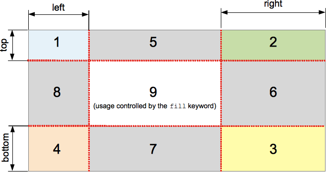


##### border-image-repeat

border-image-repeat 定义图片如何填充边框。或为单个值，设置所有的边框；或为两个值，分别设置水平与垂直的边框。

默认值：stretch  不可继承

值：
   stretch （拉伸）
   repeat，round（平铺）


##### border-image-width

border-image-width 定义图像边框宽度。 
默认值：1   不可继承


##### border-image-outset

border-image-outset属性定义边框图像可超出边框盒的大小

默认值：0  不可继承

正值： 可超出边框盒的大小


**边框图片**


```html
<head>
	<meta charset="UTF-8">
	<title></title>
	<style type="text/css">
		*{
			margin: 0;
			padding: 0;
		}
		
		#test{
			position: absolute;
			left: 0;
			right: 0;
			top: 0;
			bottom: 0;
			margin: auto;
			width: 60px;
			height: 60px;
			border: 10px solid;
			border-image-source:url(img/border-image.png);
			border-image-slice:33.3333%;
			border-image-repeat:round;
			border-image-width:20px;
			border-image-outset:10px;
		}
	</style>
</head>
<body>
	<div id="test"></div>
</body>
```


#### 背景

##### css2

###### background-color

background-color 会设置元素的背景色

默认值：  transparent    不可继承


###### background-image

background-image属性用于为一个元素设置一个或多个背景图像，图像在绘制时，以z轴方向堆叠的方式进行。先指定的图像会在之后指定的图像上面进行绘制。

注意：background-color会在image之下进行绘制，边框和内容会在image之上进行绘制

默认值：none   不可继承


###### background-repeat

background-repeat CSS 属性定义背景图像的重复方式。背景图像可以沿着水平轴，垂直轴，两个轴重复，或者根本不重复。

 默认值：repeat 不可继承

值： 
   repeat-x   =    repeat no-repeat
   repeat-y   =    no-repeat repeat
   repeat      =    repeat repeat 
   no-repeat  =    no-repeat no-repeat 

  第一个值代表水平方向。
  第二个值代表垂直方向。


###### background-position

指定背景位置的初始位置
默认值：0% 0%   不可继承

值：
   百分比：参照尺寸为背景图片定位区域的大小减去背景图片的大小  
          第一个值：元素在水平方向的位移
          第二个值：元素在垂直方向的位移 

   关键字：
       top left and left top
          Same as '0% 0%'.
       top, top center, and center top
          Same as '50% 0%'.
       right top and top right
           Same as '100% 0%'.
       left, left center, and center left
          Same as '0% 50%'.
       center and center center
          Same as '50% 50%'.
       right, right center, and center right
          Same as '100% 50%'.
       bottom left and left bottom
          Same as '0% 100%'.
       bottom, bottom center, and center bottom
          Same as '50% 100%'.
       bottom right and right bottom
          Same as '100% 100%'.

如果只有一个值被指定，则这个值就会默认设置背景图片位置中的水平方向，与此同时垂直方向的默认值被设置成50%。


###### background-attachment

background-attachment 决定背景是在视口中固定的还是随包含它的区块滚动的。

默认值：scroll 不可继承 

值：
   fixed
       此关键字表示背景相对于视口固定。即使一个元素拥有滚动机制，背景也不会随着元素的内容滚动 。
   scroll
       此关键字表示背景相对于元素本身固定， 而不是随着它的内容滚动

**文字的背景图**

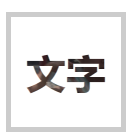


```html
<head>
	<meta charset="UTF-8">
	<title></title>
	<style type="text/css">
		*{
			margin: 0;
			padding: 0;
		}
		
		#test{
			/*
				* 默认情况下背景图片是从padding box开始绘制
								从border box开始剪裁	
				* */
			position: absolute;
			left: 0;
			right: 0;
			top: 0;
			bottom: 0;
			margin: auto;
			width: 100px;
			height: 100px;
			border: 5px solid rgba(0,0,0,.2);
			padding: 5px;
			background-color:pink ;
			background-repeat:repeat ;
			background-image:url(img/tg.png);
			background-origin:padding-box;
			-webkit-background-clip:text;
			font: bold 40px/100px "微软雅黑";
			text-align: center;
			color: rgba(0,0,0,.3);
		}
	</style>
</head>
<body>
	<div id="test">
		文字
	</div>
</body>
```


##### css3

###### background-origin

设置背景的渲染的起始位置
       border-box
       padding-box
       content-box

###### background-clip

设置背景裁剪位置

###### background-size 

background-size 设置背景图片大小

默认值：auto auto  不可继承

值：
   百分比：  指定背景图片相对背景区（background positioning area）的百分比。背景区由background-origin设置，默认为盒模型的内容区与内边距
   auto：  以背景图片的比例缩放背景图片。

注意：
  单值时，这个值指定图片的宽度，图片的高度隐式的为auto
  两个值: 第一个值指定图片的宽度，第二个值指定图片的高度      

###### background

background 是CSS简写属性，用来集中设置各种背景属性。background 可以用来设置一个或多个属性:background-color, background-image, background-position, background-repeat, background-size, background-attachment。 

默认值：    不可继承
background-image: none
background-position: 0% 0%
background-size: auto auto
background-repeat: repeat
background-origin: padding-box
background-clip: border-box
background-attachment: scroll
background-color: transparent

**顺序无关**


#### 渐变

CSS 渐变 是在 CSS3 Image Module 中新增加的图片类型；使用 CSS 渐变可以在两种颜色间制造出平滑的渐变效果. 用它代替图片，可以加快页面的载入时间、减小带宽占用。同时，因为渐变是由浏览器直接生成的，它在页面缩放时的效果比图片更好，因此你可以更加灵活、便捷的调整页面布局。


浏览器支持两种类型的渐变：线性渐变 (linear)，通过 linear-gradient 函数定义，以及 径向渐变 (radial)，通过 radial-gradient 函数定义.

##### 线性渐变

   为了创建一个线性渐变，你需要设置一个起始点和一个方向（指定为一个角度）。你还要定义终止色。终止色就是你想让浏览器去平滑的过渡过去，并且你必须指定至少两种，当然也会可以指定更多的颜色去创建更复杂的渐变效果。

-默认从上到下发生渐变
              linear-gradient(red,blue);

-改变渐变方向：（top bottom left right）
              linear-gradient(to 结束的方向,red,blue);

-使用角度
              linear-gradient(角度,red,blue);

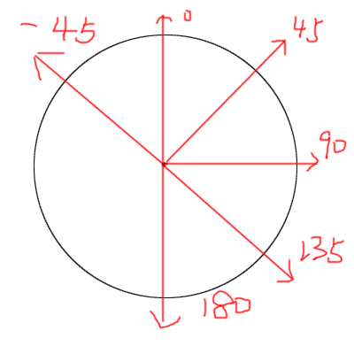

-颜色节点的分布（第一个不写为0%，最后一个不写为100%）
            linear-gradient(red 长度或者百分比,blue 长度或者百分比);
-重复渐变
           repeating-linear-gradient(60deg,red 0,blue 30%);


**颜色线性渐变**

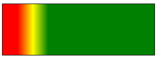

```css
background-image:linear-gradient(90deg,red 10%,yellow 20%,green 30%);
```


**纯颜色无渐变**

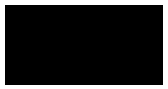

```css
background-image:linear-gradient(90deg,rgba(0,0,0,1) 100px,rgba(0,0,0,1) 300px);
```


**重复渐变**

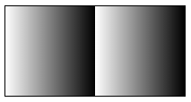

```css
background-image:repeating-linear-gradient(90deg,rgba(0,0,0,0),rgba(0,0,0,1) 100px);
```


**发廊灯**


```html
<head>
	<meta charset="UTF-8">
	<title></title>
	<style type="text/css">
		*{
			margin: 0;
			padding: 0;
		}
		
		html,body{
			height: 100%;
			overflow: hidden;
		}
		
		#wrap{
			width: 40px;
			height: 200px;
			border: 1px solid;
			margin: 100px auto;
			overflow: hidden;
		}
		#wrap > .inner{
			height: 400px;
			background:repeating-linear-gradient(135deg,black 0px,black 10px,white 10px,white 20px);
		}
		
	</style>
</head>
<body>
	<div id="wrap">
		<div class="inner"></div>
	</div>
</body>
<script type="text/javascript">
	var inner = document.querySelector("#wrap > .inner");
	var flag =0;
	
	setInterval(function(){
		flag++;
		if(flag==200){
			flag=0;
		}
		inner.style.marginTop = -flag+"px";
	},1000/60)
	
</script>
```


**光斑动画**


```html
<html>
	<head>
		<meta charset="UTF-8">
		<title></title>
		<style type="text/css">
			*{
				margin: 0;
				padding: 0;
			}
			
			html,body{
				height: 100%;
				overflow: hidden;
				background: black;
				text-align: center;
			}
			
			h1{
				/*transition: 3s;*/
				margin-top: 50px;
				display: inline-block;
				color: rgba(255, 255, 255,.3);
				font:bold 80px "微软雅黑";
				background: linear-gradient(120deg,rgba(255,255,255,0) 50px ,rgba(255,255,255,1) 100px ,rgba(255,255,255,0) 180px);
				background-repeat:no-repeat ;
				-webkit-background-clip: text ;
			}
			
			/*h1:hover{
				background-position: 500px 0;
			}*/
		</style>
	</head>
	<body>
		<h1>光斑动画</h1>
	</body>
	<script type="text/javascript">
		var h1 = document.querySelector("h1");
		var flag =-160;
		
		setInterval(function(){
			flag+=10;
			if(flag==400){
				flag=-160;
			}
			h1.style.backgroundPosition = flag+"px";
		},30)
		
	</script>
</html>
```


##### 径向渐变

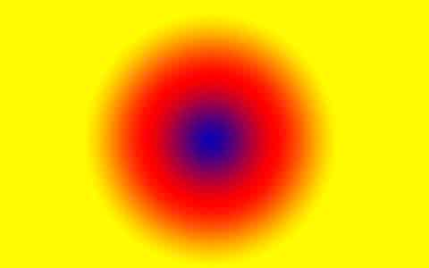

-默认均匀分布
   radial-gradient(red,blue);

-不均匀分布
    radial-gradient(red 50%,blue 70%);

-改变渐变的形状
  radial-gradient(circle ,red,blue)
   circle
   ellipse（默认为椭圆）

-渐变形状的大小
   radial-gradient(closest-corner  circle ,red,blue)
   closest-side   最近边
   farthest-side  最远边
   closest-corner 最近角
   farthest-corner 最远角  （默认值）

-改变圆心
    radial-gradient(closest-corner  circle at 10px 10px,red,blue);  


------

[^1]: AI是一种应用于出版、多媒体和在线图像的工业标准矢量插画的软件，是一款非常好的矢量图形处理工具。
[^2]: FontLab是一个专业级的字体编辑软件，广泛应用于字体 设计人员和排版印刷业等专业场合。它能够对已有的字体进行修改，也可以完全按照要求 重新设计需要的字体。


