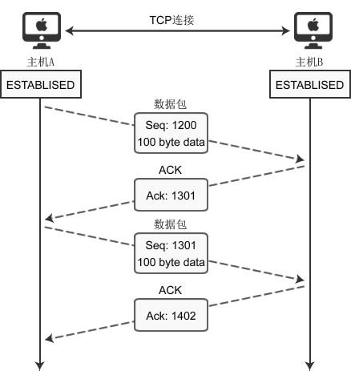
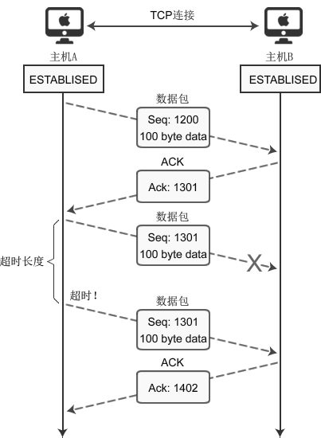
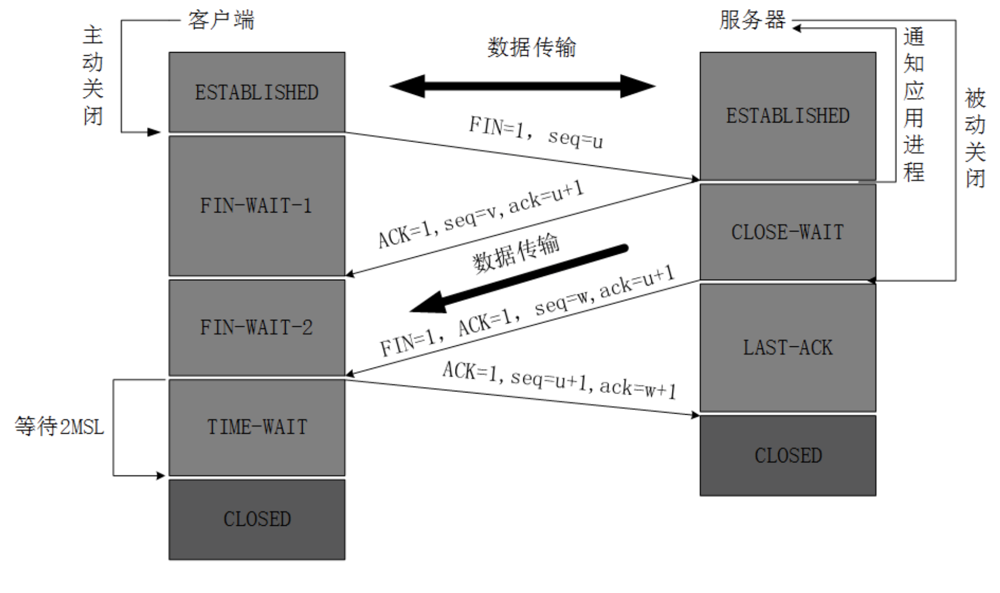
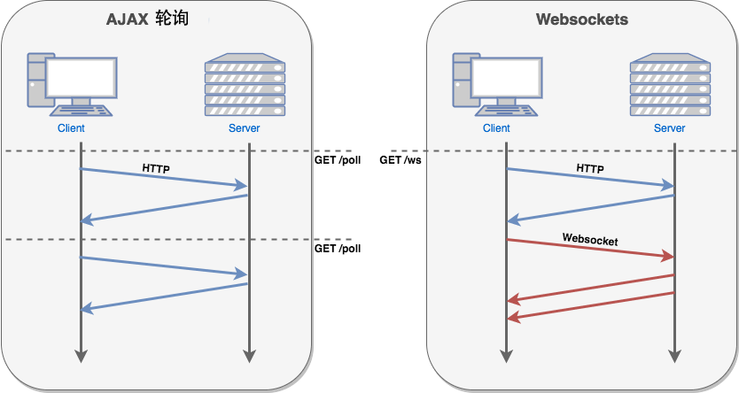

## 计算机网络体系结构（computer network architecture）

**OSI 的七层协议体系结构**（如下图（a））的概念清楚，理论也比较完整，但它既复杂又不实用。**TCP/IP 体系结构**则不同，但它现在却得到了非常广泛多的应用。TCP/IP 是一个四层的体系结构（如下图（b）），它包含**应用层**、**运输层**、**网际层**和**网络接口层**（用网际层这一个名字是强调这一层是为了解决不同网络的互连问题）。不过从实质上讲，TCP/IP 只有最上面的三层，因为最下面的网络接口层并没有什么具体内容。因此在学习计算机网路的原理时往往采取折中的办法，即综合 OSI 和 TCP/IP 的优点，采用一种只有**五层协议的体系结构**（如下图（c）），有时为了方便，也可把最底下两层称为网络接口层。


**OSI 的七层协议体系结构**

| OSI 的七层协议体系结构 | 功能                                                         | 设备           | 对应 TCP/IP 协议                         |
| ---------------------- | ------------------------------------------------------------ | -------------- | ---------------------------------------- |
| 应用层                 | 用户接口、应用程序（文件传输，电子邮件，文件服务，虚拟终端） | 网关           | TFTP, HTTP, SNMP, FTP, SMTP, DNS, Telnet |
| 表示层                 | 数据的表示、压缩和加密（数据格式化，代码转换，数据加密）     | 网关           | 没有协议                                 |
| 会话层                 | 会话的建立和结束（接触或建立与别的节点的联系）               | 网关           | 没有协议                                 |
| 传输层                 | 提供端对端的接口                                             | 网关           | TCP, UDP                                 |
| 网络层                 | 为数据包选择路由，寻址                                       | 网关           | IP, ICMP, RIP, OSPF, BGP, IGMP           |
| 数据链路层             | 保证误差错的数据链路，传输有地址的帧以及错误检测功能         | 交换机、网桥   | SLIP, CSLIP, PPP, ARP, RARP, MTU         |
| 物理层                 | 传输比特流，以二进制数据形式在物理媒体上传输数据             | 集线器、中继器 | ISO2110, IEEE802, IEEE802.2              |


**TCP/IP 体系结构**

| TCP/IP 体系结构 | 协议                                                         |
| --------------- | ------------------------------------------------------------ |
| 应用层          | Telnet（远程登录协议）, FTP（文件传输协议）, SMTP（简单邮件传输协议）, SNMP（简单网络管理协议），DNS（域名系统） |
| 传输层          | TCP（传输控制协议）, UDP（用户数据报协议）                   |
| 网络层          | IP（网际协议）, ICMP（Internet控制报文协议）, IGMP（Internet 组管理协议） |
| 数据链路层      | ARP（地址解析协议）, RARP（反向地址转换协议）                |


### 五层协议的体系结构

#### **应用层**（application layer）

应用层是体系结构中的最高层。应用层的任务是通过**应用进程间的交互**来完成特定网络应用。应用层协议定义的是**应用进程间通信和交互的规则**。这里的**进程**就是指主机中正在运行的程序。

不同的网络应用需要不同的协议，如万维网应用的**HTTP协议**，支持电子邮件的**SMTP协议**，支持文件传送的**FTP协议**等


#### **运输层**（transport layer）

运输层的任务是负责为两个主机中进程之间的通信提供**通用的数据传输服务**。应用进程利用该服务传送应用层报文。所谓“通用”，是指并不针对某个特定网络的应用。而是多种应用可以使用同一个运输层服务。

由于一台主机可同时运行多个进程，因此运输层有**复用**和**分用**的功能。复用就是多个应用层进程可同时使用下面运输层的服务，分用和复用相反，是运输层把收到的信息分别交付上面应用应用层中的相应进程。

运输层主要使用以下两种协议：

**传输控制协议TCP (Transmission Control Protocol)** （提供面向连接的，可靠的数据传输服务，数据传输的单位是报文段）

**用户数据报协议UDP (User Datagram Protocol)**（提供无连接的，尽最大努力交付，其数据传输的单位是用户数据报）


#### 网络层 (network layer)

网络层为分组交换网上不同主机提供通信服务。网络层将运输层产生的报文段或用户数据报封装成分组和包进行传送。


#### 数据链路层 (data link layer)

数据链路层常称为**链路层**。两台主机间的数据传输，总是一段一段在数据链路上传送的，这就需要使用专门的链路层协议。在两个相邻结点传送数据时，数据链路层将网路层叫下来的 IP 数据报组装成**帧**（framing）。在两个相邻节点间的链路上传送帧，每一帧包括数据和必要的**控制信息**（如同步信息，地址信息，差错控制等）

三个基本问题：封装成帧，透明传输，差错检测


#### 物理层 (physical layer)

在物理层上所传数据单位是比特。如发送1（或0）时候，接收方也必须是1或者0。因此物理层要考虑用多大的电压代表“1” 或 “0”，以及接收方如何识别出发送方的比特。物理层还要确定链接电缆的插头应当有多少根引脚以及个引脚应如何连接。需要注意的是传递信息的一些物理媒体，如双绞线，同轴电缆等，并不在物理层而是在物理层之下。


在互联网锁使用的各种协议中，最重要的和最著名的就是 TCP 和 IP 两个协议。现在人们经常提到的 TCP/IP 并不一定是单指 TCP 和 IP 这两个具体的协议，而往往是表示互联网所使用的整个 **TCP/IP 协议族(protocol suite)**。


## TCP三次握手和四次挥手

TCP有6种标示:  SYN(建立联机) 、ACK(确认)、 PSH(传送)、 FIN(结束)、 RST(重置)、 URG(紧急) 

### TCP三次握手  


**第一次握手**

客户端向服务器发出连接请求报文，这时报文首部中的同部位SYN=1，同时随机生成初始序列号 seq=x，此时，TCP客户端进程进入了 SYN-SENT（同步已发送状态）状态。TCP规定，SYN报文段（SYN=1的报文段）不能携带数据，但需要消耗掉一个序号。这个三次握手中的开始。表示客户端想要和服务端建立连接。


**第二次握手**

TCP服务器收到请求报文后，如果同意连接，则发出确认报文。确认报文中应该 ACK=1，SYN=1，确认号是ack=x+1，同时也要为自己随机初始化一个序列号 seq=y，此时，TCP服务器进程进入了SYN-RCVD（同步收到）状态。这个报文也不能携带数据，但是同样要消耗一个序号。这个报文带有SYN(建立连接)和ACK(确认)标志，询问客户端是否准备好。


**第三次握手**

TCP客户进程收到确认后，还要向服务器给出确认。确认报文的ACK=1，ack=y+1，此时，TCP连接建立，客户端进入ESTABLISHED（已建立连接）状态。

TCP规定，ACK报文段可以携带数据，但是如果不携带数据则不消耗序号。这里客户端表示我已经准备好。


>**思考：为什么要三次握手呢，有人说两次握手就好了**
>
>举例：已失效的连接请求报文段。
>
>client发送了第一个连接的请求报文，但是由于网络不好，这个请求没有立即到达服务端，而是在某个网络节点中滞留了，直到某个时间才到达server，本来这已经是一个失效的报文，但是server端接收到这个请求报文后，还是会想client发出确认的报文，表示同意连接。
>
>假如不采用三次握手，那么只要server发出确认，新的建立就连接了，但其实这个请求是失效的请求，client是不会理睬server的确认信息，也不会向服务端发送确认的请求，但是server认为新的连接已经建立起来了，并一直等待client发来数据，这样，server的很多资源就没白白浪费掉了，采用三次握手就是为了防止这种情况的发生，server会因为收不到确认的报文，就知道client并没有建立连接。这就是三次握手的作用。


### TCP数据的传输过程

建立连接后，两台主机就可以相互传输数据了。如下图所示：



  **1）**主机A初始seq为1200,滑动窗体为100,向主机B传递数据的过程。

  **2）**假设主机B在完全成功接收数据的基础上,那么主机B为了确认这一点，向主机A发送 ACK 包，并将 Ack 号设置为 1301。因此按如下的公式确认 Ack 号：

​       Ack号 = Seq号 + 传递的字节数 + 1 （这是在完全接受成功的情况下）

  **3）**主机A获得B传来的ack(1301)后,开始发送seq为1301,滑动窗体为100的数据。
       ......

与三次握手协议相同，最后加 1 是为了告诉对方要传递的 Seq 号。上面说了，主机B完全成功接收A发来的数据才是这样的,如果存在丢包该如何。

 下面分析传输过程中数据包丢失的情况，如下图所示



上图表示通过 Seq 1301 数据包向主机B传递100字节的数据，但中间发生了错误，主机B未收到。经过一段时间后，主机A仍未收到对于 Seq 1301 的ACK确认，因此尝试

重传数据。为了完成数据包的重传，TCP套接字每次发送数据包时都会启动定时器，如果在一定时间内没有收到目标机器传回的 ACK 包，那么定时器超时，数据包会重传。

上面也只是一种可能,比如数据1250丢失,那么Ack返回的就是1250,具体的可以详细看下博客：[【TCP协议】（1）---TCP协议详解](https://www.cnblogs.com/qdhxhz/p/10267932.html),这里面滑动窗口有说明。


### TCP的四次挥手  



**第一次握手**  

TCP发送一个**FIN(结束)**，用来关闭客户到服务端的连接。

客户端进程发出连接释放报文，并且停止发送数据。释放数据报文首部，FIN=1，其序列号为seq=u（等于前面已经传送过来的数据的最后一个字节的序号加1），此时，客户端进入FIN-WAIT-1（终止等待1）状态。 TCP规定，FIN报文段即使不携带数据，也要消耗一个序号。


**第二次握手**

服务端收到这个FIN，他发回一个**ACK(确认)，**确认收到序号为收到序号+1，和SYN一样，一个FIN将占用一个序号。

服务器收到连接释放报文，发出确认报文，ACK=1，ack=u+1，并且带上自己的序列号seq=v，此时，服务端就进入了CLOSE-WAIT（关闭等待）状态。TCP服务器通知高层的应用进程，客户端向服务器的方向就释放了，这时候处于半关闭状态，即客户端已经没有数据要发送了，但是服务器若发送数据，客户端依然要接受。这个状态还要持续一段时间，也就是整个CLOSE-WAIT状态持续的时间。

客户端收到服务器的确认请求后，此时，客户端就进入FIN-WAIT-2（终止等待2）状态，等待服务器发送连接释放报文（在这之前还需要接受服务器发送的最后的数据）。


**第三次握手**

服务端发送一个**FIN(结束)**到客户端，服务端关闭客户端的连接。

服务器将最后的数据发送完毕后，就向客户端发送连接释放报文，FIN=1，ack=u+1，由于在半关闭状态，服务器很可能又发送了一些数据，假定此时的序列号为seq=w，此时，服务器就进入了LAST-ACK（最后确认）状态，等待客户端的确认。


**第四次握手**

客户端发送**ACK(确认)**报文确认，并将确认的序号+1，这样关闭完成。

客户端收到服务器的连接释放报文后，必须发出确认，ACK=1，ack=w+1，而自己的序列号是seq=u+1，此时，客户端就进入了TIME-WAIT（时间等待）状态。注意此时TCP连接还没有释放，必须经过2∗∗MSL（最长报文段寿命）的时间后，当客户端撤销相应的TCB后，才进入CLOSED状态。

服务器只要收到了客户端发出的确认，立即进入CLOSED状态。同样，撤销TCB后，就结束了这次的TCP连接。可以看到，服务器结束TCP连接的时间要比客户端早一些。

>思考：那么为什么是4次挥手呢？
>
>为了确保数据能够完成传输。
>
>​      关闭连接时，当收到对方的FIN报文通知时，它仅仅表示对方没有数据发送给你了；但未必你所有的数据都全部发送给对方了，所以你可以未必会马上会关闭SOCKET,也即你可能还需要发送一些数据给对方之后，再发送FIN报文给对方来表示你同意现在可以关闭连接了，所以它这里的ACK报文和FIN报文多数情况下都是分开发送的。
>
>可能有人会有疑问，tcp我握手的时候为何ACK(确认)和SYN(建立连接)是一起发送。挥手的时候为什么是分开的时候发送呢.
>
>因为当Server端收到Client端的SYN连接请求报文后，可以直接发送SYN+ACK报文。其中ACK报文是用来应答的，SYN报文是用来同步的。但是关闭连接时，当Server端收到FIN报文时，很可能并不会立即关闭 SOCKET，所以只能先回复一个ACK报文，告诉Client端，"你发的FIN报文我收到了"。只有等到我Server端所有的报文都发送完了，我才能发送FIN报文，因此不能一起发送。故需要四步握手。


>思考:客户端突然挂掉了怎么办？
>
>正常连接时，客户端突然挂掉了，如果没有措施处理这种情况，那么就会出现客户端和服务器端出现长时期的空闲。解决办法是在服务器端设置保活计时器，每当服务器收到
>
>客户端的消息，就将计时器复位。超时时间通常设置为2小时。若服务器超过2小时没收到客户的信息，他就发送探测报文段。若发送了10个探测报文段，每一个相隔75秒，还没有响应就认为客户端出了故障，因而终止该连接。


## HTTP协议

### 概要

**定义**

HTTP（HyperText Transfer Protocol，超文本传输协议）最早就是计算机与计算机之间沟通的一种标准协议，这种协议限制了通讯内容的格式以及各项内容的含义。

随着时代的发展，技术的变迁，这种协议现在广泛的应用在各种领域，也不仅仅局限于计算机与计算机之间，手机、电视等各种智能设备很多时候都在使用这种协议通讯，所以一般现在称 HTTP 为端与端之间的通讯协议。
Web 属于 B/S 架构的应用软件，在 B/S 架构中，浏览器与服务器沟通的协议就是 HTTP 协议，作为一个合格的Web 开发者，了解 HTTP 协议中约定的内容是一门必修课。

>应用软件架构一般分为两类：
>B/S 架构：Browser（浏览器） ←→ Server（服务器），这种软件都是通过浏览器访问一个网站使用，
>服务器提供数据存储等服务。
>C/S 架构：Client（客户端） ←→ Server（服务器），这种软件通过安装一个软件到电脑，然后使用，
>服务器提供数据存储等服务。


**约定内容**

请求 / 响应报文格式
请求方法 —— GET / POST
响应状态 —— 200 / 404 / 302 / 304
预设的请求 / 响应头


**约定形式**

1. 客户端通过随机端口与服务端某个固定端口（一般为80）建立连接 三次握手
2. 客户端通过这个连接发送请求到服务端（这里的请求是名词）
3. 服务端监听端口得到的客户端发送过来的请求
4. 服务端通过连接响应给客户端状态和内容


### 核心概念

#### 报文

##### **请求报文**


**请求行**
`GET /demo.php HTTP/1.1`

请求方式 + 空格 + 请求路径 + 空格 + HTTP 协议版本


**请求头**

客户端想要告诉服务端的一些额外信息，以下为常见的请求头：

| 键              | 值                                      |
| --------------- | --------------------------------------- |
| Host            | 请求的主机                              |
| Cache-Control   | 控制缓存（例如：max-age=60 缓存 60 秒） |
| Accept          | 客户端想要接收的文档类型，逗号分隔      |
| User-Agent      | 标识什么客户端帮你发送的这次请求        |
| Referer         | 这次请求的来源                          |
| Accept-Encoding | 可以接受的压缩编码                      |
| Cookie          | 客户端本地的小票信息                    |

**请求体**
这次请求客户端想要发送给服务端的数据正文，一般在 GET 请求时很少用到，因为 GET 请求主观上都是去“拿东西”。


##### 响应报文


**状态行**
`HTTP/1.1 200 OK`

HTTP 协议版本 + 空格 + 状态码 + 空格 + 状态描述


**响应头**

服务端想要告诉客户端的一些额外信息，常见的有以下：

| 键             | 值                   |
| -------------- | -------------------- |
| Date           | 响应时间             |
| Server         | 服务器信息           |
| Content-Type   | 响应体的内容类型     |
| Content-Length | 响应的内容大小       |
| Set-Cookie     | 让客户端设置一个小票 |

如果需要在程序中设置自定义的响应头（不是预设的），建议使用 X-Property-Name

**响应体**

这次请求服务端想要返回给客户端的数据正文，一般返回的都是 HTML，也可以返回 JavaScript 或者 CSS（需要修改响应头中的响应类型）。

**应用场景**

- 设置响应文件类型

  - `header('Content-Type: text/css')` ;
  - HTTP MIME type 指的就是 像 text/css, text/html ,text/plain, applcation/javascript

- 重定向（跳转到其他网页）

  - header('Location: https://www.baidu.com');

- 下载文件

- 图片防盗链

  - 通过判断请求来源 Referer 是否为本网站从而区分是否是合法请求

    

#### 请求方式

根据 HTTP 标准，HTTP 请求可以使用多种请求方法。

HTTP1.0 定义了三种请求方法： GET, POST 和 HEAD方法。

HTTP1.1 新增了六种请求方法：OPTIONS、PUT、PATCH、DELETE、TRACE 和 CONNECT 方法。

| 序号 | 方法    | 描述                                                         |
| :--- | :------ | :----------------------------------------------------------- |
| 1    | GET     | 请求指定的页面信息，并返回实体主体。                         |
| 2    | HEAD    | 类似于 GET 请求，只不过返回的响应中没有具体的内容，用于获取报头 |
| 3    | POST    | 向指定资源提交数据进行处理请求（例如提交表单或者上传文件）。数据被包含在请求体中。POST 请求可能会导致新的资源的建立和/或已有资源的修改。 |
| 4    | PUT     | 从客户端向服务器传送的数据取代指定的文档的内容。             |
| 5    | DELETE  | 请求服务器删除指定的页面。                                   |
| 6    | CONNECT | HTTP/1.1 协议中预留给能够将连接改为管道方式的代理服务器。    |
| 7    | OPTIONS | 允许客户端查看服务器的性能。                                 |
| 8    | TRACE   | 回显服务器收到的请求，主要用于测试或诊断。                   |
| 9    | PATCH   | 是对 PUT 方法的补充，用来对已知资源进行局部更新 。           |

> http://www.w3school.com.cn/tags/html_ref_httpmethods.asp
> http://www.runoob.com/http/http-methods.html


#### HTTP状态码分类

HTTP状态码由三个十进制数字组成，第一个十进制数字定义了状态码的类型，后两个数字没有分类的作用。HTTP状态码共分为5种类型：

| 分类 | 类别                            | 分类描述                               |
| :--- | ------------------------------- | :------------------------------------- |
| 1xx  | Informational (信息性状态码)    | 服务器收到请求，需要请求者继续执行操作 |
| 2xx  | Success (成功状态码)            | 操作被成功接收并处理                   |
| 3xx  | Redirection (重定向状态码)      | 需要进一步的操作以完成请求             |
| 4xx  | Client Error (客户端错误状态码) | 请求包含语法错误或无法完成请求         |
| 5xx  | Server Error (服务器错误状态码) | 服务器在处理请求的过程中发生了错误     |


#### 常见的HTTP状态码

<escape>

  <table>
    <caption>HTTP状态码列表</caption>
    <tbody>
      <tr>
        <th nowrap>状态码类别</th>
        <th>状态码</th>
        <th>中文描述</th>
      </tr>
      <tr>
        <td rowspan="2">1xx</td>
        <td>100 Continue</td>
        <td>继续。客户端应继续其请求</td>
      </tr>
      <tr>
        <td>101 Switching Protocols</td>
        <td>切换协议。服务器根据客户端的请求切换协议。只能切换到更高级的协议，例如，切换到HTTP的新版本协议</td>
      </tr>
      <tr>
        <td colspan="3"></td>
      </tr>
      <tr>
        <td rowspan="3">2xx</td>
        <td>200 OK</td>
        <td>请求成功。一般用于GET与POST请求</td>
      </tr>
      <tr>
        <td>204 No Content</td>
        <td>无内容。服务器成功处理，但未返回内容。在未更新网页的情况下，可确保浏览器继续显示当前文档</td>
      </tr>
      <tr>
        <td>206 Partial Content</td>
        <td>部分内容。服务器成功处理了部分GET请求</td>
      </tr>
      <tr>
        <td colspan="3"></td>
      </tr>
      <tr>
        <td rowspan="8">3xx</td>
        <td>300 Multiple Choices</td>
        <td>多种选择。请求的资源可包括多个位置，相应可返回一个资源特征与地址的列表用于用户终端（例如：浏览器）选择</td>
      </tr>
      <tr>
        <td>301 Moved Permanently</td>
        <td>永久移动。请求的资源已被永久的移动到新URI，返回信息会包括新的URI，浏览器会自动定向到新URI。今后任何新的请求都应使用新的URI代替</td>
      </tr>
      <tr>
        <td>302 Found</td>
        <td>临时移动。与301类似。但资源只是临时被移动。客户端应继续使用原有URI</td>
      </tr>
      <tr>
        <td>303 See Other</td>
        <td>查看其它地址。与301类似。使用GET和POST请求查看</td>
      </tr>
      <tr>
        <td>304 Not Modified</td>
        <td>未修改。所请求的资源未修改，服务器返回此状态码时，不会返回任何资源。客户端通常会缓存访问过的资源，通过提供一个头信息指出客户端希望只返回在指定日期之后修改的资源</td>
      </tr>
      <tr>
        <td>305 Use Proxy</td>
        <td>使用代理。所请求的资源必须通过代理访问</td>
      </tr>
      <tr>
        <td>306 Unused</td>
        <td>已经被废弃的HTTP状态码</td>
      </tr>
      <tr>
        <td>307 Temporary Redirect</td>
        <td>临时重定向。与302类似。使用GET请求重定向</td>
      </tr>
      <tr>
        <td colspan="3"></td>
      </tr>
      <tr>
        <td rowspan="4">4xx</td>
        <td>400 Bad Request</td>
        <td>客户端请求的语法错误，服务器无法理解</td>
      </tr>
      <tr>
        <td>401 Unauthorized</td>
        <td>请求要求用户的身份认证</td>
      </tr>
      <tr>
        <td>403 Forbidden</td>
        <td>服务器理解请求客户端的请求，但是拒绝执行此请求</td>
      </tr>
      <tr>
        <td>404 Not Found</td>
        <td>服务器无法根据客户端的请求找到资源（网页）。通过此代码，网站设计人员可设置"您所请求的资源无法找到"的个性页面</td>
      </tr>
      <tr>
        <td colspan="3"></td>
      </tr>
      <tr>
        <td rowspan="3">5xx</td>
        <td nowrap>500 Internal Server Error</td>
        <td>服务器内部错误，无法完成请求</td>
      </tr>
      <tr>
        <td nowrap>502 Bad Gateway</td>
        <td>作为网关或者代理工作的服务器尝试执行请求时，从远程服务器接收到了一个无效的响应</td>
      </tr>
      <tr>
        <td nowrap>503 Service Unavailable</td>
        <td>由于超载或系统维护，服务器暂时的无法处理客户端的请求。延时的长度可包含在服务器的Retry-After头信息中</td>
      </tr>
    </tbody>
  </table>

</escape>

------


### 比较 GET 与 POST

- *GET* - 从指定的资源请求数据。
- *POST* - 向指定的资源提交要被处理的数据


**GET 方法**

请注意，查询字符串（名称/值对）是在 GET 请求的 ==URL== 中发送的：

```http
GET /test/demo_form.asp?name1=value1&name2=value2 HTTP/1.1
```


**POST 方法**

请注意，查询字符串（名称/值对）是在 POST 请求的 HTTP ==消息主体==中发送的：

```http
POST /test/demo_form.asp HTTP/1.1
Host: w3schools.com
name1=value1&name2=value2
```


下面的表格比较了两种 HTTP 方法：GET 和 POST。

|                  | GET                                                          | POST                                                         |
| :--------------- | :----------------------------------------------------------- | :----------------------------------------------------------- |
| 后退按钮/刷新    | 无害                                                         | 数据会被重新提交（浏览器应该告知用户数据会被重新提交）。     |
| 书签             | 可收藏为书签                                                 | 不可收藏为书签                                               |
| 缓存             | **能被缓存**                                                 | **不能缓存**                                                 |
| 编码类型         | application/x-www-form-urlencoded                            | application/x-www-form-urlencoded 或 multipart/form-data。为二进制数据使用多重编码。 |
| 历史             | 参数保留在浏览器历史中。                                     | 参数不会保存在浏览器历史中。                                 |
| 对数据长度的限制 | 是的。当发送数据时，GET 方法向 URL 添加数据；URL 的长度是受限制的（URL 的最大长度是 2048 个字符）。 | 无限制。                                                     |
| 对数据类型的限制 | 只允许 ASCII 字符。                                          | 没有限制。也允许二进制数据。                                 |
| 安全性           | 与 POST 相比，GET 的安全性较差，因为所发送的数据是 URL 的一部分。在发送密码或其他敏感信息时绝不要使用 GET ！ | POST 比 GET 更安全，因为参数不会被保存在浏览器历史或 web 服务器日志中。 |
| 可见性           | 数据在 URL 中对所有人都是可见的。                            | 数据不会显示在 URL 中。                                      |


## Cookie

HTTP 很重要的一个特点就是无状态（每一次见面都是“初次见面”），如果单纯的希望通过我们的服务端程序去记住每一个访问者是不可能的，所以必须借助一些手段或者说技巧让服务端记住客户端，这种手段就是 Cookie。


Cookie 就像是在超级市场买东西拿到的小票，由超市（Server）发给消费者（Browser），超市方面不用记住每一个消费者的脸，但是他们认识消费者手里的小票（Cookie），可以通过小票知道消费者之前的一些消费信息（在服务端产生的数据）。


**为 Cookie 服务的首部字段**

| 首部字段名 | 说明                             | 首部类型     |
| ---------- | -------------------------------- | ------------ |
| Set-Cookie | 开始状态管理所使用的 Cookie 信息 | 响应首部字段 |
| Cookie     | 服务器接收到的 Cookie 信息       | 请求首部字段 |


### Set-Cookie (响应首部字段)

> Set-Cookie: name=value; expires=Tue,10 Oct 2017 16:14:47 GMT;path=/;domain=example.com


**Set-Cookie 字段的属性**

| 属性           | 说明                                                         |
| -------------- | ------------------------------------------------------------ |
| NAME = VALUE   | 赋予 Cookie 的名称和其值                                     |
| expires = DATE | Cookie 的有效期（若不明确指定则默认为浏览器关闭前为止）      |
| path = PATH    | 将服务器上的文件目录作为 Cookie 的适用对象（若不制定则默认为文档所在的文件目录） |
| domain = 域名  | 作为 Cookie 使用对象的域名（若不指定则默认为创建 Cookie 的服务器的域名） |
| Secure         | 仅在 HTTPS 安全通信时才会发送 Cookie                         |
| HttpOnly       | 加以限制，使 Cookie 不能被 Javascript 脚本访问               |


### Cookie (请求首部字段)

> Cookie: name = value


**JavaScript 中操作 Cookie**

> 参考：http://www.runoob.com/js/js-cookies.html

```js
// 新增一条 cookie，注意：cookie 是有大小限制，约为 4k
// 格式固定：<key>=<value>[; expires=<GMT格式时间>][; path=<作用路径>][; domain=<作用域名>]
// 除了键值以外其余属性均有默认值，可以省略
// expires 表示 cookie 失效的时间，默认为关闭浏览器时
// path 表示 cookie 生效的路径，默认为当路径
// / /foo.php /abc/foo.php
// /foo /bar/abc.php
// domain 表示 cookie 生效的域名，默认为当前域名

document.cookie = 'name=value; expires=Tue,10 Oct 2017 16:14:47 GMT;path=/;domain=example.com'
// 获取全部 cookie

console.log(document.cookie)
// => 'key1=value1; key2=value2'
// 得到的结果是字符串，需要自己通过字符串操作解析

```


**jQuery plugin**

> https://github.com/carhartl/jquery-cookie


**without jQuery**

> https://github.com/js-cookie/js-cookie


## Session

由于 Cookie 是服务端下发给客户端由客户端本地保存的。换而言之客户端可以在本地对其随意操作，包括删除和修改。如果客户端随意伪造一个 Cookie 的话，对于服务端是无法辨别的，就会造成服务端被蒙蔽，构成安全隐患。于是乎就有了另外一种基于 Cookie 基础之上的手段：Session。

**session id**是一个会话的key，浏览器第一次访问服务器会在服务器端生成一个session，服务器会为该Session生成唯一的Session id。

session在访问tomcat 服务器HttpServletRequest的getSession(true)的时候 创建，tomcat的ManagerBase类提供创建sessionid的方法： 随机数+时间+jvmid；

存储在服务器的内存中，tomcat的StandardManager类将session 存储在内存中，也可以持久化到file，数据库，memcache，redis等。 **客户端只保存sessionid到cookie中**，而不会保存session，**session销毁只能通过invalidate或超时，关掉浏览器并不会关闭session**。

> ​         那么Session在何时创建呢？当然还是在服务器端程序运行的过程中创建的，不同语言实现的应用程序有不同创建Session的方法，而在Java中是通过调用HttpServletRequest的getSession方法（使用true作为参数）创建的。session在访问tomcat **服务器**HttpServletRequest的getSession(true)的时候 **创建；
>
> ​         在创建了Session的同时，服务器会为该Session生成**唯一**的Session id，而这个Session id在随后的请求中会被用来重新获得已经创建的Session；
>
> ​         在Session被创建之后，就可以调用Session相关的方法往Session中增加内容了，而这些内容只会**保存在服务器中**，发到**客户端的只有Session id**；当客户端再次发送请求的时候，会将这个Session id带上，服务器接受到请求之后就会依据Session id找到相应的Session，从而再次使用之。

- **创建**：sessionid第一次产生是在直到某server端程序调用 HttpServletRequest.getSession(true)这样的语句时才被创建。

- **删除**：超时；程序调用HttpSession.invalidate()；程序关闭；

- **session的存放**：服务器端的内存中。不过session可以通过特殊的方式做持久化管理（memcache，redis）。

- **session的id是从哪里来的**：session id 是如何使用的：当客户端第一次请求session对象时候，服务器会为客户端创建一个session，并将通过特殊算法算出一个session的ID，用来标识该session对象


Session 区别于 Cookie 一个很大的地方就是：Session 数据存在了服务端，而 Cookie 存在了客户端本地，存在服务端最大的优势就是，不是用户想怎么改就怎么改了。

Session 这种机制会更加适合于存放一些属于用户而又不能让用户修改的数据，因为客户端不再保存具体的数据，
只是保存一把“钥匙”，伪造一把可以用的钥匙，可能性是极低的，所以不需要在意。


## Json Web Token

JSON Web Token（JWT）是目前最流行的跨域身份验证解决方案。jwt 教程请看：[JSON Web Token 入门教程](http://www.ruanyifeng.com/blog/2018/07/json_web_token-tutorial.html)

### 跨域认证的问题

互联网服务离不开用户认证。一般流程是下面这样。

> 1、用户向服务器发送用户名和密码。
>
> 2、服务器验证通过后，在当前对话（session）里面保存相关数据，比如用户角色、登录时间等等。
>
> 3、服务器向用户返回一个 session_id，写入用户的 Cookie。
>
> 4、用户随后的每一次请求，都会通过 Cookie，将 session_id 传回服务器。
>
> 5、服务器收到 session_id，找到前期保存的数据，由此得知用户的身份。

**这种模式的弊端**

- 服务器压力增大

  通常session是存储在内存中的，每个用户通过认证之后都会将session数据保存在服务器的内存中，而当用户量增大时，服务器的压力增大。

- CSRF跨站伪造请求攻击

  session是基于cookie进行用户识别的, cookie如果被截获，用户就会很容易受到跨站请求伪造的攻击。

- 扩展性不强

  如果将来搭建了多个服务器，虽然每个服务器都执行的是同样的业务逻辑，但是session数据是保存在内存中的（不是共享的），用户第一次访问的是服务器1，当用户再次请求时可能访问的是另外一台服务器2，服务器2获取不到session信息，就判定用户没有登陆过

这种模式的问题在于，扩展性（scaling）不好。单机当然没有问题，如果是服务器集群，或者是跨域的服务导向架构，就要求 session 数据共享，每台服务器都能够读取 session。

举例来说，A 网站和 B 网站是同一家公司的**关联服务**。现在要求，用户只要在其中一个网站登录，再访问另一个网站就会**自动登录**，请问怎么实现？

一种解决方案是 **session 数据持久化**，写入数据库或别的持久层。各种服务收到请求后，都向持久层请求数据。这种方案的优点是架构清晰，缺点是工程量比较大。另外，持久层万一挂了，就会单点失败。

另一种方案是服务器索性不保存 session 数据了，所有数据都保存在客户端，每次请求都发回服务器。JWT 就是这种方案的一个代表。


### JWT实现认证流程


>  1.前端输入用户名、密码后台登录
>
>   2.后端根据用户ID生成Token、返回给前端
>
>   3.前端ajax请求、通过header头部设置 Authorization ：token
>
>   4.后端通过Filter、拦截所有请求、处理请求是否合法（token失效、token为空、token过期）


### JWT 认证机制

token与session的不同主要在：

①认证成功后，会对当前用户数据（如，用户ID）进行加密，生成一个加密字符串token，返还给客户端（服务器端并不进行保存）

②浏览器会将接收到的token值存储在Local Storage中，（通过js代码写入Local Storage，通过js获取，并不会像cookie一样自动携带）

③再次访问时服务器端对token值的处理：服务器对浏览器传来的token值进行解密，解密完成后进行用户数据的查询，如果查询成功，则通过认证，实现状态保持，所以，即时有了多台服务器，服务器也只是做了token的解密和用户数据的查询，它不需要在服务端去保留用户的认证信息或者会话信息，这就意味着基于token认证机制的应用不需要去考虑用户在哪一台服务器登录了，这就为应用的扩展提供了便利，解决了session扩展性的弊端。


## cookie与session的区别

1、cookie数据存放在客户端上，session数据放在服务器上。

2、cookie不是很安全，别人可以分析存放在本地的COOKIE并进行COOKIE欺骗
   考虑到安全应当使用session。

3、session会在一定时间内保存在服务器上。当访问增多，会比较占用你服务器的性能
   考虑到减轻服务器性能方面，应当使用COOKIE。

4、单个cookie保存的数据不能超过4K，很多浏览器都限制一个站点最多保存20个cookie。

5、所以个人建议：
   将登陆信息等重要信息存放为SESSION
   其他信息如果需要保留，可以放在COOKIE中


## HTTPS

**HTTP**（HyperText Transfer Protocol：超文本传输协议）是一种用于分布式、协作式和超媒体信息系统的应用层协议。 简单来说就是一种发布和接收 HTML 页面的方法，被用于在 Web 浏览器和网站服务器之间传递信息。

HTTP 默认工作在 TCP 协议 **80** 端口，用户访问网站 **http://** 打头的都是标准 HTTP 服务。

HTTP 协议以明文方式发送内容，不提供任何方式的数据加密，如果攻击者截取了Web浏览器和网站服务器之间的传输报文，就可以直接读懂其中的信息，因此，HTTP协议不适合传输一些敏感信息，比如：信用卡号、密码等支付信息。

**HTTPS**（Hypertext Transfer Protocol Secure：超文本传输安全协议）是一种透过计算机网络进行安全通信的传输协议。HTTPS 经由 HTTP 进行通信，但利用 SSL/TLS 来加密数据包。HTTPS 开发的主要目的，是提供对网站服务器的身份认证，保护交换数据的隐私与完整性。

HTTPS 默认工作在 TCP 协议 **443** 端口，它的工作流程一般如以下方式：

- TCP 三次同步握手
- 客户端验证服务器数字证书
- DH 算法协商对称加密算法的密钥、hash 算法的密钥
- SSL 安全加密隧道协商完成
- 网页以加密的方式传输，用协商的对称加密算法和密钥加密，保证数据机密性；用协商的hash算法进行数据完整性保护，保证数据不被篡改。

> HTTPS = HTTP + 加密 + 认证 + 完整性保护


**1、客户端发起 HTTPS 请求**

这个没什么好说的，就是用户在浏览器里输入一个 https 网址，然后连接到 server 的 443 端口。

**2、服务端的配置**

采用 HTTPS 协议的服务器必须要有一套数字证书，可以自己制作，也可以向组织申请，区别就是自己颁发的证书需要客户端验证通过，才可以继续访问，而使用受信任的公司申请的证书则不会弹出提示页面(startssl 就是个不错的选择，有 1 年的免费服务)。

这套证书其实就是一对公钥和私钥，如果对公钥和私钥不太理解，可以想象成一把钥匙和一个锁头，只是全世界只有你一个人有这把钥匙，你可以把锁头给别人，别人可以用这个锁把重要的东西锁起来，然后发给你，因为只有你一个人有这把钥匙，所以只有你才能看到被这把锁锁起来的东西。

**3、传送证书**

这个证书其实就是公钥，只是包含了很多信息，如证书的颁发机构，过期时间等等。

**4、客户端解析证书**

这部分工作是有客户端的TLS来完成的，首先会验证公钥是否有效，比如颁发机构，过期时间等等，如果发现异常，则会弹出一个警告框，提示证书存在问题。

如果证书没有问题，那么就生成一个随机值，然后用证书对该随机值进行加密，就好像上面说的，把随机值用锁头锁起来，这样除非有钥匙，不然看不到被锁住的内容。

**5、传送加密信息**

这部分传送的是用证书加密后的随机值，目的就是让服务端得到这个随机值，以后客户端和服务端的通信就可以通过这个随机值来进行加密解密了。

**6、服务端解密信息**

服务端用私钥解密后，得到了客户端传过来的随机值(私钥)，然后把内容通过该值进行对称加密，所谓对称加密就是，将信息和私钥通过某种算法混合在一起，这样除非知道私钥，不然无法获取内容，而正好客户端和服务端都知道这个私钥，所以只要加密算法够彪悍，私钥够复杂，数据就够安全。

**7、传输加密后的信息**

这部分信息是服务段用私钥加密后的信息，可以在客户端被还原。

**8、客户端解密信息**

客户端用之前生成的私钥解密服务段传过来的信息，于是获取了解密后的内容，整个过程第三方即使监听到了数据，也束手无策。


**HTTP 与 HTTPS 区别**

> - HTTP 明文传输，数据都是未加密的，安全性较差，HTTPS（SSL+HTTP） 数据传输过程是加密的，安全性较好。
> - 使用 HTTPS 协议需要到 CA（Certificate Authority，数字证书认证机构） 申请证书，一般免费证书较少，因而需要一定费用。证书颁发机构如：Symantec、Comodo、GoDaddy 和 GlobalSign 等。
> - HTTP 页面响应速度比 HTTPS 快，主要是因为 HTTP 使用 TCP 三次握手建立连接，客户端和服务器需要交换 3 个包，而 HTTPS除了 TCP 的三个包，还要加上 ssl 握手需要的 9 个包，所以一共是 12 个包。
> - http 和 https 使用的是完全不同的连接方式，用的端口也不一样，前者是 80，后者是 443。
> - HTTPS 其实就是建构在 SSL/TLS 之上的 HTTP 协议，所以，要比较 HTTPS 比 HTTP 要更耗费服务器资源。


## WebSocket

WebSocket 是 HTML5 开始提供的一种在单个 TCP 连接上进行全双工通讯的协议。

WebSocket 使得客户端和服务器之间的数据交换变得更加简单，允许服务端主动向客户端推送数据。在 WebSocket API 中，浏览器和服务器只需要完成一次握手，两者之间就直接可以创建持久性的连接，并进行双向数据传输。

在 WebSocket API 中，浏览器和服务器只需要做一个握手的动作，然后，浏览器和服务器之间就形成了一条快速通道。两者之间就直接可以数据互相传送。

现在，很多网站为了实现推送技术，所用的技术都是 Ajax 轮询。轮询是在特定的的时间间隔（如每1秒），由浏览器对服务器发出HTTP请求，然后由服务器返回最新的数据给客户端的浏览器。这种传统的模式带来很明显的缺点，即浏览器需要不断的向服务器发出请求，然而HTTP请求可能包含较长的头部，其中真正有效的数据可能只是很小的一部分，显然这样会浪费很多的带宽等资源。

HTML5 定义的 WebSocket 协议，能更好的节省服务器资源和带宽，并且能够更实时地进行通讯



浏览器通过 JavaScript 向服务器发出建立 WebSocket 连接的请求，连接建立以后，客户端和服务器端就可以通过 TCP 连接直接交换数据。

当你获取 Web Socket 连接后，你可以通过 **send()** 方法来向服务器发送数据，并通过 **onmessage** 事件来接收服务器返回的数据。

以下 API 用于创建 WebSocket 对象。

```js
var Socket = new WebSocket(url, [protocol] );
```

以上代码中的第一个参数 url, 指定连接的 URL。第二个参数 protocol 是可选的，指定了可接受的子协议。


**WebSocket 属性**

以下是 WebSocket 对象的属性。假定我们使用了以上代码创建了 Socket 对象：

| 属性                  | 描述                                                         |
| :-------------------- | :----------------------------------------------------------- |
| Socket.readyState     | 只读属性 **readyState** 表示连接状态，可以是以下值：0 - 表示连接尚未建立。1 - 表示连接已建立，可以进行通信。2 - 表示连接正在进行关闭。3 - 表示连接已经关闭或者连接不能打开。 |
| Socket.bufferedAmount | 只读属性 **bufferedAmount** 已被 send() 放入正在队列中等待传输，但是还没有发出的 UTF-8 文本字节数。 |

------


**WebSocket 事件**

以下是 WebSocket 对象的相关事件。假定我们使用了以上代码创建了 Socket 对象：

| 事件    | 事件处理程序     | 描述                       |
| :------ | :--------------- | :------------------------- |
| open    | Socket.onopen    | 连接建立时触发             |
| message | Socket.onmessage | 客户端接收服务端数据时触发 |
| error   | Socket.onerror   | 通信发生错误时触发         |
| close   | Socket.onclose   | 连接关闭时触发             |

------


**WebSocket 方法**

以下是 WebSocket 对象的相关方法。假定我们使用了以上代码创建了 Socket 对象：

| 方法           | 描述             |
| :------------- | :--------------- |
| Socket.send()  | 使用连接发送数据 |
| Socket.close() | 关闭连接         |


Websocket 使用 ws 或 wss 的统一资源标志符，类似于 HTTPS，其中 wss 表示在 TLS 之上的 Websocket。如：

```
ws://example.com/wsapi
wss://secure.example.com/
```

Websocket 使用和 HTTP 相同的 TCP 端口，可以绕过大多数防火墙的限制。默认情况下，Websocket 协议使用 80 端口；运行在 TLS 之上时，默认使用 443 端口。

**一个典型的Websocket握手请求如下：**

客户端请求

```
GET / HTTP/1.1
Upgrade: websocket
Connection: Upgrade
Host: example.com
Origin: http://example.com
Sec-WebSocket-Key: sN9cRrP/n9NdMgdcy2VJFQ==
Sec-WebSocket-Version: 13
```

服务器回应

```
HTTP/1.1 101 Switching Protocols
Upgrade: websocket
Connection: Upgrade
Sec-WebSocket-Accept: fFBooB7FAkLlXgRSz0BT3v4hq5s=
Sec-WebSocket-Location: ws://example.com/
```

- Connection 必须设置 Upgrade，表示客户端希望连接升级。
- Upgrade 字段必须设置 Websocket，表示希望升级到 Websocket 协议。
- Sec-WebSocket-Key 是随机的字符串，服务器端会用这些数据来构造出一个 SHA-1 的信息摘要。把 “Sec-WebSocket-Key” 加上一个特殊字符串 “258EAFA5-E914-47DA-95CA-C5AB0DC85B11”，然后计算 SHA-1 摘要，之后进行 BASE-64 编码，将结果做为 “Sec-WebSocket-Accept” 头的值，返回给客户端。如此操作，可以尽量避免普通 HTTP 请求被误认为 Websocket 协议。
- Sec-WebSocket-Version 表示支持的 Websocket 版本。RFC6455 要求使用的版本是 13，之前草案的版本均应当弃用。
- Origin 字段是可选的，通常用来表示在浏览器中发起此 Websocket 连接所在的页面，类似于 Referer。但是，与 Referer 不同的是，Origin 只包含了协议和主机名称。
- 其他一些定义在 HTTP 协议中的字段，如 Cookie 等，也可以在 Websocket 中使用。


 **websocket 与 socket 的区别**

> 软件通信有七层结构，下三层结构偏向与数据通信，上三层更偏向于数据处理，中间的传输层则是连接上三层与下三层之间的桥梁，每一层都做不同的工作，上层协议依赖与下层协议。基于这个通信结构的概念。
>
> Socket 其实并不是一个协议，是应用层与 TCP/IP 协议族通信的中间软件抽象层，它是一组接口。当两台主机通信时，让 Socket 去组织数据，以符合指定的协议。TCP 连接则更依靠于底层的 IP 协议，IP 协议的连接则依赖于链路层等更低层次。
>
> WebSocket 则是一个典型的应用层协议。
>
> 总的来说：Socket 是传输控制层协议，WebSocket 是应用层协议。


## 参考

> https://www.cnblogs.com/qdhxhz/p/8470997.html
>
> https://www.runoob.com/w3cnote/http-vs-https.html
>
> https://www.runoob.com/html/html5-websocket.html
>
> [JSON Web Token 入门教程](http://www.ruanyifeng.com/blog/2018/07/json_web_token-tutorial.html)
>
> [前后端分离-通过header传递token实现认证](https://blog.csdn.net/qq_18549249/article/details/81329654)
>
> [10分钟了解JSON Web令牌（JWT）](https://baijiahao.baidu.com/s?id=1608021814182894637&wfr=spider&for=pc)
>
> [前后端分离-通过header传递token实现认证](https://blog.csdn.net/qq_18549249/article/details/81329654)


