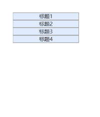
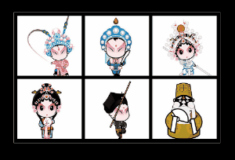
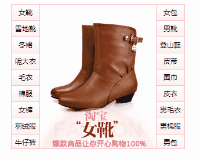
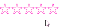
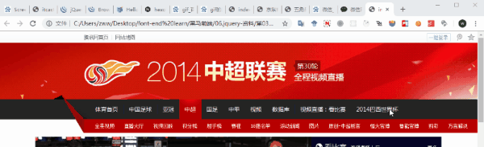
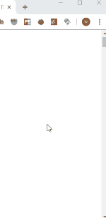
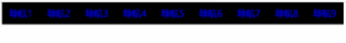

## 下拉菜单

效果：点击某个菜单标题时会弹出对应的菜单栏

思路：给所有的标题span注册点击事件，让当前span的兄弟div显示出来，其他标题span的div隐藏起来。



```html
<!DOCTYPE html>
<html>
<head lang="en">
  <meta charset="UTF-8">
  <title></title>
  <style type="text/css">
    * {padding: 0;margin: 0;}
    ul { list-style-type: none;}
    
    .parentWrap {
      width: 200px;
      text-align:center;
      margin: 100px auto 0;
    }
    
    .menuGroup {
      border:1px solid #999;
      background-color:#e0ecff;
    }
    
    .groupTitle {
      display:block;
      height:20px;
      line-height:20px;
      font-size: 16px;
      border-bottom:1px solid #ccc;
      cursor:pointer;
    }
    
    .menuGroup > div {
      height: 200px;
      background-color:#fff;
      display:none;
    }
  
  </style>
  
  <script src="jquery-1.12.4.js"></script>
  <script>
      $(function () {
          //思路分析：
          //1. 给所有的span注册点击事件，让当前span的兄弟div显示出来
          $(".groupTitle").click(function () {
            //下一个兄弟：nextElementSibling
            
            //链式编程：在jQuery里面，方法可以一直调用下去。
            $(this).next().slideDown(200).parent().siblings().children("div").slideUp(200);
          });
      });
  </script>
</head>
<body>
<ul class="parentWrap">
  <li class="menuGroup">
    <span class="groupTitle">标题1</span>
    <div>我是弹出来的div1</div>
  </li>
  <li class="menuGroup">
    <span class="groupTitle">标题2</span>
    <div>我是弹出来的div2</div>
  </li>
  <li class="menuGroup">
    <span class="groupTitle">标题3</span>
    <div>我是弹出来的div3</div>
  </li>
  <li class="menuGroup">
    <span class="groupTitle">标题4</span>
    <div>我是弹出来的div4</div>
  </li>
</ul>
</body>
</html>
```


## 突出显示

效果：鼠标悬浮某个图片时，其他图片变暗，离开所有图片时，所有图片变亮

思路：当鼠标移动到某个图片时，触发该图片的mouseenter(jq的事件函数)事件，将该图片的opaci设为1，其他图片设为0.4。



```html
<!DOCTYPE html>
<html>
<head lang="en">
  <meta charset="UTF-8">
  <title>突出显示</title>
  <style type="text/css">
    * {
      margin: 0;
      padding: 0;
    }
    
    ul {
      list-style: none;
    }
    
    body {
      background: #000;
    }
    
    .wrap {
      margin: 100px auto 0;
      width: 630px;
      height: 394px;
      padding: 10px 0 0 10px;
      background: #000;
      overflow: hidden;
      border: 1px solid #fff;
    }
    
    .wrap li {
      float: left;
      margin: 0 10px 10px 0;
      
    }
    
    .wrap img {
      display: block;
      border: 0;
    }
  </style>
  
  <script src="../jquery-1.12.4.js"></script>
  <script>
    $(function () {
      
      $(".wrap>ul>li").mouseenter(function () {
        
        $(this).css("opacity", "1").siblings().css("opacity", "0.4");
      });
      
      $(".wrap").mouseleave(function () {
        //让所有的li都变亮
        //$("li");
        //$(".wrap li");
        //$(".wrap>ul>li")
        
        //$(this).children().children("li");
        $(this).find('li').css("opacity", 1);
      });
    });
  </script>
  
</head>
<body>
<div class="wrap">
  <ul>
    <li><a href="#"></a></li>
    <li><a href="#"></a></li>
    <li><a href="#"></a></li>
    <li><a href="#"></a></li>
    <li><a href="#"></a></li>
    <li><a href="#"></a></li>
  </ul>
</div>
</body>
</html>
```


## 电商精品

效果：在左右栏中，鼠标悬浮某个商品名称，中间那一栏切换为对应的图片。

思路：鼠标悬浮某个商品名（li标签）时，取出该li标签的索引，然后中间栏显示对应索引的img。（jq：index、siblings、show、hide）





```html
<!DOCTYPE html>
<html>
<head lang="en">
  <meta charset="UTF-8">
  <title></title>
  <style type="text/css">
    * {
      margin: 0;
      padding: 0;
      font-size: 12px;
    }
    
    ul {
      list-style: none;
    }
    
    a {
      text-decoration: none;
    }
    
    .wrapper {
      width: 298px;
      height: 248px;
      margin: 100px auto 0;
      border: 1px solid pink;
      overflow: hidden;
    }
    
    #left, #center, #right {
      float: left;
    }
    
    #left li, #right li {
      background: url(images/lili.jpg) repeat-x;
    }
    
    #left li a, #right li a {
      display: block;
      width: 48px;
      height: 27px;
      border-bottom: 1px solid pink;
      line-height: 27px;
      text-align: center;
      color: black;
    }
    
    #left li a:hover, #right li a:hover {
      background-image: url(images/abg.gif);
    }
    
    #center {
      border-left: 1px solid pink;
      border-right: 1px solid pink;
    }
  </style>
  
  <script src="../jquery-1.12.4.js"></script>
  <script>
    $(function () {
      
      //找不到对象
      $(function () {
        $("#left>li").mouseenter(function () {
          $("#center>li:eq(" + $(this).index() + ")").show().siblings().hide();
        });
        $("#right>li").mouseenter(function () {
          $("#center>li").eq($(this).index() + 9).show().siblings().hide();
        });
      })
    });
    
    //      $("#left>li").mouseenter(function () {
    //        //让center中对应下标的li显示，其他li隐藏
    //        var idx = $(this).index();
    //        $("#center>li:eq(" + idx + ")").show().siblings().hide();
    //      });
    //
    //      $("#right>li").mouseenter(function () {
    //        var idx = $(this).index() + 9;
    //        $("#center>li").eq(idx).show().siblings().hide();
    //
    //        //$("#center>li").eq(idx)  :jq对象
    //        //$("#center>li").get(idx);：js对象
    //      });
    //    });
  </script>

</head>
<body>
<div class="wrapper">
  
  <ul id="left">
    <li><a href="#">女靴</a></li>
    <li><a href="#">雪地靴</a></li>
    <li><a href="#">冬裙</a></li>
    <li><a href="#">呢大衣</a></li>
    <li><a href="#">毛衣</a></li>
    <li><a href="#">棉服</a></li>
    <li><a href="#">女裤</a></li>
    <li><a href="#">羽绒服</a></li>
    <li><a href="#">牛仔裤</a></li>
  </ul>
  <ul id="center">
    <li><a href="#"></a></li>
    <li><a href="#"></a></li>
    <li><a href="#"></a></li>
    <li><a href="#"></a></li>
    <li><a href="#"></a></li>
    <li><a href="#"></a></li>
    <li><a href="#"></a></li>
    <li><a href="#"></a></li>
    <li><a href="#"></a></li>
    <li><a href="#"></a></li>
    <li><a href="#"></a></li>
    <li><a href="#"></a></li>
    <li><a href="#"></a></li>
    <li><a href="#"></a></li>
    <li><a href="#"></a></li>
    <li><a href="#"></a></li>
    <li><a href="#"></a></li>
    <li><a href="#"></a></li>
  
  </ul>
  <ul id="right">
    <li><a href="#">女包</a></li>
    <li><a href="#">男靴</a></li>
    <li><a href="#">登山鞋</a></li>
    <li><a href="#">皮带</a></li>
    <li><a href="#">围巾</a></li>
    <li><a href="#">皮衣</a></li>
    <li><a href="#">男毛衣</a></li>
    <li><a href="#">男棉服</a></li>
    <li><a href="#">男包</a></li>
  </ul>

</div>
</body>
</html>
```


## 轮播图

效果：点击左右切换按钮，进行图片切换

思路：设置变量count，点击左右按钮时，触发点击事件，对count（小于图片数目）进行自减或自加，然后显示对应的li（含有img），其他li隐藏。（jq：fadeIn、fadeOut、siblings、eq）。


## 五角星评分

效果：悬浮在某个五角星，其之前的所有五角星也会高亮，之后的五角星还是原样（空心），当点击该五角星时，则在它前面的五角星也会被选中，起到评分的作用。

思路：给`li`标签注册注册经过事件（`mouseenter`），利用`prevAll()`将自己和前面的兄弟都变成实心，给`ul`注册鼠标离开时间，让所有的`li`都变成空心；并且给`li`注册点击事件，当某个`li`标签被点击时，则给该标签添加`current`类名，兄弟`li`删除`current`类名。



```html
<!DOCTYPE html>
<html lang="en">

<head>
  <meta charset="UTF-8">
  <title>五角星评分案例</title>
  <style>
    * {
      padding: 0;
      margin: 0;
    }
    
    .comment {
      font-size: 40px;
      color: #ff16cf;
    }
    
    .comment li {
      float: left;
    }
    
    ul {
      list-style: none;
    }
  </style>
  <script src="jquery-1.12.4.js"></script>
  <script>
    $(function () {
      
      //1. 给li注册鼠标经过事件，让自己和前面所有的兄弟都变成实心
      var wjx_k = "☆";
      var wjx_s = "★";
      $(".comment>li").on("mouseenter", function () {
        $(this).text(wjx_s).prevAll().text(wjx_s);
        $(this).nextAll().text(wjx_k);
      });
      
      //2. 给ul注册鼠标离开时间，让所有的li都变成空心
      $(".comment").on("mouseleave", function () {
        $(this).children().text(wjx_k);
        
        //再做一件事件，找到current，让current和current前面的变成实心就行。
        $("li.current").text(wjx_s).prevAll().text(wjx_s);
      });
      
      //3. 给li注册点击事件
      $(".comment>li").on("click", function () {
        $(this).addClass("current").siblings().removeClass("current");
      });
      
      
    });
  </script>
</head>
<body>
<ul class="comment">
  <li>☆</li>
  <li>☆</li>
  <li>☆</li>
  <li>☆</li>
  <li>☆</li>
</ul>
</body>
</html>

```


## 固定导航栏

效果：当滑动条滑到一定距离时，导航栏固定在顶部，不会消失

思路：当滑动条滑动的距离大于等于内容部分到达页面顶部的距离时，将导航部分利用fixed固定到页面顶部。



```html
<!DOCTYPE html>
<html>
<head lang="en">
  <meta charset="UTF-8">
  <title>固定导航栏</title>
  <style>
    * {
      margin: 0;
      padding: 0
    }
    
    img {
      vertical-align: top;
    }
    
    .main {
      margin: 10px auto 0;
      width: 1000px;
    }
    
    .fixed {
      position: fixed;
      top: 0;
      left: 0;
    }
  </style>
  
  <script src="../jquery-1.12.4.js"></script>
  <script>
    $(function () {
      
      $(window).scroll(function () {
        //判断卷去的高度超过topPart的高度
        //1. 让navBar有固定定位
        //2. 让mainPart有一个marginTop
        if($(window).scrollTop() >= $(".top").height() ){
          $(".nav").addClass("fixed");
          $(".main").css("marginTop", $(".nav").height() + 10);
        }else {
          $(".nav").removeClass("fixed");
          $(".main").css("marginTop", 10);
        }
        
      });
      
    });
  </script>

</head>
<body>
<div class="top" id="topPart">
  
</div>
<div class="nav" id="navBar">
  
</div>
<div class="main" id="mainPart">
  
</div>
</body>
</html>

```


## 置顶按钮

效果：将页面滑下一定距离时，出现置顶按钮，点击该按钮，将页面置顶

思路：利用`$(window).scrollTop()`判定滑下的距离是否超过预定的值，如果超过，则用`fadeIn`把置顶按钮逐渐淡出，点击按钮，则将html或者body的scrollTop设为0进行置顶。




## 钢琴版导航条

效果：鼠标悬浮某导航栏，则该导航栏播放对应的曲调

思路：当鼠标悬浮某个导航栏时，则该导航栏下面的对应的标签滑至顶部，并且播放对应的音乐。（animate、stop）




```html
<!DOCTYPE html>
<html lang="en">
<head>
  <meta charset="UTF-8">
  <title>Title</title>
  <style>
    * {
      margin: 0;
      padding: 0;
      list-style: none;
    }
    
    .nav {
      width: 900px;
      height: 60px;
      background-color: black;
      margin: 0 auto;
    }
    
    .nav li {
      width: 100px;
      height: 60px;
      /*border: 1px solid yellow;*/
      float: left;
      position: relative;
      overflow: hidden;
    }
    
    .nav a {
      position: absolute;
      width: 100%;
      height: 100%;
      font-size: 24px;
      color: blue;
      text-align: center;
      line-height: 60px;
      text-decoration: none;
      z-index: 2;
    }
    
    .nav span {
      position: absolute;
      width: 100%;
      height: 100%;
      background-color: yellow;
      top: 60px;
    }
  </style>
  <script src="../jquery-1.12.4.js"></script>
  <script>
    $(function () {
      //给li注册鼠标进入事件,让li下面的span top：0  播放音乐
      $(".nav li").mouseenter(function () {
        $(this).children("span").stop().animate({top: 0});
        //播放音乐
        var idx = $(this).index();
        $(".nav audio").get(idx).load();
        $(".nav audio").get(idx).play();
      }).mouseleave(function () {
        $(this).children("span").stop().animate({top: 60});
      });
      
      //节流阀  ：按下的时候，触发，如果没弹起，不让触发下一次
      //1. 定义一个flag
      var flag = true;
      
      
      //按下1-9这几个数字键，能触发对应的mouseenter事件
      $(document).on("keydown", function (e) {
        if(flag) {
          flag = false;
          //获取到按下的键
          var code = e.keyCode;
          if(code >= 49 && code <= 57){
            //触发对应的li的mouseenter事件
            $(".nav li").eq(code - 49).mouseenter();
          }
        }
       
      });
  
      $(document).on("keyup", function (e) {
        flag = true;
        
        //获取到按下的键
        var code = e.keyCode;
        if(code >= 49 && code <= 57){
          //触发对应的li的mouseenter事件
          $(".nav li").eq(code - 49).mouseleave();
        }
      });
      
      
      //弹起的时候，触发mouseleave事件
      
    });
  </script>
</head>
<body>
<div class="nav">
  <ul>
    <li>
      <a href="javascript:void(0);">导航1</a>
      <span></span>
    </li>
    <li><a href="javascript:void(0);">导航2</a><span></span></li>
    <li><a href="javascript:void(0);">导航3</a><span></span></li>
    <li><a href="javascript:void(0);">导航4</a><span></span></li>
    <li><a href="javascript:void(0);">导航5</a><span></span></li>
    <li><a href="javascript:void(0);">导航6</a><span></span></li>
    <li><a href="javascript:void(0);">导航7</a><span></span></li>
    <li><a href="javascript:void(0);">导航8</a><span></span></li>
    <li><a href="javascript:void(0);">导航9</a><span></span></li>
  </ul>
  
  <div>
    <audio src="mp3/1.ogg"></audio>
    <audio src="mp3/2.ogg"></audio>
    <audio src="mp3/3.ogg"></audio>
    <audio src="mp3/4.ogg"></audio>
    <audio src="mp3/5.ogg"></audio>
    <audio src="mp3/6.ogg"></audio>
    <audio src="mp3/7.ogg"></audio>
    <audio src="mp3/8.ogg"></audio>
    <audio src="mp3/9.ogg"></audio>
  </div>
</div>
</body>
</html>
```

