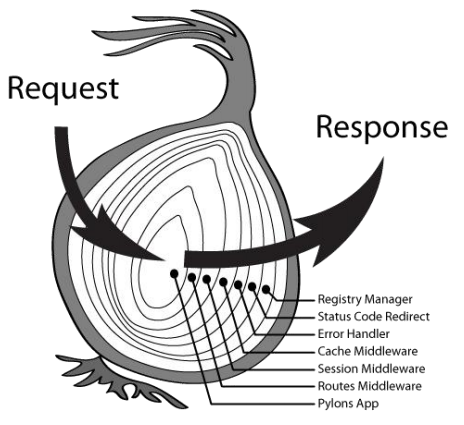
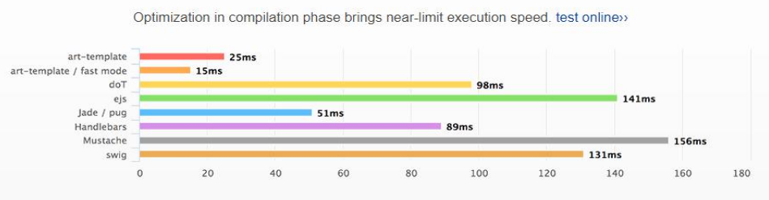
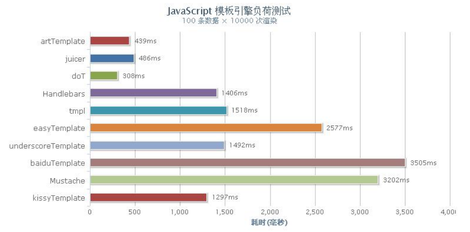

## Koa 框架介绍以及 Koa2.x 环境搭建

> [TOC]

### Koa 框架介绍

Node.js 是一个异步的世界，官方 API 支持的都是 callback 形式的异步编程模型，这会带来许多问题，例如：1、callback 嵌套问题 2、异步函数中可能同步调用 callback 返回数据，带来不一致性。为了解决以上问题 Koa 出现了。

**Koa -- 基于 Node.js 平台的下一代 web 开发框架**
koa 是由 Express 原班人马打造的，致力于成为一个更小、更富有表现力、更健壮的Web 框架。 使用 koa 编写 web 应用，可以免除重复繁琐的回调函数嵌套， 并极大地提升错误处理的效率。koa 不在内核方法中绑定任何中间件， 它仅仅提供了一个轻量优雅的函数库，使得编写 Web 应用变得得心应手。**开发思路和 express 差不多**，**最大的特点**就是可以**避免异步嵌套**。

> 早在 2011 年的就已经开始在生产环境中使用。
> 众所周知，在阿里的技术栈中， Java 是最最核心的，那 Node.js 扮演怎么样的一个角色呢？
> 1、基础设施大部分采用 Java 实现，变化较少，有事务要求的 Business Services 通常使用 Java。
> 2、而 Node.js 则替代过去 PHP/Java Web 的场景，用在需要快速迭代，需求变化非常快的用户侧。
> 3、很多内部的工程化支撑系统也逐渐基于 Node.js 了。
> 据不完全统计，目前阿里 Node.js 的开发者几百号人，线上的应用也非常之多，仅次于 Java 应用，光对外服务的进程数就超过 1w+。
> 阿里内部就在使用 Koa 框架，并在 Koa 基础上面做了一些扩展和封装。并且基于 koa 开发了一个开源框架 egg。

**Koa 学习网站：**

> 英语官网：http://koajs.com
> 中文官网：https://koajs.docschina.org/ 、http://www.itying.com/koa

### Koa2.x 框架的安装使用

**1、安装 Node.js 8.x 以上的版本**
开发 Koa2 之前，Node.js 是有要求的，它要求 Node.js 版本高于 V7.6。因为 node.js 7.6 版本开始完全支持 async/await，所以才能完全你支持我们的 Koa2。

**2、安装 Koa：**
安装 Koa 框架和我们以前安装其他模块是一样的。

```shell
npm install --save koa / cnpm install --save koa
```

--save 参数，表示自动修改 package.json 文件，自动添加依赖项。

**简单使用：**

```js
//引入 Koa
const koa=require('koa');
const app=new koa();
//配置中间件 （可以先当做路由）
app.use( async (ctx)=>{
ctx.body='hello koa2'
})
//监听端口
app.listen(3000);
```


## Koa 路由

路由（Routing）是由一个 URI（或者叫路径）和一个特定的 HTTP 方法（GET、POST 等）组成的，涉及到应用如何响应客户端对某个网站节点的访问。

通俗的讲：路由就是根据不同的 URL 地址，加载不同的页面实现不同的功能。
Koa 中的路由和 Express 有所不同，在 Express 中直接引入 Express 就可以配置路由，但是在Koa 中我们需要安装对应的 koa-router 路由模块来实现。

```shell
npm install --save koa-router
```

```js
const Koa = require('koa');
const router = require('koa-router')(); //注意：引入的方式
const app = new Koa();
router.get('/', function (ctx, next) {
	ctx.body="Hello koa";
})
router.get('/news,(ctx,next)=>{
	ctx.body="新闻 page"
});
app.use(router.routes()); //作用：启动路由
app.use(router.allowedMethods()); 
// 作用： 这是官方文档的推荐用法,我们可以看到router.allowedMethods()用在了路由匹配 router.routes()之后,所以在当所有路由中间件最后调用.此时根据 ctx.status 设置 response 响应头
app.listen(3000,()=>{
	console.log('starting at port 3000');
});
```

### Koa 路由 get 传值

在 koa2 中 GET 传值通过 request 接收，但是接收的方法有两种：query 和 querystring。
query：返回的是格式化好的参数对象。
querystring：返回的是请求字符串。

```js
const Koa = require('koa');
const Router = require('koa-router');
const app = new Koa();
const router = new Router();
router.get('/', function (ctx, next) {
	ctx.body="Hello koa";
})
router.get('/newscontent,(ctx,next)=>{
  let url =ctx.url; //获取url地址
  //从 request 中获取 GET 请求
  let request =ctx.request;
  let req_query = request.query; // { aid: '123', name: 'zhangsan' }  对象
  let req_querystring = request.querystring; //aid=123&name=zhangsan
  //从上下文中直接获取
  let ctx_query = ctx.query; //{ aid: '123' } 获取的是对象 用的最多的方式 
  let ctx_querystring = ctx.querystring; //aid=123&name=zhangsan 获取的是一个字符串
  ctx.body={
  	url,
  	req_query,
  	req_querystring,
  	ctx_query,
  	ctx_querystring
  }
});
app.use(router.routes()); //作用：启动路由
app.use(router.allowedMethods()); //作用： 当请求出错时的处理逻辑
app.listen(3000,()=>{
	console.log('starting at port 3000');
});
```

### Koa 动态路由

```js
//请求方式 http://域名/product/123
router.get('/product/:aid',async (ctx)=>{
	console.log(ctx.params); //{ aid: '123' } //获取动态路由的数据
	ctx.body='这是商品页面';
});
```

## koa 中间件

### 什么是 Koa 的中间件

通俗的讲：中间件就是匹配路由之前或者匹配路由完成做的一系列的操作，我们就可以
把它叫做中间件。
在 **express 中间件（Middleware）**是一个函数，它可以访问请求对象（request object (req)）, 响应对象（response object (res)）, 和 web 应用中处理请求-响应循环流程中的中间件，一般被命名为 next 的变量。在 Koa 中中间件和 express 有点类似。

**中间件的功能包括：**

- 执行任何代码。
- 修改请求和响应对象。
- 终结请求-响应循环。
- 调用堆栈中的下一个中间件。

如果我的 get、post 回调函数中，没有 next 参数，那么就匹配上第一个路由，就不会往下匹配了。如果想往下匹配的话，那么需要写 **next()**

### Koa 应用可使用如下几种中间件

- 应用级中间件
- 路由级中间件
- 错误处理中间件
- 第三方中间件

1. 应用级中间件

   ```js
     const Koa = require('koa');
     const Router = require('koa-router');
     const app = new Koa();
     const router = new Router();
     app.use(async (ctx,next)=>{ // 应用级中间件
     	console.log(new Date());
     	await next();
     })
     router.get('/', function (ctx, next) {
     	ctx.body="Hello koa";
     })
     router.get('/news',(ctx,next)=>{
     	ctx.body="新闻页面"
     });
     app.use(router.routes()); //作用：启动路由
     app.use(router.allowedMethods()); //作用： 当请求出错时的处理逻辑
     app.listen(3000,()=>{
     	console.log('starting at port 3000');
     });
   ```

   


2. 路由中间件

  ```js
  router.get('/', async(ctx, next)=>{
  	console.log(1)
  	next()
  })
  router.get('/', function (ctx) {
  	ctx.body="Hello koa";
  })
  // 浏览器显示为：Hello koa，控制台显示：1
  ```

  

3. 错误处理中间件

   ```js
   app.use(async (ctx,next)=> {
     next();
     if(ctx.status==404){
     	ctx.status = 404;
     	ctx.body="这是一个 404 页面"
     }
   });
   ```

   

4. 第三方中间件

   ```js
   const static = require('koa-static');
   const staticPath = './static';
   app.use(static(
   	path.join( __dirname, staticPath)
   ))
   const bodyParser = require('koa-bodyparser');
   app.use(bodyParser());
   ```

   

   ### Koa 中间件的执行顺序

   Koa 的中间件和 Express 不同，Koa 选择了洋葱圈模型。

   

   

##  art-template 模板引擎

### 常见模板引擎的性能对比

适用于 koa 的模板引擎选择非常多，比如 jade、ejs、nunjucks、art-template 等。
art-template 是一个简约、超快的模板引擎。
它采用作用域预声明的技术来优化模板渲染速度，从而获得接近 JavaScript 极限的运行性能，并且同时支持 NodeJS 和浏览器。
art-template 支持 ejs 的语法，也可以用自己的类似 angular 数据绑定的语法

> 官网：http://aui.github.io/art-template/
> 中文文档: http://aui.github.io/art-template/zh-cn/docs/





### 在 Koa 中使用 art-template 模板引擎

安装：

```shell
npm install --save art-template
npm install --save koa-art-template
```


导入和使用：

```js
const Koa = require('koa');
const render = require('koa-art-template');
const app = new Koa();
//配置 koa-art-template模板引擎
render(app, {
	root: path.join(__dirname, 'view'), 
  extname: '.art', 	 
  debug: process.env.NODE_ENV !== 'production'
});
app.use(async function (ctx) {
	await ctx.render('user');
});
app.listen(8080);
```


### art-template 模板引擎语法

> 参考：：http://aui.github.io/art-template/zh-cn/docs/syntax.html


## koa 中间件的使用

### koa post 提交数据和koa-bodyparser 中间件的使用

#### 原生 Nodejs 获取 post 提交数据

```js
// common.js
function parsePostData(ctx) {
    return new Promise((resolve, reject) => {
        try {
            let postdata = "";
            ctx.req.on('data', (data) => {
                postdata += data
            })
            ctx.req.on("end", function () {
                resolve(postdata);
            })
        } catch (error) {
            reject(error);
        }
    });
}
```

```js
// app.js
var Koa=require('koa'),
    router = require('koa-router')(),
    common = require('./module/common')

var app=new Koa();

router.post('/doAdd', async (ctx) => {
  // 获取post请求体
  let data = await common.getPostData(ctx);
  console.log(data);
  ctx.body = data;
})

app.use(router.routes());   /*启动路由*/
app.use(router.allowedMethods());
app.listen(3000);
```


#### Koa 中 koa-bodyparser 中间件的使用

安装 koa-bodyparser

```shell
npm install --save koa-bodyparser
```


安装 引入配置中间件

```js
var Koa = require('koa');
// Koa 中 koa-bodyparser 中间件获取表单提交的数据
var bodyParser = require('koa-bodyparser');
var app = new Koa();
app.use(bodyParser());

router.post('/doAdd', async (ctx) => {
  // ctx.request.body;  获取表单提交的数据
  ctx.body = ctx.request.body;
})
```


### koa-static 静态资源中间件

1. 安装 koa-static

   ```js
   npm install --save koa-static
   ```

   

2. 引入配置中间件

   ```js
   const static = require('koa-static');
   app.use(static(
   	path.join( __dirname, 'public')
   ))
   ```

例子：

```js
let Koa = require('koa'),
    router = require('koa-router')(),
    render = require('koa-art-template'),
    path = require('path'),
    static = require('koa-static');
  
let app = new Koa();

render(app, {
  root: path.join(__dirname, 'views'),
  extname: '.html',
  debug: process.env.NODE_ENV !== 'production'  //是否开启调试模式
})

//http://localhost:3000/css/basic.css  首先去static目录找 ，如果能找到返回对应的文件，找不到 next()

//配置静态web服务的中间件

app.use(static(__dirname+'/static'));

app.use(static(__dirname+'/public'));   //koa静态资源中间件可以配置多个

router.get('/', async (ctx) => {
  await ctx.render('index')
})

app.use(router.routes())
app.use(router.allowedMethods())
app.listen(3000)
```


配置了上面的静态资源中间件后，在 index.html 的文件里的 link、img 等标签的链接地址就可以访问所对应的静态资源：

```html
// 可访问到 static 或者 public 目录下的 css/basic.css
<link rel="stylesheet" href="css/basic.css"/>

// 可访问到 static 或者 public 目录下的 images 目录


```


## Cookie 的使用

### Cookie 简介

● cookie 是存储于访问者的计算机中的变量。可以让我们用同一个浏览器访问同一个域名的时候共享数据。
● HTTP 是无状态协议。简单地说，当你浏览了一个页面，然后转到同一个网站的另一个页面，服务器无法认识到这是同一个浏览器在访问同一个网站。每一次的访问，都是没有任何关系的。

### Koa Cookie 的使用

**Koa 中设置 Cookie 的值**

```js
ctx.cookies.set(name, value, [options])
```


**通过 options 设置 cookie name 的 value** :

| options 名称 | options 值                                                   |
| ------------ | ------------------------------------------------------------ |
| maxAge       | 一个数字表示从 Date.now() 得到的毫秒数                       |
| expires      | cookie 过期的 Date                                           |
| path         | cookie 路径, 默认是'/'                                       |
| domain       | cookie 域名                                                  |
| secure       | 安全 cookie 默认 false，设置成 true 表示<br/>只有 https 可以访问 |
| httpOnly     | 是否只是服务器可访问 cookie, 默认是 true                     |
| overwrite    | 一个布尔值，表示是否覆盖以前设置的同名的 cookie (默认是 false). 如果是 true, 在同一个请求中设置相同名称的所有 Cookie（不管路径或域）是否在设置此 Cookie 时从Set-Cookie 标头中过滤掉。 |


**Koa 中获取 Cookie 的值**

```js
ctx.cookies.get('name');
```


例子：

```js
/*
    1.cookie保存在浏览器客户端

    2.可以让我们用同一个浏览器访问同一个域 名的时候共享数据

/*
    1、保存用户信息
    2、浏览器历史记录
    3、猜你喜欢的功能
    4、10天免登陆
    5、多个页面之间的数据传递
    6、cookie实现购物车功能
*/


var Koa = require('koa'),
    router = require('koa-router')(),
    render = require('koa-art-template'),
    path = require('path');

var app = new Koa();

//配置 koa-art-template模板引擎
render(app, {
    root: path.join(__dirname, 'views'),   // 视图的位置
    extname: '.html',  // 后缀名
    debug: process.env.NODE_ENV !== 'production'  //是否开启调试模式

});

router.get('/', async (ctx) => {
    ctx.cookies.set('userinfo', 'zhangsan2222', {
        maxAge: 60 * 1000 * 60,

        // path:'/news',  /*配置可以访问的页面*/
        //domain:'.baidu.com'  /*正常情况不要设置 默认就是当前域下面的所有页面都可以方法*/
        
        //true表示这个cookie只有服务器端可以访问，false表示客户端（js），服务器端都可以访问
        httpOnly: false, 
        /*
            a.baidu.com
            b.baidu.com  共享cookie的数据
            express基础教程
        * */
    });

    let list = {
        name: '张三'
    }
    await ctx.render('index', {
        list: list

    });
})

router.get('/about', async (ctx) => {
    ctx.cookies.set('userinfo', 'zhangsan33333', {
        maxAge: 60 * 1000 * 60,
        path: '/news'
    });

    ctx.body = "这是关于我们";
})
//接收post提交的数据
router.get('/news', async (ctx) => {

    var userinfo = ctx.cookies.get('userinfo');

    console.log(userinfo);
    let app = {
        name: '张三11'
    };
    await ctx.render('news', {
        list: app
    });
})

router.get('/shop', async (ctx) => {

    var userinfo = ctx.cookies.get('userinfo');

    console.log(userinfo);
    ctx.body = '这是一个商品页面' + userinfo;
})

app.use(router.routes());   /*启动路由*/
app.use(router.allowedMethods());
app.listen(3000);
```


### Koa 中设置中文 Cookie

```js
// 转换成 base64 字符串：aGVsbG8sIHdvcmxkIQ==
console.log(new Buffer('hello, world!').toString('base64'));

// 还原 base64 字符串：hello, world!
console.log(new Buffer('aGVsbG8sIHdvcmxkIQ==', 'base64').toString());
```


## Session 的使用

### Session 简单介绍

session 是另一种记录客户状态的机制，不同的是 Cookie 保存在客户端浏览器中，而session 保存在服务器上。


### Session 的工作流程

当浏览器访问服务器并发送第一次请求时，服务器端会创建一个 session 对象，生成一个类似于 key,value 的键值对， 然后将 key(cookie)返回到浏览器(客户)端，浏览器下次再访问时，携带 key(cookie)，找到对应的session(value)。 客户的信息都保存在 session 中


### koa-session 的使用:

安装 koa-session

```shell
npm install koa-session --save
```


引入 express-session

```js
const session = require('koa-session');
```


设置官方文档提供的中间件

```js
app.keys = ['some secret hurr'];
const CONFIG = {
    key: 'koa:sess', //cookie key (default is koa:sess)
    maxAge: 86400000, // cookie 的过期时间 maxAge in ms (default is 1 days)
    overwrite: true, //是否可以 overwrite (默认 default true)
    httpOnly: true, //cookie 是否只有服务器端可以访问 httpOnly or not (default true)
    signed: true, //签名默认 true
    rolling: false, //在每次请求时强行设置 cookie，这将重置 cookie 过期时间（默认：false）
    renew: false, //(boolean) renew session when session is nearly expired,
};
app.use(session(CONFIG, app));
```


使用

> 设置值 ctx.session.username = "张三";
> 获取值 ctx.session.username


### Cookie 和 Session 区别

1. cookie 数据存放在客户的浏览器上，session 数据放在服务器上。
2. cookie 不是很安全，别人可以分析存放在本地的 COOKIE 并进行 COOKIE 欺骗考虑到安全应当使用session。
3. session 会在一定时间内保存在服务器上。当访问增多，会比较占用你服务器的性能考虑到减轻服务器性能方面，应当使用 COOKIE。
4. 单个 cookie 保存的数据不能超过 4K，很多浏览器都限制一个站点最多保存 20 个 cookie。


## es5、es6 class 类 静态方法 以及单例模式

### es5 的类、静态方法、继承

**es5中的类和静态方法**

```js
function Person(name,age) {
  //构造函数里面的方法和属性
  this.name=name;
  this.age=age;
  this.run=function(){
                      console.log(`${this.name}---${this.age}`)
  }
}
//原型链上面的属性和方法可以被多个实例共享
Person.prototype.sex='男';
Person.prototype.work=function(){
  console.log(`${this.name}---${this.age}---${this.sex}`);
}
//静态方法
Person.setName=function(){
  console.log('静态方法');
}
var p=new Person('zhangsan','20');   /*实例方法是通过实例化来调用的，静态是通过类名直接调用*/
p.run();
p.work();

Person.setName();  /*执行静态方法*/
```

**es5继承**

```js
/*
原型链继承和对象冒充继承

 构造函数继承:没法继承原型链上面的属性和方法

 原型链继承：可以继承构造函数里面以及原型链上面的属性和方法，实例化子类的时候没法给父类传参
* */

function  Person(name,age) {
    this.name=name;
    this.age=age;
    this.run=function(){
        console.log(this.name+'---'+this.age);
    }
}
Person.prototype.work=function(){
    console.log('work');
}

function Web(name,age){
    Person.call(this,name,age);  /*调用父类的构造函数实现继承*/
}

Web.prototype=new Person(); 
Web.constructor = Web;
var w=new Web('李四',20);
w.run();
w.work();  //w.work is not a function
/* 
结果：
李四---20
work 
*/
```


### Es6 中的类、静态方法、继承

**ES6的类定义**

```js
//定义Person类
class Person{
   constructor(name,age) {   /*类的构造函数，实例化的时候执行，new的时候执行*/
       this._name=name;
       this._age=age;
   }
   getName(){
       console.log(this._name);

   }
   setName(name){
       this._name=name
   }
}
var p=new Person('张三1','20');
p.getName(); // 张三1
p.setName('李四');
p.getName(); // 李四
```


**ES6 的继承**

```js
class Person {
    constructor(name, age) {
        this.name = name;
        this.age = age;
    }
    getInfo() {
        console.log(`姓名:${this.name} 年龄:${this.age}`);
    }
    run() {
        console.log('run')
    }
}
class Web extends Person {  //继承了Person     extends          super(name,age);
    constructor(name, age, sex) {
        super(name, age);   /*实例化子类的时候把子类的数据传给父类*/
        this.sex = sex;
    }
    print() {

        console.log(this.sex);
    }
}
var w = new Web('张三', '30', '男');
w.getInfo(); // 姓名:张三 年龄:30
```


**ES6 的静态方法**

```js
class Person {

    constructor(name) {

        this._name = name;  /*属性*/
    }
    run() {  /*实例方法*/

        console.log(this._name);
    }
    static work() {   /*静态方法*/
        console.log('这是es6里面的静态方法');
    }
}
Person.instance = '这是一个静态方法的属性';


var p = new Person('张三');

p.run(); // 张三

 /*es6里面的静态方法*/
Person.work();  // 这是es6里面的静态方法

console.log(Person.instance); // 这是一个静态方法的属性
```


**ES6 的单例**

```js
class Db {

    static getInstance() {   /*单例*/

        if (!Db.instance) {

            Db.instance = new Db();
        }
        return Db.instance;
    }

    constructor() {

        console.log('实例化会触发构造函数');

        this.connect();
    }

    connect() {

        console.log('连接数据库');
    }
    find() {
        console.log('查询数据库');
    }
}

var myDb = Db.getInstance();


var myDb2 = Db.getInstance();


var myDb3 = Db.getInstance();


var myDb4 = Db.getInstance();

// Db 还是可以通过 new 来创建，所以不是一个严格的单例模式
// var d5 = new Db()

myDb3.find();

myDb4.find();
/* 
实例化会触发构造函数
连接数据库
查询数据库
查询数据库
 */
```


## mongodb性能测试

> http://mongodb.github.io/node-mongodb-native/3.0/quick-start/quick-start/
>
> nodejs操作mongodb数据库
>
>  1.安装mongodb、
>
> ​    cnpm install mongodb --save
>
> 
>
>  2.引入mongodb下面的MongoClient
>
> ​    var MongoClient = require('mongodb').MongoClient;
>
> 
>
>  3.定义数据库连接的地址 以及配置数据库
>
> ​    koa数据库的名称
>
> ​    var url = 'mongodb://localhost:27017/';
>
> ​    var dbName = 'koa'
>
> 
>
>  4.nodejs连接数据库
>
>  MongoClient.connect(url,function(err,client){
>
> ​        const db = client.db(dbName);  数据库db对象
>
>  })
>
> 
>
> 5.操作数据库
>
> ​     db.user.insert
>
> ​     MongoClient.connect(url,function(err,db){
>
> ​            db.collection('user').insertOne({"name":"张三"},function(err,result){
>
> ​                db.close() //关闭连接
>
> ​            })
>
> ​     })


```js
var MongoClient = require('mongodb').MongoClient;

var dbUrl = 'mongodb://localhost:27017/';

var dbName = 'koa'

//连接数据库
//console.time('start');
//MongoClient.connect(dbUrl,(err,client)=>{
//    if(err){
//
//        console.log(err);
//        return;
//    }
//
//    var db=client.db(dbName);
//    console.timeEnd('start');
//    //增加数据
//
//    db.collection('user').insertOne({'username':"wangwu",'age':26,'sex':"男","status":"1"},function(err,result){
//
//        if(!err){
//            //console.log('增加数据成功');
//            client.close();
//
//        }
//    })
//
//})

console.time('start1');
MongoClient.connect(dbUrl, (err, client) => {
  if (err) {

    console.log(err);
    return;
  }

  var db = client.db(dbName);
  //查询数据
  var result = db.collection('user').find({});
  result.toArray((err, docs) => {
    console.timeEnd('start1');
    console.log(docs);

  })
})


```


## 封装 Koa 操作 Mongodb 数据库的 DB 类库

> 官方文档：http://mongodb.github.io/node-mongodb-native/

```js
// module/db.js
//DB库
var MongoClient = require('mongodb').MongoClient;
var Config = require('./config.js');

class Db {
  	// 实现单例模式
  	// 可以共享唯一的 Db 实例，即不会创建新的 Db对象，从而避免每创建一个新的 Db 对象，都会从新创建新的connect（）函数，从而导致重复连接数据库的性能消耗的问题，所以，创造了单例之后，都会共享单例的全部方法，而不会重复创建新的对象以及新的对象方法
    static getInstance() {   /*1、单例  多次实例化实例不共享的问题*/
        if (!Db.instance) {
            Db.instance = new Db();
        }
        return Db.instance;
    }

    constructor() {

        this.dbClient = ''; /*属性 放db对象*/
        //this.connect();

    }

    connect() {  /*连接数据库*/
        let _that = this;
        return new Promise((resolve, reject) => {
            /*1、解决数据库多次连接的问题*/                                                               // 如果 dbClient 存在，说明已经连接过数据了，就没必要再次连接数据库，避免重复连接，从而提高性能       
            if (!_that.dbClient) {         
                MongoClient.connect(Config.dbUrl, (err, client) => {

                    if (err) {
                        reject(err)

                    } else {

                        _that.dbClient = client.db(Config.dbName);
                        resolve(_that.dbClient)
                    }
                })

            } else {
                resolve(_that.dbClient);
            }

        })

    }

    find(collectionName, json) {

        return new Promise((resolve, reject) => {

            this.connect().then((db) => {

                var result = db.collection(collectionName).find(json);

                result.toArray(function (err, docs) {

                    if (err) {
                        reject(err);
                        return;
                    }
                    resolve(docs);
                })

            })
        })
    }
    
    update(collectionName, json1, json2) {
        return new Promise((resolve, reject) => {


            this.connect().then((db) => {

                //db.user.update({},{$set:{}})
                db.collection(collectionName).updateOne(json1, {
                    $set: json2
                }, (err, result) => {
                    if (err) {
                        reject(err);
                    } else {
                        resolve(result);
                    }
                })

            })

        })

    }
    insert(collectionName, json) {
        return new Promise((resolve, reject) => {
            this.connect().then((db) => {

                db.collection(collectionName).insertOne(json, function (err, result) {
                    if (err) {
                        reject(err);
                    } else {

                        resolve(result);
                    }
                })


            })
        })
    }

    remove(collectionName, json) {

        return new Promise((resolve, reject) => {
            this.connect().then((db) => {

                db.collection(collectionName).removeOne(json, function (err, result) {
                    if (err) {
                        reject(err);
                    } else {

                        resolve(result);
                    }
                })


            })
        })
    }
    getObjectId(id) {    /*mongodb里面查询 _id 把字符串转换成对象*/

        return new ObjectID(id);
    }
}

module.exports = Db.getInstance();

/* 测试
var myDb = Db.getInstance();

setTimeout(function () {
    console.time('start');
    myDb.find('user', {}).then(function (data) {
        //console.log(data);
        console.timeEnd('start');
    })


}, 100)


setTimeout(function () {
    console.time('start1');
    myDb.find('user', {}).then(function (data) {
        //console.log(data);
        console.timeEnd('start1');
    })


}, 3000)

var myDb2 = Db.getInstance();

setTimeout(function () {
    console.time('start3');
    myDb2.find('user', {}).then(function (data) {
        //console.log(data);
        console.timeEnd('start3');
    })

}, 5000)

setTimeout(function () {
    console.time('start4');
    myDb2.find('user', {}).then(function (data) {
        //console.log(data);
        console.timeEnd('start4');
    })
}, 7000)
*/
```

> 代码实现：https://github.com/cheungww/koa-practice/tree/master/koa_mongodb


## Koa 应用生成器以及 Koa 路由模块化

### koa 应用生成器

通过应用 koa 脚手架生成工具 可以快速创建一个基于 koa2 的应用的骨架。
1、全局安装

```shell
npm install koa-generator -g
```


2、创建项目

```shell
koa koa_demo
```


3、安装依赖

```shell
cd koa_demo
npm install
```


4、启动项目

```shell
npm start
```


脚手架的目录结构

> koa_demo
>
> |—— module	链接数据的模块（包含自定义 Db 库，对数据库增删查改）
>
> |—— routes	   路由模块（设计层级路由，根据将多个子路由归纳在同一个一级路由上）
>
> |—— statics       静态资源模块（存放静态资源，例如，css、images）
>
> |—— views         视图模块（根据不同的模块放不同的html文件）
>
> |—— app.js         项目入口文件
>
> |—— node_modules	库目录
>
> |—— package.json	记录所有的依赖 


### koa 搭建模块化路由/层级路由

1、在目录下面新建一个文件夹 routes
2、在 routes 里面配置对应的子页面
3、比如在 routes 新建 index.js

```js
const Router = require('koa-router');
let router = new Router();
router.get('/', async (ctx) => {
    ctx.body = "这是前台首页";
})
router.get('/news', async (ctx) => {
    ctx.body = '这是前台新闻页面';
})
router.get('/user', async (ctx) => {
    ctx.body = '这是用户页面';
})
module.exports = router;
```


4、然后在主应用中加载子路由模块：

```js
const Koa = require('koa');
const app = new Koa();
const Router = require('koa-router');
let index = require('./module/index.js');
let admin = require('./module/admin.js');
//装载所有子路由
let router = new Router();
router.use('/index', index.routes());
router.use('/admin', admin.routes());
//加载路由中间件
app.use(router.routes());
app.use(router.allowedMethods());
app.listen(3000, () => {
    console.log('[demo] server is starting at port 3000');
});
```


> 代码实现：https://github.com/cheungww/koa-practice/tree/master/koa_router_module


