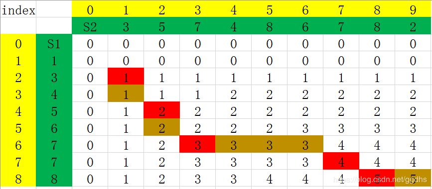

### 波兰表达式、逆波兰表达式、中缀表达式

**中缀表达式**

中缀表达式是人类最熟悉的一种表达式，例如：`1+2`，`(1+2)*3`，`3+4*2+4` 等等都是中缀表示法。先算括号里的，然后算乘除，最后算加减，但是，计算机处理中缀表达式却并不方便，因为没有一种简单的数据结构可以方便从一个表达式中间抽出一部分算完结果，再放进去，然后继续后面的计算（链表也许可以，但是比较消耗性能）。在介绍前缀，后缀表达式之前，我想先通过我们最熟悉的中缀表达式画出一棵**表达式树**来直观认识前后缀表达式。以 `1 + 2 * (3 - 4) - 10 / 5` 为例，如下图可知，中缀表达式得名于它是由相应的表达式树的**中序遍历**的结果得到的。


**逆波兰表达式**

逆波兰表达式又叫做后缀表达式。它是由相应的表达式树的**后序遍历**的结果得到的。如上图的后缀表达式为：

`1` 、`2` 、`3` 、`4` 、`-` 、`*` 、`+` 、`10` 、`5` 、`/` 、`-` 。

由后缀表达式求出结果十分方便，只需要用一个栈实现：

我们可以用一个栈 S 来实现计算，扫描从左往右进行，如果扫描到操作数，则压进 S，如果扫描到操作符，则从 S弹出两个操作数进行相应的运算，并将结果压进 S (S 的个数出2个进1个)，当扫描结束后，S 的栈顶的值就是表达式结果。


**波兰表达式**

波兰表达式又叫做前缀表达式。同样的道理，表达式的前缀表达式是由相应的表达式树的前序遍历的结果得到的。

如上图的前缀表达式为 ` - + 1 * 2 - 3 4 / 10 5 ` 。

由前缀表达式求出结果有下面两种思路：

1. **从左至右**扫描表达式，如果一个操作符后面跟着两个操作数时，则计算，然后将结果作为操作数替换(这个操作符和两个操作数)，重复此步骤，直至所有操作符处理完毕。如  ` - + 1 * 2 - 3 4 / 10 5 ` ，扫描到 `- 3 4` 时，会计算 `3 - 4 = -1 `,表达式变成： ` - + 1 * 2 -1 / 10 5 ` 。继续扫描到 `* 2 -1` ,计算 `2 * (-1) = -2` , 表达式变成:  ` - + 1 -2 / 10 5 `  ,继续 `+ 1 -2` ，依此类推。
2. 由 1. 知，要多遍扫描表达式，并且需要将3个字符替换成1个，比较繁锁，我们可以用一个栈 S 来实现计算，扫描**从右往左**进行，如果扫描到操作数，则压进 S，如果扫描到操作符，则从 S 弹出两个操作数进行相应的操作，并将结果压进 S (S 的个数出2个进1个), 当扫描结束后，S 的栈顶的值就是表达式结果。

 

**中缀表达式转换成后缀表达式**
　　既然中缀表达式对于计算机的运算并不便利，而前缀后缀表达式的计算相对简单方便。因此，找到一种途径将中缀表达式转换成前缀后缀表达式就十分重要。实际上，二者的转换算法看起来也很像一个逆过程。因此，我们着重讨论中缀转后缀。

​        从理论上讲，已知一棵二叉树的中序遍历序列，要求出它的后序遍历序列是不唯一的。但是，在这里加上了优先级这一限制条件，转换就变得唯一了。


**算法：**中缀表达式转换成后缀表达式

输入：中缀表达式串

输出：后缀表达式串


**思路：**

>**PROCESS BEGIN:**
>
>1. 从左往右扫描中缀表达式串s，对于每一个操作数或操作符，执行以下操作;
>
>​          2. IF (扫描到的s[i]是操作数DATA)
>
>　　　　   将s[i]添加到输出串中;
>
>​          3. IF (扫描到的s[i]是开括号 `'('` )
>
>​                   将s[i]压栈;
>
>​          4. WHILE (扫描到的s[i]是操作符OP)
>
>​                   IF (栈为空 或 栈顶为 `'('`  或 扫描到的操作符优先级比栈顶操作符高)
>
>​                        将s[i]压栈;
>    
>
>  ​                        BREAK;
>
> ​                   ELSE
>    
>
> ​                        出栈至输出串中
>
>
>  ​          5. IF (扫描到的s[i]是闭括号 `')'` )
>
>​                  栈中运算符逐个出栈并输出，直到遇到开括号`'('` ;
>    
>     ​                  开括号`'('` 出栈并丢弃;
>
>  ​          6. 返回第1.步
>
>
>　　  7. WHILE (扫描结束而栈中还有操作符)
>
>​                  操作符出栈并加到输出串中
>
>**PROCESS END**

参考：https://blog.csdn.net/linraise/article/details/20459751


JavaScript实现如下：

```js
let s = ['1','+','2','*','(','3','-','4',')','-','10','/','5']
let map = new Map([['+', '*/'], ['-', '*/']])
function in2post(s) {
  let len = s.length;
  let stack = [];
  let result = '';
  for (let i = 0; i < len; i++) {
    // s[i]是操作数
    if (!['+', '-', '*', '/', '(', ')'].includes(s[i])) {
      // 将s[i]添加到输出串中
      result += s[i];
    } else if (s[i] === '(') { // 扫描到的s[i]是开括号 '(',则压入栈中
      stack.push(s[i]);      
    } else if (s[i] === ')') {
      while (stack[stack.length - 1] !== '(') { // 栈中运算符逐个出栈并输出，直到遇到开括号`'('
        result += stack.pop();
      }
      stack.pop();  // 开括号`'('` 出栈并丢弃
    } else {   // s[i]是操作符OP,则进入循环
      while (['+', '-', '*', '/'].includes(s[i])) {
        let sLen = stack.length;
        // 栈为空 或 栈顶为 '(' 或 扫描到的操作符优先级比栈顶操作符高
        if (!sLen || stack[sLen - 1] === '(' || (['*', '/'].includes(s[i]) && stack[sLen - 1])) {
          stack.push(s[i]);
          break;
        } else {
          result += stack.pop(); // 出栈至输出串中
        }
      }
    }
  }

  while (stack.length) {  // 扫描结束而栈中还有操作符
    result += stack.pop();  // 操作符出栈并加到输出串中
  }
  return result;
}
```


>根据逆波兰表示法，求表达式的值。
>
>有效的运算符包括 +, -, *, / 。每个运算对象可以是整数，也可以是另一个逆波兰表达式。
>
>说明：
>
>整数除法只保留整数部分。
>给定逆波兰表达式总是有效的。换句话说，表达式总会得出有效数值且不存在除数为 0 的情况。
>
>来源：力扣（LeetCode）: [[逆波兰表达式求值](https://leetcode-cn.com/problems/evaluate-reverse-polish-notation/)]


JavaScript实现如下：

```js
var evalRPN = function(tokens) {
  let stack = [];
  let a = '';
  let b = '';
  tokens.forEach((item, i) => {
    if (['+', '-', '*', '/'].includes(item)) {
      a = stack.pop();
      b = stack.pop();
      stack.push(parseInt(eval(`(${b})${item}(${a})`)));
    } else {
      stack.push(item);
    }
  })
  return stack.pop();
};
```


### 表达式解析（反转括号里的字符串）

-- 携程秋招(笔试) 2019.9.4

> 给定一个只包含括号和小写字母的字符串S，其中括号表示将里面的字符串翻转，请你输出翻转之后的字符串，括号不匹配输出空串。示例，输入 a(bc(de)fg)hijk，输出 agfdecbhijk


解题思路：

- 如上 gif 所示，第一次遍历时，如果遇到左括号，则把它在字符串（str）所对应的索引压入栈（stack：记录左括号的索引值）中，如果遇到右括号，则弹出栈顶的所储存的索引值，此时弹出的索引值对应的左括号是与该右括号相匹配的，则这一对左右括号的索引值互相作为 map 的键值对（例如，左：2，右：6，则map = {2: 6, 6: 2} ）；
- 如果上面的第一次遍历完后，stack 为空（即括号完全匹配），则进行第二次遍历，设置一个 flag 值为1，该 flag 可以根据情况更改遍历的方向；如果遇到左或者右括号时，可以根据刚才 map 记录的相匹配括号的键值对将 i 改为 与之匹配的右或者左括号对应的索引号，并且改变 flag 的正负号，（例如，i = 2 时遇到左括号，则把 6 赋给 i，并且改变 flag 的正负号 `flag = -flag` ），如果遇到字母，就直接添加到结果字符串 result    ，遍历完全部字符串后，则返回结果 result 。

JavaScript：

```js
function resolve(str) {
  let len = str.length;
  let map = new Map();
  let stack = [];
  let tmp;
  for (let i = 0; i < len; i++) {
    if (str[i] === '(') {  // 遇到左括号，将索引压入栈中
      stack.push(i);
    } else if (str[i] === ')') { 
      if (stack.length === 0) return; // 如果遇到右括号，而栈为空，则此右括号不匹配，直接返回
      // 遇到右括号，则弹出栈顶的值（即该右括号相匹配的左括号的索引）
      tmp = stack.pop();  
      // 相匹配的左右括号的索引值互相设为键值对
      map.set(tmp, i)
         .set(i, tmp);
    }
  }
  // 遍历完后栈内还有值，说明括号不是完全匹配，直接返回
  if (stack.length !== 0) return;
  
  let flag = 1;
  let result = '';
  for (let i = 0; i < len;) {
    if (str[i] === '(' || str[i] === ')') { // 遇到左或右括号，则改变遍历方向
      i = map.get(i); // i 变成与 '(' 匹配的 ')' 的索引
      flag = -flag;
    } else {
      result += str[i]; // 字母直接加入输出结果中
    }
    i += flag;
  }
  return result;    
}

let str = 'a(bc(de)fg)hijk';
let r = resolve(str);
console.log(r);
```


### 反转链表

- **迭代**
  假设存在链表 1 → 2 → 3 → Ø，我们想要把它改成 Ø ← 1 ← 2 ← 3。

  在遍历列表时，将当前节点的 next 指针改为指向前一个元素。由于节点没有引用其上一个节点，因此必须事先存储其前一个元素。在更改引用之前，还需要另一个指针来存储下一个节点。不要忘记在最后返回新的头引用！

  
  
- **递归**

  递归版本稍微复杂一些，其关键在于反向工作。假设列表的其余部分已经被反转.假设列表为：
$$
n_1 \rightarrow \cdots \rightarrow n_{k-1} \rightarrow n_{k} \rightarrow n_{k+1} \rightarrow \cdots \rightarrow n_{m} \rightarrow \varnothing
$$


  若从节点 $n_{k+1}$ 到  $n_{m}$已经被反转，而我们正处于 $n_{k}$。
$$
  n_1 \rightarrow \cdots \rightarrow n_{k-1} \rightarrow n_{k} \rightarrow n_{k+1} \leftarrow \cdots \leftarrow n_{m}
$$


>**示例:**
>
>
>输入: 1->2->3->4->5->NULL
>输出: 5->4->3->2->1->NULL
>
>
>来源：[反转链表](https://leetcode-cn.com/problems/reverse-linked-list/)


```js
/**
 * Definition for singly-linked list.
 * function ListNode(val) {
 *     this.val = val;
 *     this.next = null;
 * }
 */
/**
 * @param {ListNode} head
 * @return {ListNode}
 */

// 迭代
var reverseList = function(head) {
  let prev = null;
  let cur = head;
  let tmp;
  while (cur !== null) {
    tmp = cur.next; // 保存当前节点的后一个节点
    cur.next = prev; // 当前节点的 next 指针指向前一个节点
    prev = cur;
    cur = tmp;
  }
  return prev;
};

/*
// 递归
function reverseL(head) {
  // 当 head 为最后一个节点时 或者 head为null 或者 只有一个头结点，就直接返回 head
  if (head === null || head.next === null) return head;
  let p = reverseL(head.next); // p 一直指向旧链表的最后一个节点，即新链表的头结点
  head.next.next = head; // 当前节点的下一个节点的 next 指向当前节点
  head.next = null; // 当前节点的 next 赋为 null
  return p; // 返回反转后的链表的头结点
};
var reverseList = function(head) {
  return reverseL(head);
}
*/
```


### 合并有序链表

**迭代**
想法

我们可以用迭代的方法来实现上述算法。我们假设 l1 元素严格比 l2元素少，我们可以将 l2 中的元素逐一插入 l1 中正确的位置。

算法

首先，我们设定一个哨兵节点 "prehead" ，这可以在最后让我们比较容易地返回合并后的链表。我们维护一个 prev 指针，我们需要做的是调整它的 next 指针。然后，我们重复以下过程，直到 l1 或者 l2 指向了 null ：如果 l1 当前位置的值小于等于 l2 ，我们就把 l1 的值接在 prev 节点的后面同时将 l1 指针往后移一个。否则，我们对 l2 做同样的操作。不管我们将哪一个元素接在了后面，我们都把 prev 向后移一个元素。

在循环终止的时候， l1 和 l2 至多有一个是非空的。由于输入的两个链表都是有序的，所以不管哪个链表是非空的，它包含的所有元素都比前面已经合并链表中的所有元素都要大。这意味着我们只需要简单地将非空链表接在合并链表的后面，并返回合并链表。


复杂度分析

- 时间复杂度：O(n + m)O(n+m) 。因为每次循环迭代中，l1 和 l2 只有一个元素会被放进合并链表中， while循环的次数等于两个链表的总长度。所有其他工作都是常数级别的，所以总的时间复杂度是线性的。
- 空间复杂度：O(1)O(1) 。迭代的过程只会产生几个指针，所以它所需要的空间是常数级别的。

题目

> 将两个有序链表合并为一个新的有序链表并返回。新链表是通过拼接给定的两个链表的所有节点组成的。 
>
> 示例：
>
> 输入：1->2->4, 1->3->4
> 输出：1->1->2->3->4->4


```js
/**
 * Definition for singly-linked list.
 * function ListNode(val) {
 *     this.val = val;
 *     this.next = null;
 * }
 */
/**
 * @param {ListNode} l1
 * @param {ListNode} l2
 * @return {ListNode}
 */
var mergeTwoLists = function(l1, l2) {
  // 定义一个哑结点，如果没有定义哑结点，就要考虑当里 l2 的头结点的值小于 l1 头结点值时候，处理头结点的情况
  let dummy = new ListNode(-1);
  let prev = dummy;
  
  while ((l1 !== null) && (l2 !== null)) {
    if (l1.val < l2.val) {
      prev.next = l1;
      l1 = l1.next;
    } else {
      prev.next = l2;
      l2 = l2.next;
    }
    
    prev = prev.next;
  }
  
  // 判断哪一个链表还有剩余的节点没有比较的，直接把这部分节点接到合并好的链表
  prev.next = l1 !== null ? l1 : l2;
  return dummy.next;
};
```


### 相交链表

根据题目意思
如果两个链表相交，那么相交点之后的长度是相同的

我们需要做的事情是，让两个链表从同距离末尾同等距离的位置开始遍历。这个位置只能是较短链表的头结点位置。
为此，我们必须消除两个链表的长度差

1. 指针 pA 指向 A 链表，指针 pB 指向 B 链表，依次往后遍历
2. 如果 pA 到了末尾，则 pA = headB 继续遍历
3. 如果 pB 到了末尾，则 pB = headA 继续遍历
4. 比较长的链表指针指向较短链表head时，长度差就消除了
5. 如此，如果两个链表有相交的节点，则 pA 和 pB 遍历到相交的节点时，是同时到达相交的节点，因为他们走过的路程是相同，如果两个链表没有相交的节点，则 pA 和 pB 也是同时走完两条链表的长度，最后返回 null

听着可能有点绕，看图最直观，链表的题目最适合看图了


题目

编写一个程序，找到两个单链表相交的起始节点。

如下面的两个链表


在节点 c1 开始相交。

**示例 1：**


输入：intersectVal = 8, listA = [4,1,8,4,5], listB = [5,0,1,8,4,5], skipA = 2, skipB = 3
输出：Reference of the node with value = 8
输入解释：相交节点的值为 8 （注意，如果两个列表相交则不能为 0）。从各自的表头开始算起，链表 A 为 [4,1,8,4,5]，链表 B 为 [5,0,1,8,4,5]。在 A 中，相交节点前有 2 个节点；在 B 中，相交节点前有 3 个节点。

**示例 2：**


输入：intersectVal = 2, listA = [0,9,1,2,4], listB = [3,2,4], skipA = 3, skipB = 1
输出：Reference of the node with value = 2
输入解释：相交节点的值为 2 （注意，如果两个列表相交则不能为 0）。从各自的表头开始算起，链表 A 为 [0,9,1,2,4]，链表 B 为 [3,2,4]。在 A 中，相交节点前有 3 个节点；在 B 中，相交节点前有 1 个节点。

**示例 3：**


输入：intersectVal = 0, listA = [2,6,4], listB = [1,5], skipA = 3, skipB = 2
输出：null
输入解释：从各自的表头开始算起，链表 A 为 [2,6,4]，链表 B 为 [1,5]。由于这两个链表不相交，所以 intersectVal 必须为 0，而 skipA 和 skipB 可以是任意值。
解释：这两个链表不相交，因此返回 null。

注意：

如果两个链表没有交点，返回 null.
在返回结果后，两个链表仍须保持原有的结构。
可假定整个链表结构中没有循环。
程序尽量满足 O(n) 时间复杂度，且仅用 O(1) 内存。

> 来源：力扣（LeetCode）
> 链接：[相交链表](https://leetcode-cn.com/problems/intersection-of-two-linked-lists/) 

```js
/**
 * Definition for singly-linked list.
 * function ListNode(val) {
 *     this.val = val;
 *     this.next = null;
 * }
 */

/**
 * @param {ListNode} headA
 * @param {ListNode} headB
 * @return {ListNode}
 */
var getIntersectionNode = function(headA, headB) {
  let pA = headA;
  let pB = headB;
  while (pA !== pB) {
    pA = pA === null ? headB : pA.next;
    pB = pB === null ? headA : pB.next;
  }
  
  return pA;
};
```


### 最长公共子序列

#### 求最长公共子序列长度

**动态规划**


数学归纳法（以下dp{str1,str2}代表对str1和str2求最长子序列)

1. text1 = "任意字符串"、 text2 = "任意字符串"

   - text1为单个字符，则所求为text1

     如图所示，紫色字母

     text1：B

     text2：A、AB、ABA、ABAZ、ABAZD、ABAZDC

     最长即为1

   - text1为多个字符，则

     - text1 = "......A"、text2= "..A/......A"
       末尾字符相同
       则所求最长公共子序列为
       dp{ text1[n-1] , text2[n-1] } + 1
       最后一个字符相同，则最长公共子序列一定有这个数
       如图所示，左边笑脸和上面笑脸处
       text1：BAC
       text2：ABAZDC
       最长即为：dp{ text1[B~A] , text2[A~D] } + 1 = 2 +1 = 3
     - text1 = "......A"、text2= "......B"
       末尾字符不相同
       则所求最长公共子序列为
       Math.max( dp{ text1[n-1] , text2[n] } , dp{ text1[n] , text2[n-1] } )
       如图所示
       text1：BAC
       text2：ABA
       最长即为：Math.max( dp{ text1[B~A] , text2[A~A] } , dp{ text1[B~C] , text2[A~B] } ) = Math.max(2,1) = 2

2. 归纳公式

   - 设 s1 = text1
   - s2 = text2
   - row = s1.length
   - col = s2.length
   - dp[s1,s2]为求接方程
   - 当 s1[row-1] != s2[row-1] 时
     - dp[s1,s2] = Max( dp[s1-1,s2] , dp[s1,s2-1] )
     - 或者，考虑末尾字符都不要的情况
     - dp[s1,s2] = Max( dp[s1-1,s2] , dp[s1,s2-1] , dp[s1-1,s2-1] )
       - 即要么两个字符串都不考虑最后一个字符，要么其中一个考虑最后一个字符
       - 事实上前面dp[s1-1,s2]求解子问题时候，会包含dp[s1-1,s2-1]，且最后一种末尾字符相同的情况下也包含此子问题
       - 所以按照第一个dp[s1,s2]方程来即可。
     - 当 s1[row-1] == s2[row-1] 时
     - dp[s1,s2] = dp[s1-1,s2-1] + 1
     - 或者，考虑剩余所以可能子情况
     - dp[s1,s2] = Max( dp[s1-1,s2] , dp[s1,s2-1] , dp[s1-1,s2-1] , (dp[s1-1,s2-1] + 1) )
       事实上，由以上分析可知
       最后一个字符相同，则最长公共子序列一定有这个数
       但是如果不考虑最后一个字符或者其中一个少考虑最后一个字符，
       意味着求出的最长公共子序列可能会少一个
       所以Max()里最大的一定是(dp[s1-1,s2-1] + 1)这种情况，即只需要第一个dp[s1,s2]方程即可。

总结递推公式为

> 当 i = 0 or j = 0, `dp[i][j]` = 0
>
> 当 text1[i] = text2[j] 时， `dp[i][j]` = `dp[i - 1][j - 1]` + 1
>
> 当 text1[i] != text2[j] 时， `dp[i][j]` = max{ `dp[i - 1][j]` , `dp[i][j - 1]` }


题目

> 给定两个字符串 text1 和 text2，返回这两个字符串的最长公共子序列。
>
> 一个字符串的 子序列 是指这样一个新的字符串：它是由原字符串在不改变字符的相对顺序的情况下删除某些字符（也可以不删除任何字符）后组成的新字符串。
> 例如，"ace" 是 "abcde" 的子序列，但 "aec" 不是 "abcde" 的子序列。两个字符串的「公共子序列」是这两个字符串所共同拥有的子序列。
>
> 若这两个字符串没有公共子序列，则返回 0。
>
> 示例 1:
>
> 输入：text1 = "abcde", text2 = "ace" 
> 输出：3  
> 解释：最长公共子序列是 "ace"，它的长度为 3。
> 示例 2:
>
> 输入：text1 = "abc", text2 = "abc"
> 输出：3
> 解释：最长公共子序列是 "abc"，它的长度为 3。
> 示例 3:
>
> 输入：text1 = "abc", text2 = "def"
> 输出：0
> 解释：两个字符串没有公共子序列，返回 0。
>
> 来源：[1143. 最长公共子序列](https://leetcode-cn.com/problems/longest-common-subsequence/) 


```js
/**
 * @param {string} text1
 * @param {string} text2
 * @return {number}
 */
var longestCommonSubsequence = function(text1, text2) {
  let row = text1.length;
  let col = text2.length;
  let dp = new Array(row+1).fill(0);
  for(let i = 0;i <= row; i++){
      dp[i] = new Array(col+1).fill(0);
  }
  
  for(let i = 1;i < row + 1;i++){
      for(let j = 1;j < col + 1;j++){
          if(text1[i-1] == text2[j-1]){
              dp[i][j] = dp[i-1][j-1] + 1;
          }else{
              dp[i][j] = Math.max(dp[i-1][j],dp[i][j-1]);
          }
      }
  }
  return dp[row][col];
};
```


#### 打印最长公共子序列

如果有两个字符串如下：
S1 = “123456778”
S2 = “357486782”
其最终的动态规划填表结果为：


其中S1和S2的LCS并不是只有1个。
我们根据递归公式

> 当 i = 0 or j = 0, `dp[i][j]` = 0
>
> 当 text1[i] = text2[j] 时， `dp[i][j]` = `dp[i - 1][j - 1]` + 1
>
> 当 text1[i] != text2[j] 时， `dp[i][j]` = max{ `dp[i - 1][j]` , `dp[i][j - 1]` }

构建了上表，
通过递推公式，可以看出，`res[i][j]` 的值来源于`res[i-1][j-1]` 或者是 `res[i-1][j]` 和 `res[i][j-1]` 的较大值（可能相等）。
我们将从最后一个元素 `c[8][9]` 倒推出S1和S2的LCS。
`res[8][9]` = 5，且S1[8] != S2[9]，所以倒推回去，`res[8][9]` 的值来源于 `c[8][8]` 的值(因为 `res[8][8]` > `res[7][9]` )。
`res[8][8]` = 5, 且S1[8] = S2[8], 所以倒推回去，`res[8][8]` 的值来源于 `res[7][7]` 。
以此类推，如果遇到S1[i] != S2[j] ，且 `res[i-1][j]` = `res[i][j-1]` 这种存在分支的情况，这里都选择一个方向（之后遇到这样的情况，也选择相同的方向，要么都往左，要么都往上，代码示例是都往上处理）。



可得S1和S2的LCS为{3、5、7、7、8} **这是遇见相等的时候，统一往左走**。
S1和S2之间还有一个LCS **这是遇见相等的时候，统一往上走**：


可得S1和S2的LCS为{3、4、6、7、8}


```js
var longestCommonSubsequence = function(text1, text2) {
  let row = text1.length;
  let col = text2.length;
  let dp = new Array(row+1).fill(0),
      solution = new Array(row+1).fill(0);
  for(let i = 0;i <= row; i++){
      dp[i] = new Array(col+1).fill(0);
      solution[i] = new Array(col+1).fill(0);
  }
  
  for(let i = 1;i < row + 1;i++){
      for(let j = 1;j < col + 1;j++){
          if(text1[i-1] === text2[j-1]){
              dp[i][j] = dp[i-1][j-1] + 1;
              solution[i][j] = 'diagonal';
          }else{
              dp[i][j] = Math.max(dp[i-1][j],dp[i][j-1]);
              solution[i][j] = (dp[i][j] === dp[i - 1][j]) ? 'top' : 'left';
              // 这里dp[i][j] 与 dp[i - 1][j]相等时包含了两种情况                                           // （1）dp[i - 1][j] 比 dp[i][j - 1] 大，所以往上走
              // （2）dp[i - 1][j] 与 dp[i][j - 1] 相等，也是往上走
          }
      }
  }
  printSolution(solution, text1, row, col)
  // return dp[row][col];
};

function printSolution (solution, text, row, col) {
  let a = row;
  let b = col;
  let x = solution[a][b];
  let answer = '';

  while (x !== 0) {
    if (solution[a][b] === 'diagonal') {
      answer = text[a - 1] + answer;
      a--;
      b--;
    } else if (solution[a][b] === 'left') {
      b--;
    } else if (solution[a][b] === 'top') {
      a--;
    }
    x = solution[a][b]
  }
  
  console.log('lcs: ' + answer);
}

longestCommonSubsequence("123456778", "357486782") // lcs: 34678
```


> 参考：[动态规划经典例题——最长公共子序列和最长公共子串（python）](https://blog.csdn.net/ggdhs/article/details/90713154) 


### 最长公共子串

给定两个字符串，求出他们之间最长的相同字符串的长度。

公共子串和公共自粗劣不同，公共子序列不要求连续，但是公共子串必须是连续的如：

A = “helloworld”

B = “loop”

A 和 B 的最长公共子序列是 “loo”，但是最长公共子串是 “lo”。

#### 求最长公共子串长度

思路

使用动态规划的算法，找到状态之间的转化方程

> 动态规划的子问题 `dp[i][j]` 为以 A[i] 和 B[j] 为最后一个元素的最长公共子串，注意，这里要求如果最长公共子串如果存在的话，最后一个元素必须是 A[i]（也是 B[j]，因为相等）。如还以 A = “helloworld” 和 B = “loop” 为例，`dp[6][3]` 表示子串 “hello” 和子串 “loo” 的最长公共子串，为 “lo”，长度为 2。
>
> 递推公式：
>
> 当 i = 0 or j = 0, `dp[i][j]` = 0
>
> 当 A[i] = B[j] 时， `dp[i][j]` = `dp[i - 1][j - 1]` + 1
>
> 当 A[i] != B[j] 时， `dp[i][j]` = 0

和最长公共子序列（LCS）问题唯一不同的地方在于当 A[i] != B[j] 时，`dp[i][j]` 就直接等于0了，因为子串必须连续，**且 `dp[i][j]` 表示的是以A[i]，B[j]截尾的公共子串的长度**。因此可以根据这个方程来进行填表，以"helloworld"和“loop”为例：


 这个和LCS问题还有一点不同的就是，需要设置一个result，每一步都更新得到最长公共子串的长度。

```js
function longestCommonSubstring (text1, text2) {
  let len1 = text1.length;
  let len2 = text2.length;
  let result = 0;
  let arr = new Array(len1 + 1);
  for (let i = 0; i <= len1; i++)
    arr[i] = new Array(len2 + 1).fill(0)

  for (let i = 1; i < len1 + 1; i++)
    for (let j = 1; j < len2 + 1; j++) {
      if (text1[i - 1] === text2[j - 1]) {
        arr[i][j] = arr[i - 1][j - 1] + 1;
        result = Math.max(result, arr[i][j])
      }
    }
  return result;
};
```


#### 打印最长公共子串

因为公共子串在原字符串中是连续的，所以在求最长公共子串的长度的基础上，记录下最长公共子串的结束的位置，即可求出最长公共子串

```js
function printLongestCommonSubstring (text1, text2) {
  let len1 = text1.length;
  let len2 = text2.length;
  let maxLen = 0, maxEnd = 0;
  let arr = new Array(len1 + 1);
  for (let i = 0; i <= len1; i++)
    arr[i] = new Array(len2 + 1).fill(0)

  for (let i = 1; i < len1 + 1; i++)
    for (let j = 1; j < len2 + 1; j++) {
      if (text1[i - 1] === text2[j - 1]) {
        arr[i][j] = arr[i - 1][j - 1] + 1;
        if (arr[i][j] > maxLen) {
          maxLen = arr[i][j];
          maxEnd = i;
        }
      }
    }
  return text1.substr(maxEnd - maxLen, maxLen);
};

console.log(printLongestCommonSubstring("helloworld","loop")); // lo
```


> 参考：
>
> [动态规划经典例题——最长公共子序列和最长公共子串（python）](https://blog.csdn.net/ggdhs/article/details/90713154) 
>
> [求两个字符串的最长公共子串](https://blog.csdn.net/qq_25800311/article/details/81607168) 


### 不同路径 i

题目

> 一个机器人位于一个 m x n 网格的左上角 （起始点在下图中标记为“Start” ）。
>
> 机器人每次只能向下或者向右移动一步。机器人试图达到网格的右下角（在下图中标记为“Finish”）。
>
> 问总共有多少条不同的路径？


> 例如，上图是一个7 x 3 的网格。有多少可能的路径？
>
> 说明：m 和 n 的值均不超过 100。
>
> 示例 1:
>
> 输入: m = 3, n = 2
> 输出: 3
> 解释:
> 从左上角开始，总共有 3 条路径可以到达右下角。
>
> 1. 向右 -> 向右 -> 向下
> 2. 向右 -> 向下 -> 向右
> 3. 向下 -> 向右 -> 向右
>
> 来源：[不同路径](https://leetcode-cn.com/problems/unique-paths/) 


**动态规划**

我们令 `dp[i][j]` 是到达 i, j 最多路径

动态方程：`dp[i][j] = dp[i-1][j] + dp[i][j-1]`

注意，对于第一行 `dp[0][j]`，或者第一列 dp[i][0]，由于都是在边界，所以只能为 1

时间复杂度：O(m*n)O(m∗n)

空间复杂度：O(m * n)O(m∗n)

优化：因为我们每次只需要 `dp[i-1][j]` , `dp[i][j-1]`

所以我们只要记录这两个数，直接看代码吧！

```js
var uniquePaths = function(m, n) {
  // 初始化二维数组（n行m列）
  let dp = Array.from(new Array(n), () => new Array(m).fill(1))  

  for (let i = 1; i < n; i++) {
    for (let j = 1; j < m; j++) {
      dp[i][j] = dp[i - 1][j] + dp[i][j - 1]
    }
  }
  return dp[n - 1][m - 1];
};
```


优化1：空间复杂度 O(2n)

```js
var uniquePaths = function(m, n) {
  let pre = new Array(m).fill(1);
  let cur = new Array(m).fill(1);

  for (let i = 1; i < n; i++) {
    for (let j = 1; j < m; j++) {
      // pre[j]是上方格的路径数，cur[j - 1]是左方格的路径数
      cur[j] = pre[j] + cur[j - 1]
    }
    // 深拷贝 cur 数组
    pre = [...cur]
  }

  return cur[m - 1]
};
```


优化2：空间复杂度 O(n)

```js
var uniquePaths = function(m, n) {
  let cur = new Array(m).fill(1);

  for (let i = 1; i < n; i++) {
    for (let j = 1; j < m; j++) {
      // cur[j-1]是左方格的路径数，cur[j]是上方格的路径数，两者相加再赋给cur[j]
      cur[j] += cur[j - 1]
    }
  }

  return cur[m - 1]
};
```


### 不同路径 ii

题目

> 一个机器人位于一个 m x n 网格的左上角 （起始点在下图中标记为“Start” ）。
>
> 机器人每次只能向下或者向右移动一步。机器人试图达到网格的右下角（在下图中标记为“Finish”）。
>
> 现在考虑网格中有障碍物。那么从左上角到右下角将会有多少条不同的路径？
>
> 
>
> 网格中的障碍物和空位置分别用 `1` 和 `0` 来表示。
>
> 示例 1:
>
> 输入:
> [
>   [0,0,0],
>   [0,1,0],
>   [0,0,0]
> ]
> 输出: 2
> 解释:
> 3x3 网格的正中间有一个障碍物。
> 从左上角到右下角一共有 2 条不同的路径：
>
> 1. 向右 -> 向右 -> 向下 -> 向下
> 2. 向下 -> 向下 -> 向右 -> 向右
>
> 来源：[不同路径 II](https://leetcode-cn.com/problems/unique-paths-ii/) 

**动态规划**

**直觉**

机器人只可以向下和向右移动，因此第一行的格子只能从左边的格子移动到，第一列的格子只能从上方的格子移动到。


对于剩下的格子，可以从左边或者上方的格子移动到。


如果格子上有障碍，那么我们不考虑包含这个格子的任何路径。我们从左至右、从上至下的遍历整个数组，那么在到达某个顶点之前我们就已经获得了到达前驱节点的方案数，这就变成了一个动态规划问题。我们只需要一个 obstacleGrid 数组作为 DP 数组。

注意： 根据题目描述，包含障碍物的格点有权值 1，我们依此来判断是否包含在路径中，然后我们可以用这个空间来存储到达这个格点的方案数。

算法

1. 如果第一个格点 obstacleGrid[0,0] 是 1，说明有障碍物，那么机器人不能做任何移动，我们返回结果 0。
2. 否则，如果 obstacleGrid[0,0] 是 0，我们初始化这个值为 1 然后继续算法。
3. 遍历第一行，如果有一个格点初始值为 1 ，说明当前节点有障碍物，没有路径可以通过，设值为 0 ；否则设这个值是前一个节点的值 obstacleGrid[i,j] = obstacleGrid[i,j-1]。
4. 遍历第一列，如果有一个格点初始值为 1 ，说明当前节点有障碍物，没有路径可以通过，设值为 0 ；否则设这个值是前一个节点的值 obstacleGrid[i,j] = obstacleGrid[i-1,j]。
5. 现在，从 obstacleGrid[1,1] 开始遍历整个数组，如果某个格点初始不包含任何障碍物，就把值赋为上方和左侧两个格点方案数之和 obstacleGrid[i,j] = obstacleGrid[i-1,j] + obstacleGrid[i,j-1]。
6. 如果这个点有障碍物，设值为 0 ，这可以保证不会对后面的路径产生贡献。


```js
/**
 * @param {number[][]} obstacleGrid
 * @return {number}
 */
var uniquePathsWithObstacles = function(obstacleGrid) {
  
  let R = obstacleGrid.length;
  let C = obstacleGrid[0].length;

  // If the starting cell has an obstacle, then simply return as there would be
  // no paths to the destination.
  if (obstacleGrid[0][0] === 1) {
      return 0;
  }

  // Number of ways of reaching the starting cell = 1.
  obstacleGrid[0][0] = 1;

  // Filling the values for the first column
  for (let i = 1; i < R; i++) {
      obstacleGrid[i][0] = (obstacleGrid[i][0] === 0 && obstacleGrid[i - 1][0] === 1) ? 1 : 0;
  }

  // Filling the values for the first row
  for (let i = 1; i < C; i++) {
      obstacleGrid[0][i] = (obstacleGrid[0][i] === 0 && obstacleGrid[0][i - 1] === 1) ? 1 : 0;
  }

  // Starting from cell(1,1) fill up the values
  // No. of ways of reaching cell[i][j] = cell[i - 1][j] + cell[i][j - 1]
  // i.e. From above and left.
  for (let i = 1; i < R; i++) {
      for (let j = 1; j < C; j++) {
          if (obstacleGrid[i][j] === 0) {
              obstacleGrid[i][j] = obstacleGrid[i - 1][j] + obstacleGrid[i][j - 1];
          } else {
              obstacleGrid[i][j] = 0;
          }
      }
  }

  // Return value stored in rightmost bottommost cell. That is the destination.
  return obstacleGrid[R - 1][C - 1];

}
```

复杂度分析

时间复杂度 ： O(M \times N)O(M×N) 。长方形网格的大小是 M \times NM×N，而访问每个格点恰好一次。
空间复杂度 ： O(1)O(1)。我们利用 obstacleGrid 作为 DP 数组，因此不需要额外的空间。

> 参考：[不同路径 II](https://leetcode-cn.com/problems/unique-paths-ii/solution/bu-tong-lu-jing-ii-by-leetcode/) 


### 路径的权和（由 不同路径ii 改编）

题目

> 求路径之的最小和，例如，
>
> 一个二维数组，每次只能向下或者向右移动一步，0是障碍物，其他数字可以通过，求左上角到右下角所经过不同的路径中，权值之和最小是多少，如果不能通过则返回 0.
>
> 示例：
>
> 输入：
>
> [[1, 2, 0],
>
>  [1, 3, 4],
>
>  [2, 0, 4]]
>
> 因为 1+1+3+4+4 = 13
>
> 输出：13


思路

**动态规划**

1. 如果第一个格点 obstacleGrid[0,0] 是 0，说明有障碍物，那么机器人不能做任何移动，我们返回结果 0。

2. 否则，如果 obstacleGrid[0,0] 不是 0，dp[0,0] = obstacleGrid[0,0] 。

3. 遍历第一列，如果有一个格点初始值为 0 ，说明当前节点有障碍物，没有路径可以通过，设值为 0 ；否则设这个值是前一个节点的值 dp[i,j] = dp[i-1, j] + obstacleGrid[i,j]。

4. 遍历第一行，如果有一个格点初始值为 0 ，说明当前节点有障碍物，没有路径可以通过，设值为 0 ；否则设这个值是前一个节点的值 dp[i,j] = dp[i, j-1] + obstacleGrid[i, j]。

5. 现在，从 obstacleGrid[1,1] 开始遍历整个数组，

   > 1. 如果这个点有障碍物，设值为 0 ，这可以保证不会对后面的路径产生贡献。
   > 2. 如果这个点的上方和左侧都为障碍物，设值为 0 ，这可以保证不会对后面的路径产生贡献。
   > 3. 如果某个格点上方和左侧都不包含任何障碍物，就把值赋为上方和左侧两个格点的权值较小值 与 obstacleGrid[i,j] 之和，dp[i, j] = min(dp[i-1, j], dp[i, j-1]) + obstacleGrid[i,j] 
   > 4. 如果某个格点上方和左侧其中一方包含障碍物，就把值赋为上方或左侧两个格点不为0的权值 与 obstacleGrid[i,j] 之和，dp[i, j] = 非0(dp[i-1, j], dp[i, j-1]) + obstacleGrid[i,j] 
   >
   > 总结：
   >
   > 1. obstacleGrid[i, j] = 0 时，进入下一次循环
   > 2. dp[i - 1, j] = 0 且 dp[i, j - 1] = 0 时， dp[i，j] = 0;
   > 3. dp[i - 1，j] !== 0 && dp[i，j - 1] !== 0时，dp[i，j] = obstacleGrid[i，j] + Math.min(dp[i - 1，j], dp[i，j - 1])
   > 4. dp[i - 1, j] 与dp[i, j - 1] 其中一个为0时，dp[i，j] = obstacleGrid[i, j] + 非0(dp[i - 1, j]， dp[i, j - 1]);

```js
/**
 * @param {number[][]} obstacleGrid
 * @return {number}
 */
var pathSumWithObstacles = function(obstacleGrid) {
  
  let R = obstacleGrid.length;
  let C = obstacleGrid[0].length;
  // 将二维数组dp（R行C列）初始化为0
  let dp = Array.from(new Array(R), () => new Array(C).fill(0))

  if (obstacleGrid[0][0] === 0) {
      return 0;
  }

  dp[0][0] = obstacleGrid[0][0];

  // 遍历第一列，如果i位置为0，则i后面的都为0，表示第一列为0的位置后面的路都不通
  for (let i = 1; i < R; i++) {
    if (obstacleGrid[i][0] === 0) {
      break;
    }
    dp[i][0] = dp[i - 1][0] + obstacleGrid[i][0];
  }

  for (let i = 1; i < C; i++) {
    if (obstacleGrid[0][i] === 0) {
      break;
    }
    dp[0][i] = dp[0][i - 1] + obstacleGrid[0][i];
  }

  for (let i = 1; i < R; i++) {
    for (let j = 1; j < C; j++) {
      // 如果obstacleGrid[i][j]为0，则遇到障碍物，此路不同
      if (obstacleGrid[i][j] === 0) {
        continue;
      }
      // 左方格与上方格都为0时，则dp[i][j]为0
      if (dp[i - 1][j] === 0 && dp[i][j - 1] === 0) {
        dp[i][j] = 0;
      } else if (dp[i - 1][j] !== 0 && dp[i][j - 1] !== 0) {
        // 左方格与上方格都不为0时，则dp[i][j]为obstacleGrid[i][j]与较小权值的和
        dp[i][j] = obstacleGrid[i][j] + Math.min(dp[i - 1][j], dp[i][j - 1])
      } else {
        // 左方格与上方格其中一个为0时，则dp[i][j]为obstacleGrid[i][j]与权值不为0的和
        dp[i][j] = obstacleGrid[i][j] + (dp[i - 1][j] !== 0 ? dp[i - 1][j] : dp[i][j - 1]);
      }
    }
  }

  return dp[R - 1][C - 1];
};
```


