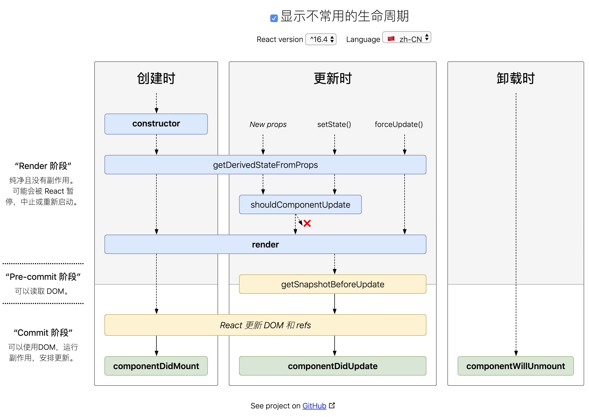
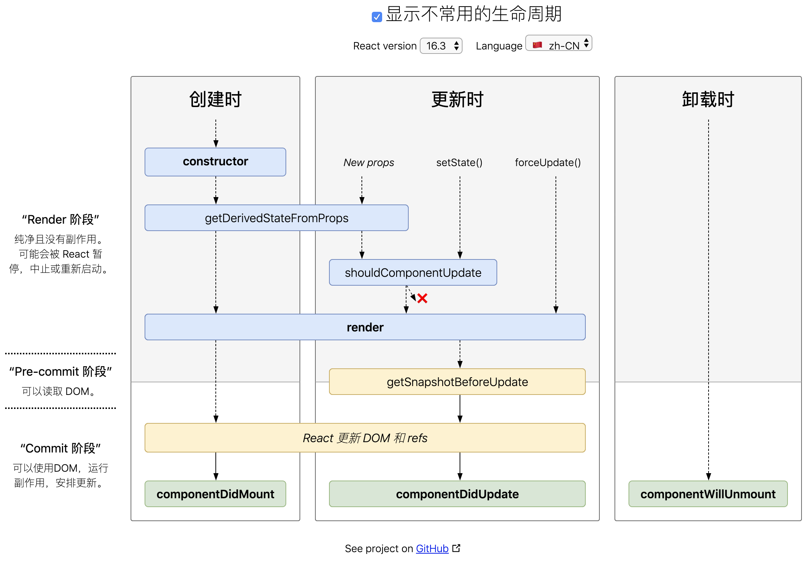

## 实现react-redux的 Provider 和 connect

react-redux库的主模块
1)react-redux向外暴露了2个API
    a. Provider组件类
    b. connect函数
2)Provider组件
    接收store属性
    让所有容器组件都可以看到store, 从而通过store读取/更新状态
3)connect函数
    接收2个参数: mapStateToProps和mapDispatchToProps
    mapStateToProps: 为一个函数, 用来指定向UI组件传递哪些一般属性
    mapDispatchToProps: 为一个函数或对象, 用来指定向UI组件传递哪些函数属性
    connect()执行的返回值为一个高阶组件: 包装UI组件, 返回一个新的容器组件
    容器组件会向UI传入前面指定的一般/函数类型属性
 

```js
import React from 'react'
import PropTypes from 'prop-types'

/*
用来向所有容器组件提供store的组件类
通过context向所有的容器组件提供store
 */
export class Provider extends React.Component {

  static propTypes = {
    store: PropTypes.object.isRequired  // 声明接收store
  }

  // 声明提供的context的数据名称和类型
  static childContextTypes = {
    store: PropTypes.object
  }

  /*
  向所有有声明子组件提供包含要传递数据的context对象
   */
  getChildContext () {
    return {
      store: this.props.store
    }
  }

  render() {
    // 返回渲染<Provider>的所有子节点
    return this.props.children
  }
}


/*
connect高阶函数: 接收mapStateToProps和mapDispatchToProps两个参数, 返回一个高阶组件函数
高阶组件: 接收一个UI组件, 返回一个容器组件
 */
export function connect(mapStateToProps, mapDispatchToProps) {
  // 返回高阶组件函数
  return (UIComponent) => {
    // 返回容器组件
    return class ContainerComponent extends React.Component {

      // 声明接收的context数据的名称和类型
      static contextTypes = {
        store: PropTypes.object
      }

      constructor (props, context) {
        super(props)
        console.log('ContainerComponent constructor()', context.store)

        // 得到store
        const {store} = context
        // 得到包含所有一般属性的对象
        const stateProps = mapStateToProps(store.getState())  // {count: 1}
        // 将所有一般属性作为容器的状态数据
        this.state = {...stateProps}

        //得到包含所有函数属性的对象
        let dispatchProps
        if(typeof mapDispatchToProps==='function') {
          dispatchProps = mapDispatchToProps(store.dispatch)
        } else {
          dispatchProps = Object.keys(mapDispatchToProps).reduce((pre, key) => {
            const actionCreator = mapDispatchToProps[key]
            pre[key] = (...args) => store.dispatch(actionCreator(...args))   // 参数透传
            return pre
          }, {})
        }

        // 保存到组件上
        this.dispatchProps = dispatchProps

        // 绑定store的state变化的监听
        store.subscribe(() => { // store内部的状态数据发生了变化
          // 更新容器组件 ==> UI组件更新
          this.setState({...mapStateToProps(store.getState())})
        })
      }

      render () {
        // 返回UI组件的标签
        return <UIComponent  {...this.state} {...this.dispatchProps}/>
      }
    }

  }
}
```


## React-Redux

### React生命周期([React.Component](<https://react.docschina.org/docs/react-component.html>))

[生命周期图谱](<http://projects.wojtekmaj.pl/react-lifecycle-methods-diagram/>)(^16.4 和 16.3)






## Redux

### Redux的基本原则

Flux的基本原则是“单向数据流”, Redux在此基础上强调三个基本原则

- **唯一数据源(Single Source of Truth)**

- **保持状态只读(State is read-only)**

- ##### **数据改变只能通过纯函数完成(Change are made with pure functions)**

#### 唯一数据源

唯一数据源指的是应用的状态数据应该只存储唯一的一个Store上

> *注意:* **Redux并没有阻止一个应用拥有多个Store, 只是在Redux的框架下,让一个应用拥有多个Store不会带来任何好处,最后还不如使用一个Store更容易组织代码.**


#### 保持状态只读

保持状态只读, 就是说不能去直接修改状态, 要修改Store的状态, 必须要通过派发一个action对象完成, 这一点和Flux的要求并没有什么区别.


#### 数据改变只能通过纯函数完成

这里所说的纯函数就是Reducer, Redux这个名字的前三个字母Red代表的就是Reducer. 按照创作者Dan Abramov的说法, Redux名字的含义是Reducer + Flux.

以JavaScript为例, 数组类型就有reduce函数, 接受的参数就是一个reducer, reduce做的事情就是把数组所有元素一次做“ 规约 ”, 对每个元素都调用一次参数reducer, 通过reducer函数完成规约所有元素的功能.

下面是一个使用reducer函数的例子:

```javascript
[1, 2, 3, 4].reduce(function reducer(accumulation, item){
    return accumulation + item
}, 0);
```

上面的代码中,reducer(注意不是reduce)函数接受两个参数, 第一个参数是上一次规约的结果, 第二个参数是这一次规约的元素, 函数体是返回两者之和, 所以这个规约的结果就是所有元素之和. 

在Redux中, 每个reducer的函数签名如下所示:

```javascript
reducer(state, action)
```

第一个参数state是当前的状态, 第二个参数action是接收到的action对象, 而reducer函数要做的事情, 就是根据state和action的值产生一个新的对象返回,注意reducer必须是纯函数,也就是说函数的返回结果必须完全有参数state和action决定, 而且不产生任何副作用, 也不能修改参数state和action对象.

***

### Redux实例

> 对应代码: [redux_basic](https://github.com/vigor-z/react-and-redux/tree/master/chapter-03/redux_basic)

首先看关于actin对象的定义, 和Flux一样, Redux应用习惯是那个把action类型和action构造函数分成两个文件定义, 其中定义action类型的src/ActionTypes.js和Flux版本没有任何区别, 但是src/Actions.js文件就不大一样了,代码如下:

```javascript
import * as ActionTypes from './ActionTypes.js';

export const increment = (counterCaption) => {
  return {
    type: ActionTypes.INCREMENT,
    counterCaption: counterCaption
  };
};

export const decrement = (counterCaption) => {
  return {
    type: ActionTypes.DECREMENT,
    counterCaption: counterCaption
  };
};
```

和Flux的src/Actions.js文件对比就会发现, Redux中每个action构造函数都返回一个action对象, 而Flux版本中action构造函数并没有返回什么, 而是把构造的动作函数立刻通过Dispatcher的dispatch函数派发出去.

Redux中“分发”这个功能, 从一个Dispatcher对象简化为Store对象是那个的一个函数dispatch, 毕竟只有一个Store, 要分发也是分发给这个Store, 就调用Store上一个表示分发的函数, 合情合理.

我们创造一个src/Store.js文件,这个文件输出全局唯一的那个Store, 代码如下:

```javascript

    
import {createStore} from 'redux';
import reducer from './Reducer.js';

const initValues = {
  'First': 0,
  'Second': 10,
  'Third': 20
};

const store = createStore(reducer, initValues);

export default store;
```

在这里我们接触到了Redux库提供的createStore函数, 这个函数第一个参数代笔更新状态的reducer, 第二个参数是状态的初始值, 第三个参数可选, 代表Store Enhancer, 后面会详细介绍.

*记住:* **Redux的Store状态设计的一个主要原则: 避免冗余的数据.**

接下来看src/Reducer.js中定义的reducer函数,代码如下: 

```javascript
import * as ActionTypes from './ActionTypes.js';

export default (state, action) => {
  const {counterCaption} = action;

  switch (action.type) {
    case ActionTypes.INCREMENT:
      return {...state, [counterCaption]: state[counterCaption] + 1};
    case ActionTypes.DECREMENT:
      return {...state, [counterCaption]: state[counterCaption] - 1};
    default:
      return state
  }
}
```


